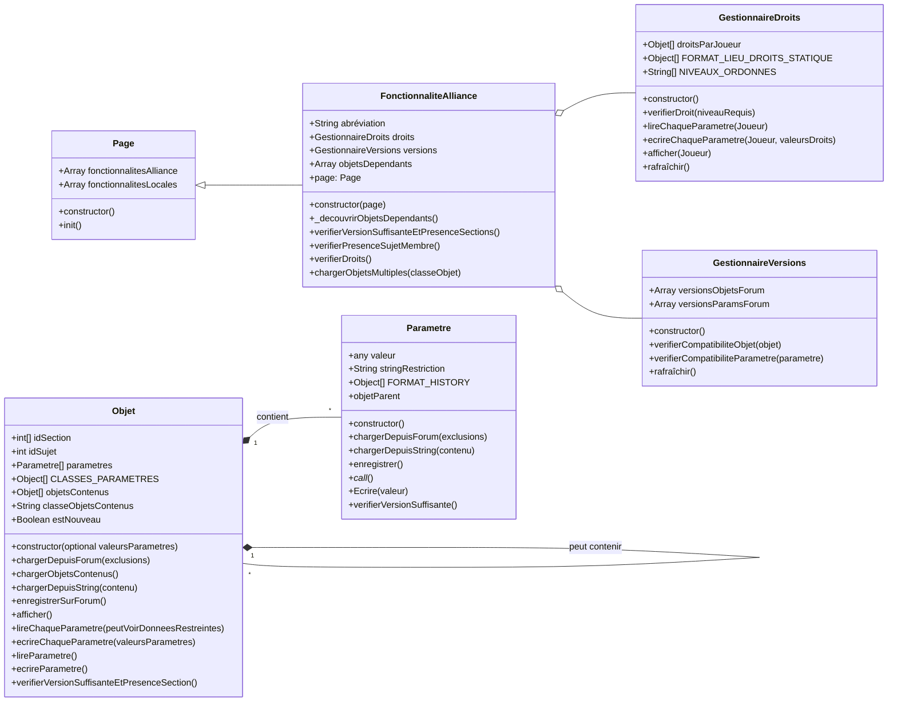

# Refonte framework fonctionnalités alliance

## Objectifs
Refondre le coeur de l'extension pour pouvoir développer plus simplement, flexiblement et robustement de nouvelles fonctionnalités d'alliance :
- Mettre en place un système de restrictions par joueur de l’accès à chaque fonctionnalité
- Mettre en place un système de restrictions s'il y a incompatibilité de version

## Fonctionnement Détaillé

Le framework repose sur trois piliers pour assurer la robustesse et la flexibilité des fonctionnalités d'alliance :

1.  **Gestion Centralisée des Droits :** Un `GestionnaireDroits` unique contrôle l'accès de chaque joueur à chaque fonctionnalité.
2.  **Gestion Centralisée des Versions :** Un `GestionnaireVersions` unique valide la compatibilité des formats de données entre l'extension et le forum.
3.  **Découverte Dynamique :** Le système identifie automatiquement les fonctionnalités et leurs dépendances (`Objets`) sans nécessiter de déclaration manuelle, allégeant ainsi le travail de développement.

#### **1. Gestion des Droits et Restrictions**

*   **Niveaux de Droits :**
    *   `A` (Administrateur) : Accès complet.
    *   `N` (Normal) : Accès standard, peut voir les données restreintes des autres joueurs.
    *   `R` (Restreint) : Accès limité, peut voir uniquement les données *non restreintes* de tous les joueurs.
    *   `B` (Bloqué) : Aucun accès.

#### **2. Architecture des Classes**

> #### **Nouvelle Classe Mère : `Page`**
>
> Pour optimiser les vérifications répétitives, une classe de base `Page` est introduite.
> *   **Rôle :** Servir de conteneur pour les fonctionnalités et de cache pour les données partagées à l'échelle d'une page.



#### **3. Processus Clés**

##### **Initialisation et Lancement**

Au démarrage de l'extension, une fonction globale (`initialiserFrameworkGlobal`) construit un registre de toutes les classes `Objet` et `FonctionnaliteAlliance` et prépare les gestionnaires centraux (`GestionnaireDroits`, `GestionnaireVersions`). Au chargement d'une page du forum, la classe `Page` correspondante s'assure que cet état global est valide, puis instancie et initialise les fonctionnalités d'alliance dont elle a besoin.

##### **Séquence de Vérification d'une Fonctionnalité**

Avant de s'exécuter, chaque `FonctionnaliteAlliance` suit une séquence de validation stricte pour garantir la robustesse :
1.  **Vérification des Versions et Dépendances :** Elle vérifie récursivement la compatibilité de tous les `Objets` dont elle dépend. Pour chaque objet, la validation couvre la présence de sa section sur le forum, la version de sa logique, le format de ses paramètres et la compatibilité de ses objets contenus.
2.  **Présence du Joueur :** Elle s'assure que le joueur actuel est bien un membre de l'alliance.
3.  **Vérification des Droits :** Elle interroge le `GestionnaireDroits` pour confirmer que le joueur a au minimum le droit 'Restreint' (`R`).

##### **Chargement des Données**

Le framework fournit des méthodes optimisées pour lire les données du forum :
*   **Chargement de Masse (`chargerObjetsMultiples`) :** Permet de récupérer toutes les instances d'un type d'objet (ex: tous les `Joueur`) en une seule fois, en groupant les requêtes par section du forum.
*   **Chargement Imbriqué (`chargerObjetsContenus`) :** Gère le cas où des objets sont contenus dans d'autres (ex: des `Commande` dans un `SujetDeCommandes`).
*   **Mise en Cache :** Un cache au niveau de la `Page` évite de recharger plusieurs fois les mêmes données au sein d'une même page.

##### **Affichage Sécurisé**

Toute méthode d'affichage (`afficher`) doit d'abord vérifier le niveau de droit de l'utilisateur. Elle passe ensuite un indicateur (`peutVoirDonneesRestreintes`) aux méthodes de lecture de données, qui se chargent de retourner soit la valeur réelle, soit une chaîne de restriction, garantissant que la logique de sécurité est appliquée de manière cohérente.

##### **Découverte Dynamique des Dépendances**

Pour éviter la déclaration manuelle et les oublis, le framework s'appuie sur une analyse statique du code. Lorsqu'une `FonctionnaliteAlliance` est initialisée, elle analyse son propre code source (via un Arbre Syntaxique Abstrait - AST) pour identifier de manière fiable toutes les classes `Objet` qu'elle utilise. Ce mécanisme robuste garantit que toutes les dépendances sont automatiquement prises en compte dans les vérifications de version.

## Plan d'Implémentation

### **Lancement Global**

Pour garantir la robustesse, le framework s'appuie sur une fonction d'initialisation globale unique qui peut être appelée à la fois au démarrage de l'extension et pour se "réparer" si l'état global est perdu.

1.  **Fonction `initialiserFrameworkGlobal()`**
    *   **Rôle :** Centraliser toute la logique de démarrage.
    *   **Actions :**
        a.  Construit le **registre global de classes** en scannant le `manifest.json` pour créer une `Map` de toutes les classes `FonctionnaliteAlliance` et `Objet`.
        b.  Analyse le code d'initialisation pour créer la **"carte des types"** des variables globales (ex: `global.gd` -> `GestionnaireDroits`).
        c.  Crée les instances globales des gestionnaires (`GestionnaireDroits`, `GestionnaireVersions`) et les stocke dans l'objet `global`.
        d.  Initialise les caches globaux (`global.dependancesObjetsCache`).
    *   Cette fonction est appelée une première fois au démarrage de l'extension.

### **Plan Détaillé : Classe `Page`**

#### **Attributs**

| Nom | Type | Portée | Description | Initialisation |
| :--- | :--- | :--- | :--- | :--- |
| `cacheObjets` | `Map<String, Array<Objet>>` | `instance` | Cache pour les listes d'objets chargés depuis le forum, avec le nom de la classe comme clé. | `new Map()` |
| `fonctionnalitesAlliance` | `Array<Class>` | `instance` | **Configuration déclarative.** Liste des classes de `FonctionnaliteAlliance` à lancer pour cette page. Doit être surchargée par la classe fille. | `[]` |
| `fonctionnalitesLocales` | `Array<Function>` | `instance` | **Configuration déclarative.** Liste des méthodes de la classe fille à exécuter comme fonctionnalités locales. Doit être surchargée. | `[]` |

#### **Méthodes**

##### **1. `init()`**

*   **Signature :** `async init(): Promise<void>`
*   **Objectif :** Orchestrer l'initialisation de toutes les fonctionnalités (d'alliance et locales) déclarées dans les attributs de la classe en garantissant que l'état global du framework est présent.
*   **Logique Détaillée :**
    1.  **Vérification et Réparation de l'État Global :**
        a.  La méthode vérifie la présence des gestionnaires globaux (ex: `if (!global.gestionnaireDroits || !global.gestionnaireVersions)`).
        b.  Si l'un d'eux est manquant, elle appelle `await initialiserFrameworkGlobal()` pour reconstruire l'état complet du framework.
    2.  L'instance globale de `GestionnaireVersions` est rafraîchie.
    3.  **Initialisation des Fonctionnalités d'Alliance :**
        a.  La méthode parcourt la liste `this.fonctionnalitesAlliance`.
        b.  Pour chaque `ClasseFonctionnalite` dans la liste :
            i.  Elle l'instancie en se passant elle-même en référence : `const instance = new ClasseFonctionnalite(this);`.
            ii. Elle appelle sa méthode d'initialisation asynchrone : `await instance.init();`.
    4.  **Lancement des Fonctionnalités Locales :**
        a.  La méthode parcourt la liste `this.fonctionnalitesLocales`.
        b.  Pour chaque `fonctionLocale` dans la liste, elle l'exécute dans le contexte de l'instance de la page : `fonctionLocale.call(this);`.

### **Plan Détaillé : Classe `Objet`**

#### **Attributs**

| Nom | Type | Portée | Description | Initialisation |
| :--- | :--- | :--- | :--- | :--- |
| `VERSION_LOGIQUE` | `String` | `static` | **Configuration déclarative.** Version de la logique de fonctionnement de l'objet. Ex: `'1.0'`. Doit être surchargée dans chaque classe fille si l'objet est versionné. | `null` |
| `CLASSES_PARAMETRES` | `Array<Array<Class>>` | `static` | **Configuration déclarative.** Liste de listes des classes de `Parametre`. Chaque liste interne représente les paramètres utilisés par une version spécifique de l'objet, de la plus ancienne à la plus récente. Doit être surchargée dans chaque classe fille. | `[]` (tableau vide). |
| `FORMATS_LIEUX` | `Array<Object>` | `static` | **Configuration déclarative.** Historique des lieux de stockage de l'objet. Chaque élément est un dictionnaire : `{'section': 'nom_section', 'lieu': 'titre' ou 'message'}`. Doit être surchargé dans chaque classe fille. | `[]` |
| `parametres` | `Array<Parametre>` | `instance` | Conteneur des instances de `Parametre`, peuplé par le constructeur. | `[]` (tableau vide). |
| `idsSection` | `Array<Number>` | `instance` | Liste des IDs de section où les données de cet objet peuvent être trouvées. | `[]` (tableau vide). |
| `idSujet` | `Number` | `instance` | L'ID du sujet spécifique sur le forum contenant les données de l'instance. | `null`. |
| `numeroMessage` | `Number` | `instance` | Le numéro du message spécifique dans le sujet contenant les données de l'instance. | `null`. |
| `objetsContenus` | `Array<Objet>` | `instance` | Liste d'autres instances d'`Objet` imbriquées. | `[]` (tableau vide). |
| `mapParametres` | `Map<String, Parametre>` | `instance` | Cache pour un accès rapide aux paramètres par n'importe quel de leurs noms. | `new Map()` |
| `classeObjetsContenus` | `Class` | `static` | Spécifie le type d'objet contenu. | `null`. |
| `estModifie` | `Boolean` | `instance` | Indique si l'objet a été modifié depuis son dernier chargement/enregistrement. | `true`. |

#### **Méthodes**

##### **1. `constructor()`**

*   **Signature :** `constructor(donneesInitiales?: Object)` (le paramètre est optionnel).
*   **Objectif :** Initialiser l'objet, et optionnellement, peupler ses paramètres avec des valeurs fournies.
*   **Logique Détaillée :**
    1.  **Vérification de la Configuration :** Le constructeur accède à la propriété statique `CLASSES_PARAMETRES` de la classe fille. Il s'attend à ce que ce soit une liste de listes.

    2.  **Création de la liste unique de paramètres :**
        a.  Il aplatit la liste de listes (`CLASSES_PARAMETRES`) en un seul tableau contenant toutes les classes de paramètres de toutes les versions.
        b.  Il supprime les doublons de ce tableau pour obtenir une liste unique de toutes les classes de `Parametre` que l'objet peut potentiellement utiliser, quelle que soit la version.

    3.  **Instanciation et Liaison des Paramètres :** Le constructeur parcourt cette **liste unique**. Pour chaque `ClasseDeParametre`, il effectue la séquence suivante pour assurer une liaison correcte :
        a.  Il instancie le paramètre : `const nouveauParametre = new ClasseDeParametre();`.
        b.  Il établit la liaison parent-enfant en injectant la référence de l'objet conteneur dans le paramètre : `nouveauParametre.objetParent = this;`.
        c.  Il ajoute le paramètre fraîchement lié à sa liste interne : `this.parametres.push(nouveauParametre);`.
        d.  **Mise en cache des noms :** Il parcourt le `FORMAT_HISTORY` du `nouveauParametre` et ajoute chaque `nom` historique à la `mapParametres` de l'objet, avec une référence au `nouveauParametre`. Cela accélère considérablement les recherches futures.
            ```javascript
            nouveauParametre.constructor.FORMAT_HISTORY.forEach(format => {
                this.mapParametres.set(format.nom, nouveauParametre);
            });
            ```

    4.  **Peuplement Optionnel des Paramètres :**
        a.  Le constructeur vérifie si l'argument `donneesInitiales` a été fourni et s'il s'agit bien d'un objet.
        b.  Si c'est le cas, il appelle `this.ecrireChaqueParametre(donneesInitiales)` pour peupler les paramètres qui viennent d'être instanciés avec les valeurs fournies.

    5.  **Initialisation des IDs de Section :** Le constructeur accède à la propriété statique `FORMATS_LIEUX` de la classe fille, convertit les noms de section en IDs numériques, et stocke ces IDs uniques dans le tableau `this.idsSection`.

Le constructeur de la classe fille se résume alors à une unique instruction : `super()` (ou `super(donneesInitiales)`), qui déclenche toute cette logique.

##### **2. `verifierVersionSuffisanteEtPresenceSection()`**

*   **Signature :** `verifierVersionSuffisanteEtPresenceSection(): Boolean`
*   **Objectif :** Orchestrer la validation de l'objet et de ses dépendances (paramètres, objets contenus).
*   **Logique Détaillée :**
    1.  **Validation de la Présence de la Section :**
        a.  Si `this.idsSection` n'est pas vide, la méthode vérifie que le dernier ID de section est valide (entier positif correspondant à une section existante et accessible du forum). Si ce n'est pas le cas, elle retourne `false`.

    2.  **Validation des Paramètres :**
        a.  La méthode parcourt `this.parametres` et appelle `parametre.verifierVersionSuffisante()` pour chacun.
        b.  Cette étape garantit que toutes les définitions de version des paramètres sont créées/mises à jour sur le forum et que le cache du `GestionnaireVersions` est peuplé avec leurs `idSujet` respectifs.
        c.  Si un seul de ces appels retourne `false`, la méthode retourne immédiatement `false`.

    3.  **Validation de l'Objet lui-même (Exécutée après les paramètres) :**
        a.  La méthode vérifie si l'objet est un objet versionné (`this.constructor.VERSION_LOGIQUE` et `this.constructor.FORMATS_LIEUX` sont définis).
        b.  **Si c'est le cas**, elle appelle `global.gestionnaireVersions.verifierCompatibiliteObjet(this)`. Si cet appel retourne `false`, la méthode retourne `false`.
        c.  **Sinon**, cette étape est sautée.

    4.  **Validation Récursive des Objets Contenus :**
        a.  Si les validations précédentes ont réussi et que `classeObjetsContenus` est défini, la méthode appelle récursivement la vérification sur une instance du sous-objet.
        b.  Si cet appel retourne `false`, la méthode retourne `false`.

    5.  **Résultat Final :**
        a.  Retourne `true` si toutes les étapes ont réussi.

##### **3. `rafraîchir()`**

*   **Nouvelle Signature :** `rafraîchir(chargerContenus: Boolean = true): Boolean`
*   **Objectif :** Mettre à jour (rafraîchir) une instance d'objet **déjà identifiée** (dont `idSujet` est connu) en lisant uniquement le titre du sujet correspondant.
*   **Prérequis :**
    *   L'attribut `this.idSujet` doit être un entier positif.
    *   L'objet doit être un objet conteneur, dont les données sont stockées dans le titre d'un sujet.
*   **Logique Détaillée :**
    1.  **Vérification des prérequis :** Si `this.idSujet` est `null` ou invalide, la méthode retourne `false`.
    2.  **Lecture du Titre :**
        a.  Lit le titre du sujet correspondant à `this.idSujet`.
        b.  Si la lecture échoue, retourne `false`.
    3.  **Délégation au Parsing :**
        a.  Appelle `this.chargerDepuisString(titreLu, chargerContenus)`.
    4.  **Retour Final :** Retourne le résultat (`true` ou `false`) de l'appel à `chargerDepuisString`.

##### **4. `chargerObjetsContenus()`**

*   **Signature :** `chargerObjetsContenus(): void`
*   **Objectif :** Peupler le tableau `this.objetsContenus` en lisant tous les messages d'un sujet de forum et en les transformant en instances d'un sous-objet.
*   **Prérequis :**
    1.  L'objet principal (celui qui appelle cette méthode) doit déjà avoir été chargé et posséder un `idSujet` valide.
*   **Logique Détaillée :**
    1.  **Vérification des Prérequis :**
        a.  La méthode vérifie que `this.idSujet` n'est pas `null` et `classeObjetsContenus` est défini.
        b.  Elle vérifie que `this.constructor.classeObjetsContenus` est bien une classe valide (héritant d'`Objet`). Si l'un des prérequis est manquant, la méthode se termine sans rien faire, éventuellement en affichant un avertissement.

    2.  **Récupération des Données Brutes :**
        a.  La méthode effectue une requête à une instance de PageForum pour récupérer le contenu de **tous les messages** du sujet identifié par `this.idSujet`.

    3.  **Synchronisation et Chargement Efficaces :**
        a.  **Création d'une Map pour les objets existants :** La méthode crée une `Map` des objets déjà présents dans `this.objetsContenus`, en utilisant leur `numeroMessage` comme clé. Cela permet une recherche en temps constant (O(1)).
        b.  **Itération sur les messages récupérés :** La méthode crée une nouvelle liste et parcourt la liste des messages (`listeMessages`) récupérés du forum.
        c.  **Mise à jour ou Création :** Pour chaque `message` :
            i.  Si un objet avec le même `numeroMessage` existe dans la `Map`, elle le met à jour en appelant `chargerDepuisString`, et l'ajoute à la nouvelle liste.
            ii. Sinon, elle crée une nouvelle instance de `this.constructor.classeObjetsContenus`, la charge, lui injecte son numeroMessage, et l'ajoute à une nouvelle liste.
        d.  **Remplacement :** La liste `this.objetsContenus` est remplacée par la nouvelle liste synchronisée. Les objets qui n'existent plus sur le forum sont ainsi automatiquement supprimés.

##### **5. `chargerDepuisString(contenu)`**

*   **Nouvelle Signature :** `chargerDepuisString(contenu: String, chargerContenus: Boolean = true): Boolean`
*   **Objectif :** Orchestrateur central du chargement à partir d'une chaîne. Peuple les paramètres de l'objet, puis lance le chargement de ses objets contenus.
*   **Logique Détaillée :**
    1.  **Chargement des Paramètres Propres :**
        a.  La méthode parcourt `this.parametres` et appelle `parametre.chargerDepuisString(contenu)` pour chacun.
        b.  Si un seul de ces appels retourne `false`, le chargement de l'objet principal échoue. La méthode retourne immédiatement `false`.
    2.  **Migration des Données Anciennes :**
        a.  La méthode appelle `this.completerChargementPourVersionsAnterieures()` pour s'assurer que les données chargées sont migrées vers le format le plus récent.
    3.  **Succès du Chargement Principal :**
        a.  Si tous les paramètres propres sont chargés, la méthode met à jour l'état : `this.estModifie = false;`.
    4.  **Chargement des Objets Contenus :**
        a.  La méthode vérifie si l'argument `chargerContenus` est `true` et si la classe a des objets contenus (`this.constructor.classeObjetsContenus` est défini).
        b.  Si c'est le cas, elle appelle `this.chargerObjetsContenus()`.
    5.  **Retour Final :** La méthode retourne `true`, indiquant que l'objet et (le cas échéant) ses enfants ont été chargés avec succès.

##### **6. `afficher()`**

*   **Objectif :** Générer directement les chaînes de caractères HTML pour la ligne d'en-tête (`<thead>`) et la ligne de corps (`<tbody>`) d'un tableau.
*   **Signature :** `afficher(liste: Array<String> = null): {en_tete_html: String, corps_html: String}`
*   **Logique Détaillée :**
    1.  **Vérification des Droits et Lecture des Données :**
        a.  Appelle le `GestionnaireDroits` pour savoir si l'utilisateur peut voir les données restreintes (`peutVoirDonneesRestreintes`).
        b.  Appelle `this.lireChaqueParametre(peutVoirDonneesRestreintes, liste)` pour obtenir un objet des données sécurisées.
    2.  **Construction de l'En-tête HTML (`en_tete_html`) :**
        a.  Initialise `let en_tete_html = '<tr>';`.
        b.  Parcourt les **clés** (noms des paramètres) de l'objet de données.
        c.  Pour chaque clé, elle ajoute une cellule d'en-tête : `en_tete_html += '<th>' + cle + '</th>';`.
        d.  Finalise la chaîne : `en_tete_html += '</tr>';`.
    3.  **Construction du Corps HTML (`corps_html`) :**
        a.  Initialise `let corps_html = '<tr>';`.
        b.  Parcourt les **valeurs** de l'objet de données.
        c.  Pour chaque valeur, elle ajoute une cellule de données : `corps_html += '<td>' + valeur + '</td>';`.
        d.  Finalise la chaîne : `corps_html += '</tr>';`.
    4.  **Retour :** Retourne l'objet `{ en_tete_html: en_tete_html, corps_html: corps_html }`.
*   **Note sur la personnalisation :**
    *   Une classe fille pourra surcharger cette méthode pour insérer des éléments interactifs (comme des `<select>`) dans les cellules du `corps_html` au lieu de simple texte.

##### **7. `lireChaqueParametre(peutVoirDonneesRestreintes, liste)`**

*   **Signature :** `lireChaqueParametre(peutVoirDonneesRestreintes: Boolean = true, liste: Array<String> = null): Object`
*   **Objectif :** Agréger les valeurs des paramètres de l'objet en un seul objet JavaScript simple (clé-valeur), en utilisant le nom d'affichage le plus récent comme clé. Si une `liste` est fournie, seuls les paramètres de cette liste sont retournés, dans l'ordre spécifié.
*   **Logique Détaillée :**
    1.  **Initialisation :** La méthode crée un objet vide, `let donnees = {};`.
    2.  **Détermination de la liste des paramètres à traiter :**
        a.  Initialise `let parametresATraiter = new Set();`.
        b.  Si `liste` est fournie, elle parcourt la `liste`. Pour chaque `nomParametre`, elle utilise la `mapParametres` pour trouver le paramètre correspondant en O(1) et l'ajoute à l'ensemble `parametresATraiter` pour garantir l'unicité.
        c.  Sinon (si `liste` n'est pas fournie), elle peuple `parametresATraiter` avec tous les paramètres de `this.parametres`.
    3.  **Itération sur les Paramètres :** Elle parcourt l'ensemble `parametresATraiter`.
    4.  **Lecture Sécurisée :** Pour chaque `parametre` :
        a.  Elle récupère la valeur (en respectant les droits) en appelant `parametre(peutVoirDonneesRestreintes)`.
        b.  Elle récupère le nom d'affichage de la **dernière version** disponible pour ce paramètre : `const nomAffiche = parametre.constructor.FORMAT_HISTORY[parametre.constructor.FORMAT_HISTORY.length - 1].nom;`.
        c.  Elle utilise ce `nomAffiche` comme clé pour peupler l'objet `donnees` avec la valeur retournée.
    5.  **Retour des Données :** La méthode retourne l'objet `donnees` complet.

##### **8. `ecrireChaqueParametre(donnees)`**

*   **Signature :** `ecrireChaqueParametre(donnees: Object): void`
*   **Objectif :** Mettre à jour rapidement les valeurs des paramètres de l'objet à partir d'un objet clé-valeur.
*   **Logique Détaillée :**
    1.  **Itération sur les Données Fournies :** La méthode parcourt les clés (`nomParametre`) de l'objet `donnees`.
    2.  **Recherche et Écriture Rapides :** Pour chaque `nomParametre` :
        a.  Elle utilise la `mapParametres` pour trouver le `parametre` correspondant en O(1).
        b.  Si un `parametre` est trouvé, elle appelle `parametre.Ecrire(donnees[nomParametre])` et marque l'objet comme modifié (`this.estModifie = true;`).

##### **9. `enregistrerSurForum()`**

*   **Signature :** `async enregistrerSurForum(): Promise<void>`
*   **Objectif :** Point d'entrée unique pour écrire l'état de l'objet sur le forum. Gère la création et la mise à jour pour les objets principaux et les objets contenus.
*   **Logique Détaillée :**
    1.  **Vérification de Modification :** Si `this.estModifie` est `false`, la méthode se termine immédiatement sans rien faire.

    2.  **Enregistrement de l'objet principal :**
        a.  **Génération de la chaîne de contenu :**
            i.  Récupère la liste des classes de paramètres de la **dernière version** depuis la configuration statique : `const classesDerniereVersion = new Set(this.constructor.CLASSES_PARAMETRES[this.constructor.CLASSES_PARAMETRES.length - 1]);`.
            ii. Filtre les paramètres de l'instance pour ne garder que ceux qui appartiennent à la dernière version : `const parametresAEnregistrer = this.parametres.filter(p => classesDerniereVersion.has(p.constructor));`.
            iii. Génère la chaîne `contenuFinal` en appelant `genererStringPourEnregistrement()` sur chaque paramètre dans `parametresAEnregistrer` et en concaténant les résultats.
        b.  Récupère le `{section, lieu}` le plus récent depuis `FORMATS_LIEUX`.
        c.  **Logique d'écriture selon le `lieu` :**
            *   **Si `lieu` est `'titre'` :**
                -   Si `this.idSujet` est `null` (création), appelle `PageForum.creerSujet(contenuFinal, '', idSection)`. Stocke le nouvel ID dans `this.idSujet`.
                -   Sinon (mise à jour), appelle `PageForum.modifierSujet(contenuFinal, '', this.idSujet)`.
            *   **Si `lieu` est `'message'` :**
                -   Si `this.objetParent.idSujet` est `null`, lève une erreur.
                -   Si `this.numeroMessage` est `null` (création), appelle `PageForum.envoyerMessage(this.objetParent.idSujet, contenuFinal)`. Stocke le nouveau numéro dans `this.numeroMessage`.
                -   Sinon (mise à jour), appelle `PageForum.modifierMessage(this.objetParent.idSujet, this.numeroMessage, contenuFinal)`.
        d.  Met `this.estModifie = false;`.

    3.  **Enregistrement des objets contenus :**
        a.  Parcourt `this.objetsContenus`.
        b.  Pour chaque `sousObjet`, appelle `await sousObjet.enregistrerSurForum()`.

##### **10. `lireParametre(nomParametre)`**

*   **Nouvelle Signature :** `lireParametre(nomParametre: String): any`
*   **Objectif Modifié :** Fournir un accès direct et rapide en lecture à la valeur brute d'un paramètre.
*   **Logique Détaillée :**
    1.  **Recherche Rapide via Map :** La méthode utilise la `mapParametres` de l'objet pour trouver le paramètre en temps constant : `const parametre = this.mapParametres.get(nomParametre);`.
    2.  **Lecture Directe :** Si le `parametre` est trouvé, elle retourne sa `valeur` brute.
    3.  **Retour par défaut :** Si non trouvé, retourne `null`.

##### **11. `ecrireParametre(nomParametre, valeur)`**

*   **Nouvelle Signature :** `ecrireParametre(nomParametre: String, valeur: any): void`
*   **Objectif Modifié :** Fournir un accès direct et rapide en écriture à un paramètre.
*   **Logique Détaillée :**
    1.  **Recherche Rapide via Map :** La méthode trouve le paramètre en temps constant : `const parametre = this.mapParametres.get(nomParametre);`.
    2.  **Écriture de la Valeur :** Si un `parametre` est trouvé, elle appelle sa méthode `Ecrire(valeur)` et marque l'objet comme modifié : `this.estModifie = true;`.

##### **12. `_determinerVersionChargee()`**

*   **Signature :** `_determinerVersionChargee(): Number`
*   **Portée :** Protégée (interne à la classe et ses filles).
*   **Objectif :** Analyser les paramètres qui ont été chargés pour déterminer à quelle version de l'objet ils correspondent, en s'assurant d'une correspondance exacte.
*   **Logique Détaillée :**
    1.  **Identifier les Paramètres Chargés :** La méthode commence par créer un `Set` des classes de tous les paramètres qui ont été chargés avec succès (en se basant sur leur flag `estCharge`).
        ```javascript
        const classesChargees = new Set(
            this.parametres
                .filter(p => p.estCharge)
                .map(p => p.constructor)
        );
        ```
    2.  **Vérification de Correspondance Exacte :**
        a.  La méthode parcourt la liste des versions `this.constructor.CLASSES_PARAMETRES` (de la plus ancienne à la plus récente).
        b.  Pour chaque `listeParamsVersion` à l'index `i` :
            i.  Elle crée un ensemble des paramètres attendus pour cette version : `const classesDeVersion = new Set(listeParamsVersion);`
            ii. **Elle vérifie l'égalité stricte des deux ensembles :**
                -   La taille des deux ensembles doit être identique (`classesChargees.size === classesDeVersion.size`).
                -   Chaque élément de `classesChargees` doit être présent dans `classesDeVersion`.
            ```javascript
            const estCorrespondanceExacte = (classesChargees.size === classesDeVersion.size) && 
                                           [...classesChargees].every(classe => classesDeVersion.has(classe));
            ```
            iii. Si `estCorrespondanceExacte` est `true`, la méthode a trouvé la version unique et exacte. Elle retourne l'index `i`.
    3.  **Retour par Défaut :** Si la boucle se termine sans trouver de correspondance exacte, la méthode retourne `-1`.

##### **13. `completerChargementPourVersionsAnterieures()`**

*   **Signature :** `completerChargementPourVersionsAnterieures(): void`
*   **Portée :** Publique, destinée à être surchargée dans les classes filles.
*   **Objectif :** Contenir la logique de migration pour calculer les valeurs des paramètres des versions récentes à partir des données d'une version plus ancienne qui a été chargée. La méthode de la classe mère `Objet` est vide.
*   **Exemple d'implémentation dans une classe fille :**
    ```javascript
    completerChargementPourVersionsAnterieures() {
        let versionActuelle = this._determinerVersionChargee();
        const versionCible = this.constructor.CLASSES_PARAMETRES.length - 1;

        // Boucle tant que nous n'avons pas atteint la dernière version
        while (versionActuelle < versionCible && versionActuelle !== -1) {
            switch (versionActuelle) {
                case 0:
                    // Logique pour migrer de la v0 à la v1
                    console.log('Migration de v0 à v1...');
                    // ... mettre à jour les paramètres de la v1 ...
                    break; // On sort du switch pour la v0

                case 1:
                    // Logique pour migrer de la v1 à la v2
                    console.log('Migration de v1 à v2...');
                    // ... mettre à jour les paramètres de la v2 ...
                    break; // On sort du switch pour la v1
            }
            
            // Incrémenter la version pour la prochaine itération de la boucle
            versionActuelle++; 
        }
    }
    ```

### **Plan Détaillé : Classe `Parametre`**

#### **Attributs**

| Nom | Type | Portée | Valeur Initiale | Description |
| :--- | :--- | :--- | :--- | :--- |
| `FORMAT_HISTORY` | `Array<Object>` | `static` | `[]` | **Configuration déclarative.** Liste des versions du format. Chaque élément est un dictionnaire : `{'nom': 'Nom unique', 'format': 'template string avec {valeur}'}`. **Doit être surchargée** dans chaque classe fille. |
| `stringRestriction` | `String` | `static` | `null` | **Configuration déclarative.** Chaîne à afficher si l'accès est restreint. Si `null`, la donnée n'est pas restreinte. **Doit être surchargée** dans la classe fille si nécessaire. |
| `valeur` | `any` | `instance` | `null` | Valeur réelle de la donnée. La valeur initiale est définie directement dans la déclaration de la classe fille (ex: `valeur = 0;` ou `valeur = '';`). |
| `objetParent` | `Objet` | `instance` | `null` | Référence à l'instance de l'`Objet` qui contient ce paramètre. Cette liaison est établie par le constructeur de l'`Objet`. |
| `estCharge` | `Boolean` | `instance` | `false` | Passe à `true` uniquement lorsque le paramètre a réussi à charger une valeur depuis le forum ou une chaîne. |

#### **Méthodes**

##### **1. `constructor()`**

*   **Objectif :** Créer une instance "vierge" du paramètre. La configuration est entièrement gérée par les attributs statiques de la classe fille, et la liaison avec l'objet parent est effectuée par ce dernier.

*   **Logique Détaillée :**
    *   Le constructeur de la classe `Parametre` est vide : `constructor() {}`.

##### **2. `verifierVersionSuffisante()`**

*   **Classe :** `Parametre`
*   **Signature :** `verifierVersionSuffisante(): Boolean`
*   **Objectif :** Déléguer la vérification de compatibilité de version au `GestionnaireVersions` et retourner son verdict.
*   **Logique Détaillée :**
    1.  La méthode appelle la fonction `verifierCompatibiliteParametre()` de l'instance globale du `GestionnaireVersions`.
    2.  Elle se passe elle-même en argument (`this`) pour que le gestionnaire puisse accéder à sa configuration statique (`FORMAT_HISTORY`).
    3.  Elle retourne directement le résultat booléen (`true` ou `false`) de cet appel.

##### **3. `chargerDepuisForum(idsExclus)`**

*   **Action :** **Supprimée.** La logique est transférée à la classe `Objet`.

##### **4. `chargerDepuisString(contenu)`**

*   **Classe :** `Parametre`
*   **Signature :** `chargerDepuisString(contenu: String): Boolean`
*   **Objectif :** Peupler la `valeur` du paramètre en parsant une chaîne de caractères fournie. Cette méthode est utilisée lorsque la donnée du paramètre est directement contenue dans une chaîne (par exemple, un message de forum pour un sous-objet), plutôt que d'être dans un sujet distinct.
*   **Logique Détaillée :**
    1.  **Itération sur l'Historique des Formats :** La méthode parcourt sa `FORMAT_HISTORY` statique (du plus récent au plus ancien).
    2.  **Application du Format :** Pour chaque `{lieu, format}` de l'historique :
        a.  Elle dérive une expression régulière à partir de la concaténation des template string `nom` et `format` (en remplaçant `{valeur}` par un groupe capturant), puis l'applique sur la chaîne `contenu` fournie en argument.
        b.  Elle ne se soucie pas du `lieu` ici, car la donnée est déjà dans la chaîne `contenu`.
    3.  **Extraction et Stockage :** Dès qu'une correspondance est trouvée par l'expression régulière :
        a.  Elle extrait la valeur correspondante.
        b.  Elle stocke cette valeur dans `this.valeur`.
        c.  Elle met à jour le flag de chargement : `this.estCharge = true;`.
        d.  Elle retourne `true` pour indiquer le succès du chargement.
    4.  **Échec du Chargement :** Si, après avoir parcouru toute la `FORMAT_HISTORY`, aucune correspondance n'est trouvée dans la chaîne `contenu`, la méthode retourne `false`.

##### **5. `enregistrer()`**

*   **Action :** **Supprimée.** La logique est transférée à la classe `Objet`.

##### **6. `genererStringPourEnregistrement()`**

*   **Classe :** `Parametre`
*   **Signature :** `genererStringPourEnregistrement(): String`
*   **Objectif :** Retourner la chaîne de caractères formatée pour ce paramètre, prête à être intégrée dans le contenu final par l'objet parent.
*   **Logique Détaillée :**
    1.  Récupère le format le plus récent depuis son `FORMAT_HISTORY`.
    2.  Construit la chaîne en utilisant le `nom` et le `format` et en y injectant `this.valeur`.
    3.  Retourne la chaîne (ex: `"Droit SDC: N\n"`).

##### **7. `Ecrire(valeur)`**

*   **Classe :** `Parametre`
*   **Signature :** `Ecrire(valeur: any): void`
*   **Objectif :** Mettre à jour la valeur interne du paramètre.
*   **Logique Détaillée :**
    1.  La méthode met à jour l'attribut `this.valeur` avec la `valeur` fournie en argument.
    2.  Elle ne retourne rien.

##### **8. `_call_()`**

*   **Classe :** `Parametre`
*   **Signature :** `_call_(peutVoirDonneesRestreintes: Boolean = True): any`
*   **Objectif :** Fournir un accès direct en lecture à la valeur du paramètre, en respectant les restrictions d'affichage basées sur les droits de l'utilisateur.
*   **Logique Détaillée :**
    1.  Si `this.stringRestriction` n'est pas `null` (le paramètre est configuré pour être restreint) ET `peutVoirDonneesRestreintes` est `false` (l'utilisateur n'a pas les droits suffisants pour voir les données restreintes) :
        a.  Retourne `this.stringRestriction`.
    2.  Sinon (le paramètre n'est pas restreint, ou l'utilisateur a les droits suffisants) :
        a.  Retourne `this.valeur`.


### **Plan Détaillé : Classe `GestionnaireDroits`**

#### **Héritage**
Hérite de la classe `Objet`.

#### **Attributs**

| Nom | Type | Portée | Description | Initialisation |
| :--- | :--- | :--- | :--- | :--- |
| `NIVEAUX_ORDONNES` | `Array<String>` | `static` | Liste ordonnée des niveaux de droits. | `['B', 'R', 'N', 'A']` |
| `FORMATS_LIEUX_DROITS_HISTORY` | `Array<Object>` | `static` | **Configuration déclarative.** Historique des formats et lieux pour les paramètres de droits, du plus ancien au plus récent. | `[{'section': 'Droits Outiiil', 'lieu': 'titre', 'format': 'droit_{abrev}'}]` |
| `objetsContenus` | `Array<Objet>` | `instance` | Contiendra la liste des instances d'`Objet` représentant les droits pour chaque joueur. | `[]` |
| `mapDroits` | `Map<String, Objet>` | `instance` | Cache qui associe un pseudo de joueur à son instance `ObjetDroit` pour un accès O(1). | `new Map()` |
| `classeObjetsContenus` | `Class` | `static` | Spécifie le type d'objet contenu. La classe `ObjetDroits` créée dynamiquement sera assignée ici. | `null` |

#### **Méthodes**

##### **1. `constructor()`**

*   **Objectif :** Découvrir les fonctionnalités, créer dynamiquement les classes de droits et configurer le gestionnaire.
*   **Logique Détaillée :** Le constructeur exécute une séquence d'opérations critiques pour dynamiquement construire l'architecture des droits.

    1.  **Étape 1 : Création de la classe `ObjetDroits`**
        a.  Le constructeur crée dynamiquement une nouvelle classe, `ObjetDroits`, qui hérite de la classe de base `Objet`.
        b.  Il construit ensuite la propriété statique `FORMATS_LIEUX` pour cette nouvelle classe. Pour ce faire, il parcourt `FORMATS_LIEUX_DROITS_HISTORY`, extrait tous les couples `{section, lieu}` uniques, et les assigne à `ObjetDroits.FORMATS_LIEUX`. Cela garantit que l'objet saura où chercher les données de droits, quelle que soit leur version de format.

    2.  **Étape 2 : Découverte des Fonctionnalités et Création des `ParametreDroit`**
        a.  Le gestionnaire découvre toutes les `FonctionnaliteAlliance` disponibles via le registre global de l'extension.
        b.  Pour chaque `FonctionnaliteAlliance` trouvée, il exécute les étapes suivantes pour créer une classe `ParametreDroit` sur mesure :
            i.  **Création de la classe :** Il crée une nouvelle classe anonyme qui hérite de `Parametre`.
            ii. **Construction de `FORMAT_HISTORY` :** Le point crucial est la construction de la propriété statique `FORMAT_HISTORY` de ce nouveau paramètre. La méthode calcule le **produit cartésien** entre les entrées uniques de `ABREVIATIONS_HISTORY` de la fonctionnalité et les entrées uniques de format de `FORMATS_LIEUX_DROITS_HISTORY` du gestionnaire.
            iii. **Assignation de la Valeur par Défaut :** Il assigne la valeur par défaut `'B'` (Bloqué) à la propriété `valeur` de la classe nouvellement créée. Cela garantit que toute nouvelle instance de ce paramètre de droit sera initialisée avec le droit le plus restrictif.
            iv. La classe `ParametreDroit` nouvellement créée est ajoutée à une liste temporaire.

    3.  **Étape 3 : Finalisation de la classe `ObjetDroits`**
        a.  La liste temporaire de toutes les classes `ParametreDroit` est assignée à la propriété statique `ObjetDroits.CLASSES_PARAMETRES`.
        b.  La classe `ObjetDroits` entièrement configurée est assignée à la propriété statique `this.constructor.classeObjetsContenus` pour être utilisée par les autres méthodes du gestionnaire (comme `rafraîchir`), se conformant ainsi au modèle d'un objet conteneur standard.

##### **2. `verifierDroit(niveauRequis)`**

*   **Nouvelle Signature :** `verifierDroit(abrevFonctionnalite: String, niveauRequis: String): Boolean`
*   **Objectif :** Déterminer si le joueur actuel a un niveau de droit suffisant pour une fonctionnalité donnée.
*   **Logique Détaillée :**
    1.  **Identifier le Joueur Actuel :**
        a.  Elle récupère le pseudo du joueur actuel à partir des variables globales de l'extension.
    2.  **Trouver l'Objet de Droits du Joueur :**
        a.  Elle utilise la `mapDroits` pour un accès direct à l'objet de droits du joueur : `const objetDroit = this.mapDroits.get(pseudoJoueur);`.
        b.  Si l'objet n'est pas trouvé, elle retourne `false` par sécurité.
    3.  **Trouver le Droit Spécifique à la Fonctionnalité :**
        a.  Une fois l'objet de droits du joueur trouvé, elle récupère la valeur du paramètre voulu en utilisant la fonction `lireParametre(abrevFonctionnalite)` de l'objet.
        b.  Elle récupère la `valeur` de ce paramètre, qui est le niveau de droit actuel du joueur pour cette fonctionnalité (ex: 'N').
    5.  **Comparaison des Droits :**
        a.  Elle utilise la liste statique `NIVEAUX_ORDONNES` pour comparer le niveau de droit du joueur avec le `niveauRequis`.
        b.  Elle trouve l'index du droit du joueur (ex: `NIVEAUX_ORDONNES.indexOf('N')`) et l'index du droit requis (ex: `NIVEAUX_ORDONNES.indexOf('R')`).
        c.  Si l'index du joueur est supérieur ou égal à l'index requis, la méthode retourne `true`. Sinon, elle retourne `false`.
    6.  **Cas par Défaut :** Si l'objet de droits du joueur ou le paramètre de droit spécifique n'est pas trouvé, la méthode retourne `false` par sécurité.

##### **3. `lireChaqueParametre(joueur)`**

*   **Objectif :** Obtenir un objet JavaScript simple représentant l'ensemble des droits (ex: `{ pseudo: 'Joueur1', sdc: 'N', pex: 'A' }`) pour **un seul joueur spécifique**.
*   **Signature :** `lireChaqueParametre(joueur: Joueur | String): Object | null`
    *   Le paramètre `joueur` peut être soit une instance de la classe `Joueur`, soit directement une chaîne de caractères contenant son pseudo.
    *   La méthode retourne un objet représentant les droits, ou `null` si le joueur n'est pas trouvé.
*   **Logique Détaillée :**
    1.  **Identifier le Pseudo Cible :** La méthode détermine d'abord le pseudo du joueur à rechercher. Si l'argument `joueur` est un objet, elle accède à sa propriété `pseudo`. Si c'est une chaîne, elle l'utilise directement.
    2.  **Rechercher l'Objet de Droits du Joueur :** Elle utilise la `mapDroits` pour un accès direct : `const objetDroit = this.mapDroits.get(pseudoCible);`.
    3.  **Déléguer l'Appel :**
        *   Si un `objetDroit` est trouvé, elle appelle la méthode `lireChaqueParametre()` de **cet `objetDroit` spécifique**.
        *   Comme `ObjetDroit` surcharge cette méthode, l'appel retournera un objet formaté avec les abréviations des fonctionnalités comme clés (ex: `{ sdc: 'N', ... }`).
    5.  **Retourner le Résultat :** La méthode retourne l'objet de droits obtenu. Si aucun joueur correspondant n'est trouvé après avoir parcouru toute la liste, elle retourne `null`.

##### **4. `ecrireChaqueParametre(joueur, nouvellesValeurs)`**

*   **Objectif :** Mettre à jour les droits pour **un seul joueur spécifique** à partir d'un objet JavaScript. Cette méthode modifie l'état en mémoire, mais ne sauvegarde pas automatiquement sur le forum.
*   **Signature :** `ecrireChaqueParametre(joueur: Joueur | String, nouvellesValeurs: Object): Boolean`
    *   `joueur` : Le joueur dont les droits doivent être modifiés.
    *   `nouvellesValeurs` : Un objet où les clés sont les abréviations des fonctionnalités et les valeurs sont les nouveaux niveaux de droits (ex: `{ sdc: 'A', pex: 'R' }`).
    *   La méthode retourne `true` si le joueur a été trouvé et les droits mis à jour, `false` sinon.
*   **Logique Détaillée :**
    1.  **Identifier le Pseudo Cible :** Identique à la méthode de lecture, elle extrait le pseudo du paramètre `joueur`.
    2.  **Rechercher l'Objet de Droits du Joueur :** Elle utilise la `mapDroits` pour un accès direct : `const objetDroit = this.mapDroits.get(pseudoCible);`.
    3.  **Déléguer la Mise à Jour :**
        *   Si un `objetDroit` est trouvé, elle appelle la méthode `ecrireChaqueParametre(nouvellesValeurs)` de **cet `objetDroit`**.
        *   Cette méthode (héritée de `Objet` et surchargée par `ObjetDroit`) parcourt l'objet `nouvellesValeurs` et met à jour chaque `ParametreDroit` correspondant.
    4.  **Confirmer le Succès :** Si le joueur a été trouvé et la mise à jour effectuée, la méthode retourne `true`.
    5.  **Gérer l'Échec :** Si aucun joueur correspondant n'est trouvé, la méthode ne fait rien et retourne `false`.

##### **5. `afficher(joueur)`**

*   **Objectif :** Obtenir la structure HTML complète (en-tête et corps) pour un joueur spécifique.
*   **Signature :** `afficher(joueur: Joueur | String): {en_tete_html: String, corps_html: String} | null`
    *   Retourne un objet contenant les deux chaînes HTML, ou `null` si le joueur n'est pas trouvé.
*   **Logique Détaillée :**
    1.  **Trouver l'Objet Droit :** Utilise la `mapDroits` pour trouver l'`ObjetDroit` correspondant au `joueur`. Si non trouvé, retourne `null`.
    2.  **Déléguer l'Affichage :**
        *   Appelle la méthode `afficher()` de l'objet `ObjetDroit` trouvé.
    3.  **Retourner la Structure Complète :** Retourne directement l'objet `{ en_tete_html: "...", corps_html: "..." }` reçu de l'appel précédent.

##### **6. `rafraîchir()`**

*   **Objectif :** Synchroniser complètement la liste des droits en mémoire avec la liste officielle des membres de manière performante.
*   **Signature :** `async rafraîchir(fonctionnaliteAppelante: FonctionnaliteAlliance): Promise<void>`
*   **Logique Détaillée :**
    1.  **Étape 1 : Chargement Parallèle.**
        a.  Lance en parallèle le chargement des droits existants et de la liste officielle des membres.
        ```javascript
        const [droitsActuels, membresOfficiels] = await Promise.all([
            fonctionnaliteAppelante.chargerObjetsMultiples(this.classeObjetDroit),
            fonctionnaliteAppelante.chargerObjetsMultiples(Joueur)
        ]);
        ```

    2.  **Étape 2 : Indexation et Synchronisation.**
        a.  La méthode met à jour sa `mapDroits` interne avec les `droitsActuels` fraîchement chargés pour garantir des recherches à jour.
        b.  Initialise une nouvelle liste `droitsSynchronises` et une liste de promesses `promessesEnregistrement`.
        c.  Parcourt les `membresOfficiels`. Pour chaque `membre` :
            i.  Si le membre existe dans la `mapDroits` mise à jour, son objet de droits est ajouté à `droitsSynchronises`.
            ii. Sinon (nouveau membre), crée une instance `ObjetDroit`, peuple le pseudo, et ajoute la promesse `nouvelObjetDroit.enregistrerSurForum()` à `promessesEnregistrement`. L'objet est aussi ajouté à `droitsSynchronises`.
    
    3.  **Étape 3 : Enregistrement Parallèle des Nouveaux Membres.**
        a.  Exécute toutes les sauvegardes des nouveaux membres en parallèle : `await Promise.all(promessesEnregistrement);`.

    4.  **Étape 4 : Mise à Jour Finale.**
        a.  Remplace l'ancienne liste : `this.objetsContenus = droitsSynchronises;`.
        b.  Reconstruit la map de cache pour un accès rapide :
            ```javascript
            this.mapDroits.clear();
            this.objetsContenus.forEach(droit => {
                const pseudo = droit.lireParametre('pseudo');
                if (pseudo) this.mapDroits.set(pseudo, droit);
            });
            ```
        c.  Les droits des membres existants sont déjà à jour grâce au cache de `chargerObjetsMultiples`.

### **Plan Détaillé : Classe `GestionnaireVersions`**

#### **Attributs**

| Nom | Type | Portée | Description | Initialisation |
| :--- | :--- | :--- | :--- | :--- |
| `versionsObjetsForum` | `Array<Object>` | `instance` | Cache des versions d'objets lues sur le forum. Format : `{ idSujet, type, versionLogique, formatsLieuxHistory, parametresHistory }`. | `[]` |
| `versionsParamsForum` | `Array<Object>` | `instance` | Cache des versions de paramètres lues sur le forum. Format : `{ idSujet, type, formatHistory }`. | `[]` |

#### **Méthodes**

##### **1. `constructor()`**

*   **Signature :** `constructor()`
*   **Objectif :** Initialiser le gestionnaire de versions.
*   **Logique Détaillée :**
    1.  Le constructeur appelle immédiatement la méthode `this.rafraichir()`.

##### **2. `rafraichir()`**

*   **Signature :** `rafraichir(): Promise<void>`
*   **Objectif :** Vider et reconstruire l'état du gestionnaire en lisant les titres des sujets de la section `Versions Outiiil`.
*   **Logique Détaillée :**
    1.  **Réinitialisation :** Vide `versionsObjetsForum` et `versionsParamsForum`.
    2.  **Chargement :** Récupère tous les sujets de la section `Versions Outiiil`.
    3.  **Parsing et Tri :** Pour chaque sujet :
        a.  Parse le titre JSON : `let versionInfo = JSON.parse(sujet.titre);`.
        b.  Vérifie la présence d'une clé `type`.
        c.  Si `versionInfo.type === 'objet'`, ajoute `{ idSujet: sujet.id, ...versionInfo }` à `this.versionsObjetsForum`.
        d.  Si `versionInfo.type === 'parametre'`, ajoute `{ idSujet: sujet.id, ...versionInfo }` à `this.versionsParamsForum`.

##### **3. `verifierCompatibiliteObjet(objet)`**

*   **Signature :** `verifierCompatibiliteObjet(objet: Objet): Boolean`
*   **Objectif :** Valider la compatibilité d'un `Objet` en séparant son identification (via ses dépendances) de sa comparaison de version (via `VERSION_LOGIQUE`).
*   **Logique Détaillée :**

    *   **Phase 1 : Construction des "Empreintes" de Versions**
        1.  **Construire l'Empreinte Locale :**
            a.  Récupère l'historique de l'objet : `formatsLieuxHistory`.
            b.  **Construit `parametresHistoryLocal` :**
                i.  Crée une `Map` temporaire `mapAncreVersIdSujet` à partir du cache `this.versionsParamsForum` pour une recherche rapide (clé = ancre du paramètre, valeur = `idSujet`).
                ii. Parcourt `objet.constructor.CLASSES_PARAMETRES` (liste de listes de classes).
                iii. Pour chaque liste de classes, elle crée une liste d'`idSujet` correspondante en utilisant la `Map` pour la traduction.
                iv. Le résultat est une liste de listes d'`idSujet`.
        2.  **Trouver et Construire l'Empreinte Forum :**
            a.  Parcourt `this.versionsObjetsForum` pour trouver la `versionForum` correspondante.
            b.  L'ancrage se fait en comparant la **première version** de chaque historique : `formatsLieuxHistory[0]`, et `parametresHistoryLocal[0]`.
            c.  Si une correspondance est trouvée, l'empreinte du forum est identifiée. Sinon, on passera au Scénario 4.

    *   **Phase 2 : Synchronisation et Comparaison de Version**
        *   Une fois la `versionForum` identifiée grâce à son empreinte :
        *   **Scénario 1 (Extension obsolète) :**
            - **Détection :** `versionForum.versionLogique` est sémantiquement supérieure à `objet.constructor.VERSION_LOGIQUE`, OU si l'un des historiques (`formatsLieuxHistory`, `parametresHistory`) du forum est plus long.
            - **Action :** Tente de déclencher une mise à jour de l'extension. Retourne `false` si la mise à jour échoue, `true` sinon.
        *   **Scénario 2 (Forum obsolète) :**
            - **Détection :** `objet.constructor.VERSION_LOGIQUE` est supérieure à `versionForum.versionLogique`, OU si l'un des historiques locaux est plus long.
            - **Action :** Construit un objet de données complet avec la `versionLogique` locale et les historiques locaux, ajoute `{ type: 'objet' }`, le sérialise en JSON, et met à jour le titre du sujet `versionForum.idSujet` et le cache en mémoire. Retourne `true`.
        *   **Scénario 3 (Concordance parfaite) :**
            - **Détection :** La `versionLogique` est identique ET les longueurs de tous les historiques correspondent.
            - **Action :** Aucune. Retourne `true`.
        *   **Scénario 4 (Nouvel objet) :**
            - **Détection :** Aucune `versionForum` n'a été identifiée en Phase 1.
            - **Action :** Crée un nouveau sujet sur le forum avec la `versionLogique` locale et les historiques locaux, ajoute `{ type: 'objet' }`, le sérialise en JSON, et ajoute la nouvelle entrée (avec son ID) au cache en mémoire. Retourne `true`.

##### **4. `verifierCompatibiliteParametre(parametre)`**

*   **Signature :** `verifierCompatibiliteParametre(parametre: Parametre): Boolean`
*   **Objectif :** Valider la compatibilité d'un `Parametre` (format uniquement).
*   **Logique Détaillée :**
    *   **Phase 1 : Identification**
        1.  Récupère la configuration locale : `formatHistoryLocal = parametre.constructor.FORMAT_HISTORY`.
        2.  Cherche dans `this.versionsParamsForum` une `versionForum` correspondante. L'ancrage se fait sur le **premier format**.
    *   **Phase 2 : Synchronisation (4 scénarios)**
        *   **Scénario 1 (Extension obsolète) :** `versionForum.formatHistory` est plus long. Tente une MAJ de l'extension. Retourne `false` si elle échoue, `true`sinon.
        *   **Scénario 2 (Forum obsolète) :** `formatHistoryLocal` est plus long. Met à jour sa représentation en mémoire dans `this.versionsParamsForum` et le titre du sujet sur le forum avec `{ type: 'parametre', formatHistory: formatHistoryLocal }`. Retourne `true`.
        *   **Scénario 3 (Concordance) :** Les longueurs correspondent. Retourne `true`.
        *   **Scénario 4 (Nouveau paramètre) :** Pas de correspondance. Crée un nouveau sujet avec le titre JSON `{ type: 'parametre', formatHistory: formatHistoryLocal }`. Ajoute la nouvelle entrée avec son `idSujet` à `this.versionsParamsForum`. Retourne `true`.

### **Plan Détaillé : Classe `FonctionnaliteAlliance`**

#### **Contexte d'Exécution (Flux de Démarrage de l'extension)**

1.  **Au démarrage de l'extension :**
    a.  Le **registre global de classes** est construit. Un script de démarrage scanne le `manifest.json`, importe tous les fichiers JS, et inspecte les exports pour créer deux `Map` globales :
        - Une des classes qui héritent d'`Objet` (`Map<NomClasse, Constructeur>`).
        - Une des classes qui héritent de'`FonctionnaliteAlliance` (`Map<NomClasse, Constructeur>`).
    b.  Il crée également une instance globale de chaque gestionnaire en écrasant leur potentielle ancienne version.


#### **Attributs**

| Nom | Type | Portée | Description |
| :--- | :--- | :--- | :--- |
| `ABREVIATIONS_HISTORY` | `Array<String>` | `static` | **Configuration déclarative.** Liste des abréviations de la fonctionnalité, de la plus ancienne à la plus récente. Doit être surchargée dans la classe fille. |
| `droits` | `GestionnaireDroits` | `instance` | Référence à l'instance du gestionnaire de droits créée au chargement de la page. |
| `versions` | `GestionnaireVersions` | `instance` | Référence à l'instance du gestionnaire de versions créée au chargement de la page. |
| `objetsDependants` | `Array<Objet>` | `instance` | Liste des instances des classes `Objet` utilisées par la fonctionnalité. |
| `page` | `Page` | `instance` | Référence à l'instance de la page qui a créé cette fonctionnalité. |

#### **Méthodes**

##### **1. `constructor(page)`**

*   **Signature :** `constructor(page: Page)`
*   **Objectif :** Effectuer l'initialisation **synchrone** de la fonctionnalité.
*   **Logique Détaillée :**
    1.  Le constructeur reçoit une référence à son instance de page parente et la stocke : `this.page = page;`.
    2.  Assigner les instances globales des gestionnaires aux attributs de l'instance : `this.droits = global.gestionnaireDroits;` et `this.versions = global.gestionnaireVersions;`.

##### **2. `init()` (Nouvelle méthode)**

*   **Signature :** `async init(): Promise<Boolean>`
*   **Objectif :** Gérer la séquence d'initialisation **asynchrone** de la fonctionnalité.
*   **Logique Détaillée :**
    1.  Débuter la séquence de vérification dans un bloc `try...catch` pour gérer les erreurs potentielles.
    2.  Appeler `this.verifierVersionSuffisanteEtPresenceSections()`. Si la méthode retourne `false`, arrêter l'exécution et retourner `false`.
    3.  Si succès, appeler `await this.verifierPresenceSujetMembre()`. Si `false`, arrêter l'exécution et retourner `false`.
    4.  Si succès, appeler `await this.verifierDroits()`. Si `false`, arrêter l'exécution et retourner `false`.
    5.  Si toutes les vérifications réussissent, appeler une méthode `run()` (qui sera implémentée par la classe fille) pour démarrer la logique métier spécifique.
    6.  Retourner `true` pour indiquer que l'initialisation a réussi.
    7.  En cas d'échec dans le `try...catch`, retourner `false`.

##### **2. `_decouvrirObjetsDependants()` (Méthode privée)**

*   **Signature :** `_decouvrirObjetsDependants(): void`
*   **Logique Détaillée :**
    1.  **Vérification du Cache Global :**
        a.  Récupère le nom de la classe de la fonctionnalité (ex: `'SystemeDeCommerce'`).
        b.  Si ce nom existe comme clé dans `global.dependancesObjetsCache`, peuple `this.objetsDependants` avec les instances du cache et termine.
    2.  **Découverte par Analyse Statique (si non trouvé dans le cache) :**
        a.  **Prérequis :** Au démarrage de l'extension, une **"carte des types"** a été créée en analysant les initialisations globales (ex: `global.gd = new GestionnaireDroits()`), mappant les variables globales à leur nom de classe (`'global.gd'` -> `'GestionnaireDroits'`).
        b.  **Analyse AST :**
            i.  Récupère et concatène les codes sources de la classe de la fonctionnalité et de sa classe mère.
            ii. Utilise une bibliothèque de parsing (ex: `acorn`) pour générer un Arbre Syntaxique Abstrait (AST).
            iii. Parcourt l'AST pour collecter tous les `Identifiants` (noms de variables/classes) et `Literals` (chaînes de caractères) dans un `Set` pour garantir l'unicité.
        c.  **Résolution et Validation :**
            i.  Initialise une liste temporaire `let dependancesTrouvees = new Set()`.
            ii. Parcourt les identifiants/chaînes collectés. Pour chaque `nomTrouve` :
                -   Vérifie si `nomTrouve` est une clé dans le registre global des classes `Objet`. Si oui, ajoute le nom de la classe à `dependancesTrouvees`.
                -   Vérifie si `nomTrouve` correspond à une variable globale dans la "carte des types". Si oui, récupère le nom de la classe correspondant et l'ajoute à `dependancesTrouvees` si il constitue une clé dans le registre global des classes `Objet`.
        d.  **Instanciation :**
            i.  Crée une liste `let instancesDependances = []`.
            ii. Pour chaque nom de classe unique dans `dependancesTrouvees`, récupère son constructeur depuis le registre et crée une instance, qui est ajoutée à `instancesDependances`.
    3.  **Mise en Cache et Utilisation :**
        a.  Stocke la liste `instancesDependances` dans le cache global : `global.dependancesObjetsCache.set(nomClasse, instancesDependances);`.
        b.  Peuple `this.objetsDependants` avec le contenu de `instancesDependances`.

##### **3. `verifierVersionSuffisanteEtPresenceSections()`**

*   **Signature :** `verifierVersionSuffisanteEtPresenceSections(): Boolean`
*   **Logique Détaillée :**
    1.  Appeler `this._decouvrirObjetsDependants()` pour peupler la liste des dépendances.
    2.  Parcourir chaque `objet` dans le tableau `this.objetsDependants`.
    3.  Pour chaque `objet`, appeler sa méthode `objet.verifierVersionSuffisanteEtPresenceSection()`.
    4.  Si l'un de ces appels retourne `false`, la boucle s'interrompt et la méthode retourne immédiatement `false`.
    5.  Si la boucle se termine sans échec, la méthode retourne `true`.

##### **4. `verifierPresenceSujetMembre()`**

*   **Signature :** `async verifierPresenceSujetMembre(): Promise<Boolean>`
*   **Objectif :** Vérifier si le joueur a un sujet membre en utilisant la liste des joueurs mise en cache.
*   **Logique Détaillée :**
    1.  **Chargement des Joueurs :**
        a.  La méthode appelle `await this.chargerObjetsMultiples(Joueur)` pour obtenir la liste des joueurs de l'alliance. Grâce au cache, cette opération ne contactera le forum que la première fois.
    2.  **Vérification :**
        a.  Elle récupère le pseudo du joueur actuel depuis les variables globales de l'extension.
        b.  Elle cherche une correspondance pour ce pseudo dans la liste des joueurs chargée.
    3.  **Retour :**
        a.  Retourne `true` si une correspondance est trouvée, `false` sinon.

##### **5. `rafraichirDroits()`**

*   **Signature :** `async rafraichirDroits(): Promise<void>`
*   **Objectif :** Encapsuler l'appel au rafraîchissement du gestionnaire de droits, en lui passant la référence à l'instance de la fonctionnalité actuelle. Conforme au principe de ne pas exposer les détails d'implémentation des appels externes.
*   **Logique Détaillée :**
    1.  Appelle `await this.droits.rafraichir(this)`.

##### **6. `verifierDroit(niveauRequis)`**

*   **Signature :** `verifierDroit(niveauRequis: String): Boolean`
*   **Objectif :** Encapsuler l'appel au gestionnaire de droits pour vérifier un niveau de droit spécifique, en ajoutant automatiquement l'abréviation de la fonctionnalité. Cette méthode est destinée à être utilisée par les classes filles pour leurs logiques de droits internes.
*   **Logique Détaillée :**
    1.  Récupérer l'abréviation la plus récente de la fonctionnalité : `const abrev = this.constructor.ABREVIATIONS_HISTORY[this.constructor.ABREVIATIONS_HISTORY.length - 1];`.
    2.  Appeler `this.droits.verifierDroit(abrev, niveauRequis)`.
    3.  Retourner directement le résultat booléen de cet appel.

##### **7. `verifierDroits()`**

*   **Signature :** `async verifierDroits(): Promise<Boolean>`
*   **Objectif :** Vérifier que le joueur a les droits suffisants pour l'initialisation de la fonctionnalité.
*   **Logique Détaillée :**
    1.  Appeler `await this.rafraichirDroits()`.
    2.  Appeler `this.verifierDroit('R')` pour s'assurer que le joueur a le droit minimum requis ('Restreint') pour utiliser la fonctionnalité.
    3.  Retourner directement le résultat booléen de cet appel.

##### **8. `chargerObjetsMultiples(ClasseObjet)`**

*   **Signature :** `async chargerObjetsMultiples(ClasseObjet: new () => T, chargerContenus: Boolean = true): Promise<Array<T>>`
*   **Objectif :** Centraliser et optimiser la lecture du forum pour charger en masse toutes les instances d'un type d'objet, en utilisant un cache au niveau de la page pour éviter les chargements redondants.
*   **Logique Détaillée :**
    1.  **Vérification du Cache :**
        a.  Récupère le nom de la classe demandée : `const nomClasse = ClasseObjet.name;`.
        b.  Vérifie si une entrée pour cette classe existe déjà dans le cache de la page : `if (this.page.cacheObjets.has(nomClasse))`.
        c.  Si c'est le cas, la méthode retourne immédiatement la liste d'objets depuis le cache : `return this.page.cacheObjets.get(nomClasse);`.

    2.  **Initialisation du Chargement (si non trouvé dans le cache) :**
        a.  Initialise `let objetsCharges = [];` et `let tousLesSujets = [];`.

    3.  **Récupération des Sections :**
        a.  Crée une instance temporaire `new ClasseObjet()` pour accéder à sa configuration statique.
        b.  Récupère la liste complète des IDs de section depuis `instance.idsSection`. Si la liste est vide, retourne un tableau vide.

    4.  **Lecture Groupée du Forum :**
        a.  Parcourt chaque `idSection` dans la liste récupérée.
        b.  Pour chaque ID, effectue un appel pour récupérer la liste de tous les sujets de cette section.
        c.  Concatène les sujets récupérés à la liste `tousLesSujets`.

    5.  **Boucle de Chargement en Mémoire :**
        a.  Parcourt la liste agrégée `tousLesSujets`.
        b.  Pour chaque `sujet` :
            i.  Crée une nouvelle instance : `let instance = new ClasseObjet();`.
            ii. Appelle `instance.chargerDepuisString(sujet.titre, chargerContenus)`.
            iii. **Si le chargement réussit :**
                -   Assigne l'ID du sujet à l'instance : `instance.idSujet = sujet.id;`.
                -   Ajoute l'instance au tableau `objetsCharges`.

    6.  **Mise en Cache et Retour :**
        a.  Une fois le chargement terminé, la méthode stocke la liste nouvellement créée dans le cache de la page : `this.page.cacheObjets.set(nomClasse, objetsCharges);`.
        b.  Retourne le tableau `objetsCharges` complet.

## Tests à effectuer

Ce plan de test est conçu comme un ensemble de procédures ultra-détaillées à suivre pour valider le framework de manière intégrée et robuste. Chaque étape est décomposée pour ne laisser aucune place à l'interprétation.

### Préambule : Configuration de l'Environnement de Test

Avant de commencer, il est impératif de préparer l'environnement sur le forum de test :
1.  **Créer une Catégorie "Tests Outiiil"** : Isoler tous les sujets de test.
2.  **Créer les Sections Requises** dans cette catégorie :
    *   Une section nommée `Versions Outiiil`.
    *   Une section nommée `Droits Outiiil`.
    *   Une section nommée `Données Test SDC` pour une fonctionnalité de test `SystemeDeCommerce`.
    *   Une section nommée `Données Test PEX` pour une fonctionnalité de test `GestionPEX`.
3.  **Préparer les Fichiers de Test** dans le code de l'extension :
    *   Créer une `TestPage.js` qui hérite de `Page` et déclare les fonctionnalités de test.
    *   Créer `TestFonctionnaliteSDC.js` et `TestFonctionnalitePEX.js`.
    *   Créer `TestObjetCommande.js` (qui peut contenir des `TestObjetLigneCommande`) et `TestObjetPEX.js`.
    *   Créer les classes `TestParametre...js` nécessaires.

---

### Suite de Tests n°1 : Cycle de Vie et Robustesse des Données

**Objectif** : Valider la fiabilité de la création, lecture, mise à jour, et la gestion des erreurs de données.

#### **Procédure 1.1 : Cycle de vie complet (Création, Lecture, Mise à Jour)**
*   **Contexte** : Valider le flux nominal de bout en bout pour un objet simple.
1.  **Préparation (Code)** :
    *   Dans `TestParametreQuantite.js`, définir `FORMAT_HISTORY = [{'nom': 'Quantité', 'format': 'Quantité: {valeur}'}]`.
    *   Dans `TestParametreCoordonnees.js`, définir `FORMAT_HISTORY = [{'nom': 'Coordonnées', 'format': ' | Coordonnées: {valeur}'}]` et `stringRestriction = 'Confidentiel'`.
    *   Dans `TestObjetCommande.js`, définir `CLASSES_PARAMETRES = [[TestParametreQuantite, TestParametreCoordonnees]]` et `FORMATS_LIEUX` pour pointer vers la section `Données Test SDC`.
    *   Dans `TestFonctionnaliteSDC.js`, s'assurer que la découverte automatique de dépendances identifiera `TestObjetCommande`.
    *   Dans `TestPage.js`, déclarer `fonctionnalitesAlliance = [TestFonctionnaliteSDC]`.
2.  **Phase 1 : Création**
    *   **Action** :
        a.  Dans la méthode `run()` de `TestFonctionnaliteSDC`, insérer le code suivant :
            ```javascript
            console.log('TEST: Début création...');
            const nouvelleCommande = new TestObjetCommande({ 'Quantité': 100, 'Coordonnées': '1:1:1' });
            await nouvelleCommande.enregistrerSurForum();
            console.log('TEST: Fin création.');
            ```
        b.  Lancer la page de test.
    *   **Vérification** :
        a.  Consulter la console du navigateur. Les logs "Début création..." et "Fin création." doivent apparaître.
        b.  Naviguer vers la section `Données Test SDC` sur le forum.
        c.  **Critère de succès** : Un nouveau sujet doit exister avec le titre exact `Quantité: 100 | Coordonnées: 1:1:1`.
3.  **Phase 2 : Lecture et Mise à Jour**
    *   **Action** :
        a.  Remplacer le code de `run()` par :
            ```javascript
            console.log('TEST: Début lecture/MAJ...');
            const commandes = await this.chargerObjetsMultiples(TestObjetCommande);
            const commandeChargee = commandes[0];
            commandeChargee.ecrireParametre('Quantité', 200);
            await commandeChargee.enregistrerSurForum();
            console.log('TEST: Fin lecture/MAJ.');
            ```
        b.  Relancer la page de test.
    *   **Vérification** :
        a.  Consulter la console pour les logs de début et de fin.
        b.  Consulter le sujet de la commande sur le forum.
        c.  **Critère de succès** : Le titre du sujet doit maintenant être `Quantité: 200 | Coordonnées: 1:1:1`.

#### **Procédure 1.2 : Gestion des objets contenus**
*   **Contexte** : Valider la relation parent-enfant où les enfants sont des messages dans le sujet du parent.
1.  **Préparation (Code)** :
    *   Configurer `TestObjetCommande` pour qu'il soit un conteneur : `classeObjetsContenus = TestObjetLigneCommande`.
    *   Configurer `TestObjetLigneCommande` pour qu'il soit stocké dans un message (`'lieu': 'message'`) et qu'il ait un `ParametreProduit`.
2.  **Action** :
    *   Dans `run()`, charger la commande existante.
    *   Ajouter le code pour instancier deux `TestObjetLigneCommande` (`{ 'Produit': 'TDC' }` et `{ 'Produit': 'Ouvrières' }`).
    *   Pour chaque ligne, lier au parent (`ligne.objetParent = commandeChargee`) et appeler `ligne.enregistrerSurForum()`.
    *   Ensuite, appeler `commandeChargee.chargerObjetsContenus()`.
3.  **Vérification** :
    *   **Critère de succès 1** : Le sujet de la commande sur le forum contient maintenant deux messages, avec le contenu `Produit: TDC` et `Produit: Ouvrières`.
    *   **Critère de succès 2** : Ajouter un `console.log(commandeChargee.objetsContenus.length)` à la fin de `run()`. La console doit afficher `2`.

#### **Procédure 1.3 : Robustesse au parsing (données corrompues)**
*   **Contexte** : Le framework doit ignorer les données invalides sans planter.
1.  **Préparation (Forum)** : Manuellement, éditer le titre du sujet de la commande pour qu'il soit invalide : `Quantité: ABC | Coordonnées: 1:1:1`.
2.  **Action** : Lancer la page de test avec le code de `run()` qui exécute `chargerObjetsMultiples(TestObjetCommande)`.
3.  **Vérification** :
    *   **Critère de succès** : La méthode `chargerObjetsMultiples` doit retourner un tableau vide. L'extension ne doit afficher aucune erreur fatale dans la console.

---

### Suite de Tests n°2 : Gestion Fine des Droits et Synchronisation

**Objectif** : Valider la granularité, la dynamique et la robustesse du système de droits.

#### **Procédure 2.1 : Affichage différencié et blocage de fonctionnalité**
*   **Contexte** : Confirmer que les niveaux de droits sont correctement appliqués.
1.  **Préparation (Forum)** : Créer "JoueurAdmin" (droit 'A' pour SDC) et "JoueurRestreint" (droit 'R' pour SDC) via des sujets dans `Droits Outiiil`.
2.  **Action (Joueur Restreint)** :
    a. Simuler une connexion en tant que "JoueurRestreint".
    b. Dans `run()`, charger la commande et appeler `commande.afficher()`. Stocker le HTML retourné.
    c. Lancer la page.
3.  **Vérification (Joueur Restreint)** :
    *   **Critère de succès** : Le `corps_html` généré doit contenir `<td>200</td>` (pour la quantité) et `<td>Confidentiel</td>` (la `stringRestriction` pour les coordonnées).
4.  **Action (Joueur Bloqué)** :
    a. Modifier le sujet de droit de "JoueurRestreint" à 'B'.
    b. Ajouter un log `console.log('ERREUR: run() a été exécuté')` dans la méthode `run()`.
    c. Relancer la page.
5.  **Vérification (Joueur Bloqué)** :
    *   **Critère de succès** : Le log "ERREUR" ne doit PAS apparaître dans la console. La fonctionnalité doit être silencieusement bloquée lors de la séquence `init()`.

#### **Procédure 2.2 : Synchronisation des droits (nouveau joueur / joueur parti)**
*   **Contexte** : Le `GestionnaireDroits` doit s'adapter dynamiquement à la liste des membres de l'alliance.
1.  **Préparation (Forum)** :
    a. La liste des membres de l'alliance contient "JoueurA" et "JoueurB".
    b. Seul "JoueurA" a un sujet de droits dans `Droits Outiiil`.
2.  **Action** : Lancer une page qui appelle `this.droits.rafraichir(this)` dans la `TestFonctionnaliteSDC`.
3.  **Vérification** :
    *   **Critère de succès** : Un nouveau sujet de droits a été créé sur le forum pour "JoueurB" avec les droits par défaut.
4.  **Préparation 2** : Retirer "JoueurA" de la liste des membres de l'alliance sur le forum.
5.  **Action 2** : Relancer la page pour exécuter `rafraichirDroits()` à nouveau.
6.  **Vérification 2** :
    *   **Critère de succès** : Ajouter un `console.log(this.droits.objetsContenus.length)` après le rafraîchissement. La console doit afficher `1` (seul le droit de JoueurB reste en mémoire).

---

### Suite de Tests n°3 : Gestion Avancée des Versions et Migration

**Objectif** : Valider la capacité du système à gérer des évolutions complexes de la structure des données.

#### **Procédure 3.1 : Migration d'un objet de v1 à v2 avec logique de calcul**
*   **Contexte** : Valider la migration de données avec une transformation logique.
1.  **Préparation (Code)** :
    a. Créer `TestObjetCommandeV2` avec `CLASSES_PARAMETRES = [[ParamV1], [ParamV2a, ParamV2b]]`.
    b. Implémenter `completerChargementPourVersionsAnterieures()` pour que si la v1 est chargée, la valeur du `ParamV1` soit utilisée pour calculer et peupler `ParamV2a` et `ParamV2b`.
2.  **Préparation (Forum)** :
    a. Dans `Versions Outiiil`, créer un sujet pour `TestObjetCommandeV2` décrivant le format v1.
    b. Dans `Données Test SDC`, créer un sujet de commande au format v1.
3.  **Action** : Lancer une page qui charge cet objet, puis le ré-enregistre.
4.  **Vérification** :
    *   **Critère 1 (Migration en mémoire)** : Ajouter un log dans `run()` pour afficher les valeurs des paramètres v2a et v2b après le chargement. Elles doivent être correctement calculées.
    *   **Critère 2 (Mise à jour sur le forum)** : Le sujet de la commande sur le forum doit être réécrit au format v2.
    *   **Critère 3 (Mise à jour de la version)** : Le sujet de version dans `Versions Outiiil` doit être mis à jour pour décrire le format v2.

#### **Procédure 3.2 : Introduction d'un nouvel objet versionné**
*   **Contexte** : Le système doit détecter et enregistrer les nouveaux types d'objets.
1.  **Préparation** : Le `TestObjetPEX` est nouveau et n'a pas de sujet de version dans `Versions Outiiil`.
2.  **Action** : Lancer une page dont la fonctionnalité (`TestFonctionnalitePEX`) dépend de `TestObjetPEX`. L'initialisation déclenchera `verifierCompatibiliteObjet`.
3.  **Vérification** :
    *   **Critère de succès** : Un nouveau sujet est créé dans `Versions Outiiil` pour `TestObjetPEX`, contenant le JSON de sa configuration de version initiale.

---

### Suite de Tests n°4 : Robustesse du Framework et Cas Limites

**Objectif** : Tester la résilience du framework face à des états inattendus.

#### **Procédure 4.1 : Réparation de l'état global**
*   **Contexte** : Simuler la perte de l'état global (ex: rechargement de l'extension).
1.  **Préparation** : Au tout début de la méthode `init()` de `TestPage`, ajouter : `global.gestionnaireDroits = null; console.log('TEST: État global supprimé.');`.
2.  **Action** : Lancer la page de test.
3.  **Vérification** :
    *   **Critère de succès** : La console doit afficher "État global supprimé", puis les logs indiquant que `initialiserFrameworkGlobal` a été appelé, et enfin la fonctionnalité doit s'exécuter normalement.

#### **Procédure 4.2 : Gestion d'une section de forum manquante**
*   **Contexte** : Une section configurée dans un objet peut ne pas exister.
1.  **Préparation** : Configurer `TestObjetCommande.js` pour utiliser une section `FORMATS_LIEUX` pointant vers "Section Inexistante".
2.  **Action** : Lancer la page qui dépend de cet objet.
3.  **Vérification** :
    *   **Critère de succès** : L'initialisation de la `TestFonctionnaliteSDC` doit échouer. Ajouter un log dans la condition `if (!instance.init())` de `Page.js` pour confirmer que l'échec est bien capturé. L'extension ne doit pas planter.

## Avancement
