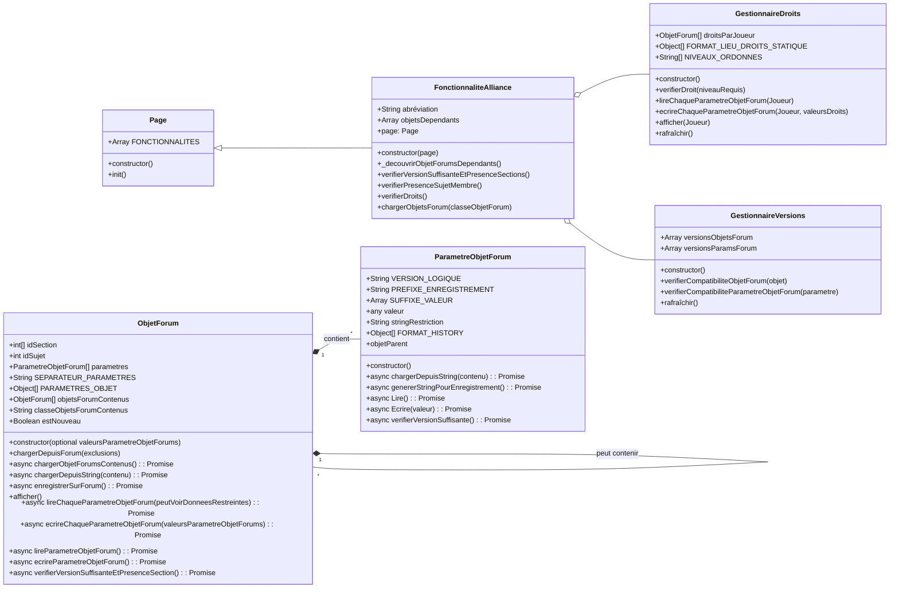

# Refonte framework fonctionnalités alliance

## Objectifs
Refondre le coeur de l'extension pour pouvoir développer plus simplement, flexiblement et robustement de nouvelles fonctionnalités d'alliance :
- Mettre en place un système de restrictions par joueur de l’accès à chaque fonctionnalité
- Mettre en place un système de restrictions s'il y a incompatibilité de version

## Fonctionnement Détaillé

Le framework repose sur trois piliers pour assurer la robustesse et la flexibilité des fonctionnalités d'alliance :

1.  **Gestion Centralisée des Droits :** Un `GestionnaireDroits` unique contrôle l'accès de chaque joueur à chaque fonctionnalité.
2.  **Gestion Centralisée des Versions :** Un `GestionnaireVersions` unique valide la compatibilité des formats de données entre l'extension et le forum.
3.  **Découverte Dynamique :** Le système identifie automatiquement les fonctionnalités et leurs dépendances (`ObjetForums`) sans nécessiter de déclaration manuelle, allégeant ainsi le travail de développement.

#### **1. Gestion des Droits et Restrictions**

*   **Niveaux de Droits :**
    *   `A` (Administrateur) : Accès complet.
    *   `N` (Normal) : Accès standard, peut voir les données restreintes des autres joueurs.
    *   `R` (Restreint) : Accès limité, peut voir uniquement les données *non restreintes* de tous les joueurs.
    *   `B` (Bloqué) : Aucun accès.

#### **2. Architecture des Classes**

> #### **Nouvelle Classe Mère : `Page`**
>
> Pour optimiser les vérifications répétitives, une classe de base `Page` est introduite.
> *   **Rôle :** Servir de conteneur pour les fonctionnalités et de cache pour les données partagées à l'échelle d'une page.



#### **3. Processus Clés**

##### **Initialisation et Lancement**

Au démarrage de l'extension, une fonction globale (`initialiserFrameworkGlobal`) construit un registre de toutes les classes `ObjetForum` et `FonctionnaliteAlliance` et prépare les gestionnaires centraux (`GestionnaireDroits`, `GestionnaireVersions`). Au chargement d'une page du forum, la classe `Page` correspondante s'assure que cet état global est valide, puis instancie et initialise les fonctionnalités d'alliance dont elle a besoin.

##### **Séquence de Vérification d'une Fonctionnalité**

Avant de s'exécuter, chaque `FonctionnaliteAlliance` suit une séquence de validation stricte pour garantir la robustesse :
1.  **Vérification des Versions et Dépendances :** Elle vérifie récursivement la compatibilité de tous les `ObjetForums` dont elle dépend. Pour chaque objet, la validation couvre la présence de sa section sur le forum, la version de sa logique, le format de ses paramètres et la compatibilité de ses objets contenus.
2.  **Présence du Joueur :** Elle s'assure que le joueur actuel est bien un membre de l'alliance.
3.  **Vérification des Droits :** Elle interroge le `GestionnaireDroits` pour confirmer que le joueur a au minimum le droit 'Restreint' (`R`).

##### **Chargement des Données**

Le framework fournit des méthodes optimisées pour lire les données du forum :
*   **Chargement de Masse (`chargerObjetsForum`) :** Permet de récupérer toutes les instances d'un type d'objet (ex: tous les `Joueur`) en une seule fois, en groupant les requêtes par section du forum.
*   **Chargement Imbriqué (`chargerObjetForumsContenus`) :** Gère le cas où des objets sont contenus dans d'autres (ex: des `Commande` dans un `SujetDeCommandes`).
*   **Mise en Cache :** Un cache au niveau de la `Page` évite de recharger plusieurs fois les mêmes données au sein d'une même page.

##### **Affichage Sécurisé**

Toute méthode d'affichage (`afficher`) doit d'abord vérifier le niveau de droit de l'utilisateur. Elle passe ensuite un indicateur (`peutVoirDonneesRestreintes`) aux méthodes de lecture de données, qui se chargent de retourner soit la valeur réelle, soit une chaîne de restriction, garantissant que la logique de sécurité est appliquée de manière cohérente.

##### **Découverte Dynamique des Dépendances**

Pour éviter la déclaration manuelle et les oublis, le framework s'appuie sur une analyse statique du code. Lorsqu'une `FonctionnaliteAlliance` est initialisée, elle analyse son propre code source (via un Arbre Syntaxique Abstrait - AST) pour identifier de manière fiable toutes les classes `ObjetForum` qu'elle utilise. Ce mécanisme robuste garantit que toutes les dépendances sont automatiquement prises en compte dans les vérifications de version.

##### **Transfert de Sujet**

Une fonction sera ajoutée à la page forum pour permettre le transfert d'un sujet existant vers une nouvelle section. Cette fonction prendra en argument l'ID du sujet à transférer et l'ID de la section de destination.

## Plan d'Implémentation

### **Classe d'Erreur Personnalisée**

Pour une gestion claire des erreurs liées aux restrictions d'accès, une classe d'erreur spécifique est introduite.

```javascript
class ErreurRestriction extends Error {
    constructor(message, donnees = {}) {
        super(message);
        this.name = 'ErreurRestriction';
        this.donnees = donnees; // Contient les données lues jusqu'à présent
    }
}
```

### **Lancement Global**

Pour garantir la robustesse, le framework s'appuie sur une fonction d'initialisation globale unique qui peut être appelée à la fois au démarrage de l'extension et au chargement d'une page.

1.  **Fonction `initialiserFrameworkGlobal()`**
    *   **Rôle :** Centraliser toute la logique de démarrage.
    *   **Actions :**
        a.  Construit le **registre global de classes** en scannant le `manifest.json` pour créer une `Map` de toutes les classes `FonctionnaliteAlliance` et `ObjetForum`.
        b.  Analyse le code d'initialisation pour créer la **"carte des types"** des variables globales (ex: `window.gd` -> `GestionnaireDroits`).
        c.  Crée les instances globales des gestionnaires (`GestionnaireDroits`, `GestionnaireVersions`) et les stocke dans l'objet `window`.
        d.  Initialise les caches globaux (`window.dependancesObjetForumsCache`, `window.cacheObjetForums`).
        e.  Crée la liste des noms de section requis.
    *   Cette fonction est appelée une première fois au démarrage de l'extension.

### **Plan Détaillé : Classe `Page`**

#### **Attributs**

| Nom | Type | Portée | Description | Initialisation |
| :--- | :--- | :--- | :--- | :--- |
| `FONCTIONNALITES` | `Array<Class|Function>` | `static` | **Configuration déclarative.** Liste unifiée contenant des références de méthodes (fonctionnalités locales) et des classes `FonctionnaliteAlliance`. L'ordre de cette liste dicte l'ordre d'exécution. Doit être surchargée par la classe fille. | `[]` |

#### **Méthodes**

##### **1. `init()`**

*   **Signature :** `async init(): Promise<void>`
*   **Objectif :** Orchestrer l'initialisation séquentielle de toutes les fonctionnalités déclarées dans la liste statique `FONCTIONNALITES`.
*   **Logique Détaillée :**
    1.  **Initialisation des Fonctionnalités d'Alliance :**
        a.  Appeler `await window.gestionnaireVersions.verifierPresenceSectionVersions()`. Stocker le résultat dans un flag.
        b.  Si le flage est à true, l'instance globale de `GestionnaireVersions` est rafraîchie : `await window.gestionnaireVersions.rafraichir();`.
    2.  La méthode parcourt la liste statique `this.constructor.FONCTIONNALITES`.
        2.  Pour chaque `item` de la liste :
            a.  Elle vérifie le type de l'`item`.
            b.  **Si c'est une fonction** (une méthode locale), elle l'exécute dans le contexte de l'instance de la page : `await item.call(this);`.
            c.  **Si c'est une classe** qui hérite de `FonctionnaliteAlliance`, si le flag est à true, elle l'instancie en se passant elle-même en référence (`const instance = new item(this);`) puis appelle sa méthode d'initialisation asynchrone : `await instance.init();`.

##### **2. `estAdminFourmizzz()`**

*   **Signature :** `estAdminFourmizzz(): boolean`
*   **Objectif :** Récupérer le statut d'administrateur Fourmizzz ou non. Renvoie false par défaut, à surcharger dans les classes filles avec la manière de déterminer cela.

### **Plan Détaillé : Classe `FonctionnaliteAlliance`**

#### **Attributs**

| Nom | Type | Portée | Description |
| :--- | :--- | :--- | :--- |
| `ABREVIATIONS_HISTORY` | `Array<String>` | `static` | **Configuration déclarative.** Liste des abréviations de la fonctionnalité, de la plus ancienne à la plus récente. Doit être surchargée dans la classe fille. |
| `objetsDependants` | `Array<ObjetForum>` | `instance` | Liste des instances des classes `ObjetForum` utilisées par la fonctionnalité. |
| `page` | `Page` | `instance` | Référence à l'instance de la page qui a créé cette fonctionnalité. |

#### **Méthodes**

##### **1. `constructor(page)`**

*   **Signature :** `constructor(page: Page)`
*   **Objectif :** Effectuer l'initialisation **synchrone** de la fonctionnalité.
*   **Logique Détaillée :**
    1.  Le constructeur reçoit une référence à son instance de page parente et la stocke : `this.page = page;`.

##### **2. `init()`**

*   **Signature :** `async init(): Promise<Boolean>`
*   **Objectif :** Gérer la séquence d'initialisation **asynchrone** de la fonctionnalité.
*   **Logique Détaillée :**
    1.  Débuter la séquence de vérification dans un bloc `try...catch` pour gérer les erreurs potentielles.
    2.  Appeler `this.verifierVersionSuffisanteEtPresenceSections()`. Si la méthode retourne `false`, arrêter l'exécution et retourner `false`.
    3.  Si succès, appeler `await this.verifierPresenceSujetMembre()`. Si `false`, arrêter l'exécution et retourner `false`.
    4.  Si succès, appeler `await this.verifierDroits()`. Si `false`, arrêter l'exécution et retourner `false`.
    5.  Si toutes les vérifications réussissent, appeler une méthode `run()` (qui sera implémentée par la classe fille) pour démarrer la logique métier spécifique.
    6.  Retourner `true` pour indiquer que l'initialisation a réussi.
    7.  En cas d'échec dans le `try...catch`, retourner `false`.

##### **2. `_decouvrirObjetForumsDependants()` (Méthode privée)**

*   **Signature :** `_decouvrirObjetForumsDependants(): void`
*   **Logique Détaillée :**
    1.  **Vérification du Cache Global :**
        a.  Récupère le nom de la classe de la fonctionnalité (ex: `'SystemeDeCommerce'`).
        b.  Si ce nom existe comme clé dans `window.dependancesObjetForumsCache`, peuple `this.objetsDependants` avec les instances du cache et termine.
    2.  **Découverte par Analyse Statique (si non trouvé dans le cache) :**
        a.  **Prérequis :** Au démarrage de l'extension, une **"carte des types"** a été créée en analysant les initialisations globales (ex: `window.gd = new GestionnaireDroits()`), mappant les variables globales à leur nom de classe (`'window.gd'` -> `'GestionnaireDroits'`).
        b.  **Analyse AST :**
            i.  Récupère et concatène les codes sources de la classe de la fonctionnalité et de sa classe mère.
            ii. Utilise une bibliothèque de parsing (ex: `acorn`) pour générer un Arbre Syntaxique Abstrait (AST).
            iii. Parcourt l'AST pour collecter tous les `Identifiants` (noms de variables/classes) dans un `Set` pour garantir l'unicité.
        c.  **Résolution et Validation :**
            i.  Initialise une liste temporaire `let dependancesTrouvees = new Set()`.
            ii. Parcourt les identifiants collectés. Pour chaque `nomTrouve` :
                -   Vérifie si `nomTrouve` est une clé dans le registre global des classes `ObjetForum`. Si oui, ajoute le nom de la classe à `dependancesTrouvees`.
                -   Vérifie si `nomTrouve` correspond à une variable globale dans la "carte des types". Si oui, récupère le nom de la classe correspondant et l'ajoute à `dependancesTrouvees` s'il constitue une clé dans le registre global des classes `ObjetForum`.
        d.  **Instanciation :**
            i.  Crée une liste `let instancesDependances = []`.
            ii. Pour chaque nom de classe unique dans `dependancesTrouvees` :
                - Récupère son constructeur `ClasseDependance` depuis le registre.
                - **Vérifie l'existence d'une instance globale** (ex: `window.gestionnaireDroits`). Si une instance globale de `ClasseDependance` existe (par convention, nommée en camelCase, ex: `gestionnaireDroits`), elle est ajoutée à `instancesDependances`.
                - Sinon, une nouvelle instance est créée (`new ClasseDependance(this)`) et ajoutée à la liste.
    3.  **Mise en Cache et Utilisation :**
        a.  Stocke la liste `instancesDependances` dans le cache global : `window.dependancesObjetForumsCache.set(nomClasse, instancesDependances);`.
        b.  Peuple `this.objetsDependants` avec le contenu de `instancesDependances`.

##### **3. `verifierVersionSuffisanteEtPresenceSections()`**

*   **Signature :** `verifierVersionSuffisanteEtPresenceSections(): Boolean`
*   **Logique Détaillée :**
    1.  Appeler `this._decouvrirObjetForumsDependants()` pour peupler la liste des dépendances.
    2.  Parcourir chaque `objet` dans le tableau `this.objetsDependants`.
    3.  Pour chaque `objet`, appeler sa méthode `objet.verifierVersionSuffisanteEtPresenceSection()`.
    4.  Si l'un de ces appels retourne `false`, la boucle s'interrompt et la méthode retourne immédiatement `false`.
    5.  Si la boucle se termine sans échec, la méthode retourne `true`.

##### **4. `verifierPresenceSujetMembre()`**

*   **Signature :** `async verifierPresenceSujetMembre(): Promise<Boolean>`
*   **Objectif :** Vérifier si le joueur a un sujet membre en utilisant la liste des joueurs mise en cache.
*   **Logique Détaillée :**
    1.  **Chargement des Joueurs :**
        a.  La méthode appelle `await this.chargerObjetsForum(Joueur)` pour obtenir la liste des joueurs de l'alliance. Grâce au cache, cette opération ne contactera le forum que la première fois.
    2.  **Vérification :**
        a.  Elle récupère le pseudo du joueur actuel depuis les variables globales de l'extension.
        b.  Elle cherche une correspondance pour ce pseudo dans la liste des joueurs chargée.
    3.  **Retour :**
        a.  Retourne `true` si une correspondance est trouvée, `false` sinon.

##### **5. `rafraichirDroits()`**

*   **Signature :** `async rafraichirDroits(): Promise<void>`
*   **Objectif :** Encapsuler l'appel au rafraîchissement du gestionnaire de droits, en lui passant la référence à l'instance de la fonctionnalité actuelle. Conforme au principe de ne pas exposer les détails d'implémentation des appels externes.
*   **Logique Détaillée :**
    1.  Appelle `await window.GestionnaireDroits.rafraichir(this)`.

##### **6. `verifierDroit(niveauRequis)`**

*   **Signature :** `verifierDroit(niveauRequis: String): Boolean`
*   **Objectif :** Encapsuler l'appel au gestionnaire de droits pour vérifier un niveau de droit spécifique, en ajoutant automatiquement l'abréviation de la fonctionnalité. Cette méthode est destinée à être utilisée par les classes filles pour leurs logiques de droits internes.
*   **Logique Détaillée :**
    1.  Récupérer l'abréviation la plus récente de la fonctionnalité : `const abrev = this.constructor.ABREVIATIONS_HISTORY[this.constructor.ABREVIATIONS_HISTORY.length - 1];`.
    2.  Appeler `window.GestionnaireDroits.verifierDroit(abrev, niveauRequis)`.
    3.  Retourner directement le résultat booléen de cet appel.

##### **7. `verifierDroits()`**

*   **Signature :** `async verifierDroits(): Promise<Boolean>`
*   **Objectif :** Vérifier que le joueur a les droits suffisants pour l'initialisation de la fonctionnalité.
*   **Logique Détaillée :**
    1.  Appeler `await this.rafraichirDroits()`.
    2.  Appeler `this.verifierDroit(this.constructor.NIVEAU_DROIT_REQUIS)` pour s'assurer que le joueur a le droit minimum Outiiil requis pour utiliser la fonctionnalité.
    3.  Appeler `this.page.estAdminFourmizzz` pour récupérer le statut éventuel d'admin Fourmizzz
    3.  Retourner le résultat du ou logique de ces appels.

##### **8. `chargerObjetsForum(ClasseObjetForum)`**

*   **Signature :** `async chargerObjetsForum(ClasseObjetForum: new () => T, chargerContenus: Boolean = true): Promise<Array<T>>`
*   **Objectif :** Centraliser et optimiser la lecture du forum pour charger en masse toutes les instances d'un type d'objet, en utilisant un cache au niveau de la page pour éviter les chargements redondants.
*   **Logique Détaillée :**
    1.  **Vérification du Cache :**
        a.  Récupère le nom de la classe demandée : `const nomClasse = ClasseObjetForum.name;`.
        b.  Vérifie si une entrée pour cette classe existe déjà dans le cache de la page : `if (cacheObjetForums.has(nomClasse))`.
        c.  Si c'est le cas, la méthode retourne immédiatement la liste d'objets depuis le cache : `return cacheObjetForums.get(nomClasse);`.

    2.  **Initialisation du Chargement (si non trouvé dans le cache) :**
        a.  Initialise `let objetsCharges = [];` et `let tousLesSujets = [];`.

    3.  **Récupération des Sections :**
        a.  Crée une instance temporaire `new ClasseObjetForum()` pour accéder à sa configuration statique.
        b.  Récupère la liste complète des IDs de section depuis `instance.idsSection`. Si la liste est vide, retourne un tableau vide.

    4.  **Lecture Groupée du Forum :**
        a.  Parcourt chaque `idSection` dans la liste récupérée.
        b.  Pour chaque ID, appelle `Utils.recupererSujetsSection(idSection)` pour obtenir la liste des sujets.
        c.  La méthode `recupererSujetsSection` retourne déjà une liste de sujets contenant `{id, derniere_activite, contenu}`.
        d.  Concatène les sujets récupérés à la liste `tousLesSujets`.

    5.  **Boucle de Chargement en Mémoire :**
        a.  Parcourt la liste agrégée `tousLesSujets`.
        b.  Pour chaque `sujet` :
            i.  Crée une nouvelle instance en passant la référence de la fonctionnalité actuelle et un objet d'options contenant l'id du sujet : `let instance = new ClasseObjetForum(this, { idSujet: parseInt(sujet.id, 10) });`.
            ii. `const chargementReussi = await instance.rafraîchir(chargerContenus);`
            iii. **Si le chargement réussit :**
                -   **Transfert du sujet si nécessaire :**
                    -   Récupère le dernier ID de section de l'objet : `const idDerniereSection = instance.idsSection[instance.idsSection.length - 1];`.
                    -   Si l'ID de la section actuelle du sujet (`idSection`) est différent de `idDerniereSection` :
                        -   Appelle `await Utils.transfererSujet(instance.idSujet, idDerniereSection);`.
                -   Ajoute l'instance au tableau `objetsCharges`.

    6.  **Mise en Cache et Retour :**
        a.  Une fois le chargement terminé, la méthode stocke la liste nouvellement créée dans le cache de la page : `cacheObjetForums.set(nomClasse, objetsCharges);`.
        b.  Retourne le tableau `objetsCharges` complet.

### **Plan Détaillé : Classe `ObjetForum`**

#### **Attributs**

| Nom | Type | Portée | Description | Initialisation |
| :--- | :--- | :--- | :--- | :--- |
| `VERSION_LOGIQUE` | `String` | `static` | **Configuration déclarative.** Version de la logique de fonctionnement de l'objet. Ex: `'1.0'`. Doit être surchargée dans chaque classe fille si l'objet est versionné. | `null` |
| `SEPARATEUR_PARAMETRES` | `String` | `static` | **Configuration déclarative.** Séparateur à utiliser entre les chaînes de paramètres lors de l'enregistrement. | `''` |
| `PARAMETRES_OBJET` | `Array<Array<Class>>` | `static` | **Configuration déclarative.** Liste de listes des classes de `ParametreObjetForum`. Chaque liste interne représente les paramètres utilisés par une version spécifique de l'objet, de la plus ancienne à la plus récente. Doit être surchargée dans chaque classe fille. | `[]` (tableau vide). |
| `LOCATION_HISTORY` | `Array<Object>` | `static` | **Configuration déclarative.** Historique des lieux de stockage de l'objet. Chaque élément est un dictionnaire : `{section: 'nom_section', lieu: 'titre' ou 'message'}`. Doit être surchargé dans chaque classe fille. | `[]` |
| `parametres` | `Array<ParametreObjetForum>` | `instance` | Conteneur des instances de `ParametreObjetForum`, peuplé par le constructeur. | `[]` (tableau vide). |
| `idsSection` | `Array<Number>` | `instance` | Liste des IDs de section où les données de cet objet peuvent être trouvées. | `[]` (tableau vide). |
| `idSujet` | `Number` | `instance` | L'ID du sujet spécifique sur le forum contenant les données de l'instance. | `null`. |
| `idMessage` | `Number` | `instance` | L'id du message spécifique dans le sujet contenant les données de l'instance. | `null`. |
| `objetsForumContenus` | `Array<ObjetForum>` | `instance` | Liste d'autres instances d'`ObjetForum` imbriquées. | `[]` (tableau vide). |
| `mapParametreObjetForums` | `Map<String, ParametreObjetForum>` | `instance` | Cache pour un accès rapide aux paramètres par n'importe quel de leurs noms. | `new Map()` |
| `classeObjetsForumContenus` | `Class` | `static` | Spécifie le type d'objet contenu. | `null`. |
| `estModifie` | `Boolean` | `getter/setter` | Indique si l'objet a été modifié depuis son dernier chargement/enregistrement. Le getter retourne le OU logique des `estModifie` des paramètres de la dernière version de l'objet. Le setter (appelé avec `false`) remet à `false` les `estModifie` des paramètres de la dernière version de l'objet. | N/A |
| `fonctionnaliteCreatrice` | `FonctionnaliteAlliance` | `instance` | Référence à l'instance de la fonctionnalité qui a créé cet objet. | `null`. |
| `objetParent` | `ObjetForum` | `instance` | Référence à l'instance de l'objet qui a créé cet objet. | `null`. |
| `_readerCount` | `Number` | `instance` | Compteur de lecteurs actifs. | `0` |
| `_writerWaiting` | `Boolean` | `instance` | Indique si un writer est en attente d'acquérir le verrou. | `false` |
| `_writerCount` | `Number` | `instance` | Compteur de writers actifs. | `0` |
| `_readerQueue` | `Array<Function>` | `instance` | File d'attente pour les lecteurs en attente. | `[]` |
| `_writerQueue` | `Array<Function>` | `instance` | File d'attente pour les writers en attente. | `[]` |

#### **Méthodes**

##### **1. `constructor()`**

*   **Signature :** `constructor(fonctionnaliteCreatrice, options = {})`
*   **Objectif :** Initialiser l'objet, stocker ses références et optionnellement, peupler ses paramètres avec des valeurs fournies via un objet d'options.
*   **Logique Détaillée :**
    1.  **Stockage des Références :** Le constructeur stocke la référence `this.fonctionnaliteCreatrice = fonctionnaliteCreatrice;`. Les autres références sont extraites de l'objet `options` : `this.objetParent = options.objetParent || null;`, `this.idSujet = options.idSujet || null;`, `this.idMessage = options.idMessage || null;`.
    2.  **Vérification de la Configuration :** Le constructeur accède à la propriété statique `PARAMETRES_OBJET` de la classe fille. Il s'attend à ce que ce soit une liste de listes.

    2.  **Création de la liste unique de paramètres :**
        a.  Il aplatit la liste de listes (`PARAMETRES_OBJET`) en un seul tableau contenant toutes les classes de paramètres de toutes les versions.
        b.  Il supprime les doublons de ce tableau pour obtenir une liste unique de toutes les classes de `ParametreObjetForum` que l'objet peut potentiellement utiliser, quelle que soit la version.

    3.  **Instanciation et Liaison des Paramètres :** Le constructeur parcourt cette **liste unique**. Pour chaque `ClasseDeParametreObjetForum`, il effectue la séquence suivante pour assurer une liaison correcte :
        a.  Il instancie le paramètre en lui passant la référence de l'objet conteneur : `const nouveauParametreObjetForum = new ClasseDeParametreObjetForum(this);`.
        b.  Il ajoute le paramètre fraîchement lié à sa liste interne : `this.parametres.push(nouveauParametreObjetForum);`.
        c.  **Mise en cache des noms :** Il parcourt le `FORMAT_HISTORY` du `nouveauParametreObjetForum` et ajoute chaque `nom` historique à la `mapParametreObjetForums` de l'objet, avec une référence au `nouveauParametreObjetForum`. Cela accélère considérablement les recherches futures.
            ```javascript
            nouveauParametreObjetForum.constructor.FORMAT_HISTORY.forEach(format => {
                this.mapParametreObjetForums.set(format.nom, nouveauParametreObjetForum);
            });
            ```
            **Note :** Le `FORMAT_HISTORY` est généré dynamiquement dans le constructeur de `ParametreObjetForum` à partir de `NAME_HISTORY` et `FORMATS`.

    4.  **Initialisation Attributs et Peuplement Optionnel des Paramètres et Attributs :**
        a.  Le constructeur crée les attributs dans `ATTRIBUTS_OBJET` et leur affecte leur valeur initiale
        a.  Il vérifie si `options.donneesInitiales` a été fourni et s'il s'agit bien d'un objet.
        b.  Si c'est le cas, il regarde pour chaque donnée initiale si elle correspond à un attribut
        c.  Si c'est le cas, il utilise le setter associé si existant, sinon il affecte directement à l'attribut
        b.  Si la donnée initiale correpsond à un paramètre, il appelle `this.ecrireObjetForum(options.donneesInitiales)` pour peupler les paramètres qui viennent d'être instanciés avec les valeurs fournies.

    5.  **Initialisation des IDs de Section :** Le constructeur accède à la propriété statique `LOCATION_HISTORY` de la classe fille, convertit les noms de section en IDs numériques, et stocke ces IDs uniques dans le tableau `this.idsSection`.


Le constructeur de la classe fille se résume alors à une unique instruction : `super(this, options)`, qui déclenche toute cette logique.

##### **2. `verifierVersionSuffisanteEtPresenceSection()`**

*   **Signature :** `async verifierVersionSuffisanteEtPresenceSection()`
*   **Objectif :** Orchestrer la validation de l'objet et de ses dépendances (paramètres, objets contenus).
*   **Logique Détaillée :**
    1.  **Acquisition du verrou de lecture :** `await this._acquireReadLock();`
    2.  **Vérification du cache :** Si `window.sectionsEnCache` existe et contient le résultat pour l'ID de section, retourne la valeur mise en cache.
    3.  **Validation de la Présence de la Section :**
        a.  Si `this.idsSection` n'est pas vide, la méthode tente de consulter la section correspondante au dernier ID de section via `Utils.consulterSection()`. Si cette consultation lève une erreur, ou le titre de la section retourné ne correspond pas à celui attendu, la section est considérée comme invalide et la méthode retourne `false`.
        b. **Mise en cache du résultat :** Le résultat de la validation est stocké dans `window.sectionsEnCache` pour l'ID de section.

    3.  **Validation des Paramètres :**
        a.  La méthode parcourt `this.parametres` et appelle `parametre.verifierVersionSuffisante()` pour chacun.
        b.  Cette étape garantit que toutes les définitions de version des paramètres sont créées/mises à jour sur le forum et que le cache du `GestionnaireVersions` est peuplé avec leurs `idSujet` respectifs.
        c.  Si un seul de ces appels retourne `false`, la méthode retourne immédiatement `false`.

    4.  **Validation de l'ObjetForum lui-même (Exécutée après les paramètres) :**
        a.  La méthode vérifie si l'objet est un objet versionné (`this.constructor.VERSION_LOGIQUE`, `this.constructor.LOCATION_HISTORY` et `this.constructor.PARAMETRES_OBJET` sont définis).
        b.  **Si c'est le cas**, elle appelle `window.gestionnaireVersions.verifierCompatibiliteObjetForum(this)`. Si cet appel retourne `false`, la méthode retourne `false`.
        c.  **Sinon**, cette étape est sautée.

    5.  **Validation Récursive des ObjetForums Contenus :**
        a.  Si les validations précédentes ont réussi et que `classeObjetsForumContenus` est défini, la méthode appelle récursivement la vérification sur une instance du sous-objet.
        b.  Si cet appel retourne `false`, la méthode retourne `false`.

    6.  **Résultat Final :**
        a.  Retourne `true` si toutes les étapes ont réussi.
    
    7.  **Libération du verrou de lecture :** Dans le bloc `finally`, `this._releaseReadLock();` est appelé.

##### **3. `rafraîchir()`**

*   **Signature :** `async rafraichir(chargerContenus = true): Promise<Boolean>`
*   **Objectif :** Mettre à jour (rafraîchir) une instance d'objet **déjà identifiée** (dont `idSujet` est connu) en lisant uniquement le titre du sujet correspondant.
*   **Prérequis :**
    *   L'attribut `this.idSujet` doit être un entier positif.
    *   L'objet doit être un objet conteneur, dont les données sont stockées dans le titre d'un sujet.
*   **Logique Détaillée :**
    1.  **Acquisition du verrou de lecture :** `await this._acquireReadLock();`
    2.  **Bloc `try...finally` :**
        a.  **Vérification des prérequis :** Si `this.idSujet` est `null` ou invalide, la méthode retourne `false`.
        b.  **Lecture du Titre et des Messages :**
            i.  Appelle `const { titre, messages } = await Utils.consulterSujetAvecMessagesEtIds(this.idSujet);`.
            ii. Si la lecture échoue, retourne `false`.
        c.  **Délégation au Parsing du Titre :**
            i.  `const titreCharge = await this.chargerDepuisString(titre);`
            ii. Si `titreCharge` est `false`, retourne `false`.
        d.  **Chargement des Objets Contenus (si pertinent) :**
            i.  Si `chargerContenus` est `true` :
                -   `const contenusCharges = await this.chargerObjetForumsContenus(messages);`
                -   Si `contenusCharges` est `false`, retourne `false`.
        e.  **Chargement des attributs de la classe fille :**
            i.  Invoque `completerRafraichissement()`
            ii. Si la fonction retourne `false`, retourne `false`.
        f.  **Retour Final :** Retourne `true`.
    3.  **Libération du verrou de lecture :** Dans le bloc `finally`, `this._releaseReadLock();` est appelé.

##### **4. `chargerObjetForumsContenus()`**

*   **Signature :** `protected async chargerObjetForumsContenus(messages): Promise<Boolean>`
*   **Objectif :** Peupler le tableau `this.objetsForumContenus` en transformant les messages fournis en instances d'un sous-objet.
*   **Prérequis :**
    1.  L'objet principal (celui qui appelle cette méthode) doit déjà avoir été chargé et posséder un `idSujet` valide.
    2.  La liste des `messages` doit être fournie.
*   **Logique Détaillée :**
    1.  **Acquisition du verrou de lecture :** `await this._acquireReadLock();`
    2.  **Bloc `try...finally` :**
        a.  **Vérification des Prérequis :**
            i.  La méthode vérifie que `this.constructor.classeObjetsForumContenus` est une classe valide héritant d'`ObjetForum`. Si ce n'est pas le cas, la méthode retourne `false`.

        b.  **Synchronisation et Chargement :**
            i.  Initialise `const nouveauxObjetForumsContenus = [];`.
            ii. Crée une `Map` des objets existants par leur `idMessage` pour une réutilisation basée sur l'ID : `const objetsExistantsMap = new Map(this.objetsForumContenus.map(obj => [obj.idMessage, obj]));`.
            iii. La méthode itère sur les `messages` trouvés. Pour chaque `message` :
                -   Elle extrait son `idMessage` directement depuis `message.id`.
                -   Elle tente de réutiliser un objet existant avec cet `idMessage` depuis `objetsExistantsMap`. Si aucun n'existe, elle en crée un nouveau en passant les références parentes : `new this.constructor.classeObjetsForumContenus(this.fonctionnaliteCreatrice, {objetParent:this, idMessage:message.id})`.
                -   `const chargementReussi = await instance.chargerDepuisString(message.contenu);`
                -   Si `chargementReussi` est `false`, la méthode retourne `false`.
                -   Si le chargement réussit, elle l'ajoute à `nouveauxObjetForumsContenus`.
            iv. **Remplacement :** Une fois tous les messages traités, la liste `this.objetsForumContenus` est complètement remplacée par la nouvelle liste synchronisée. Les objets dont les messages n'existent plus sont ainsi automatiquement supprimés.
        v.  **Retour Final :** Retourne `true`.
    3.  **Libération du verrou de lecture :** Dans le bloc `finally`, `this._releaseReadLock();` est appelé.

##### **5. `chargerDepuisString(contenu)`**

*   **Signature :** `protected async chargerDepuisString(contenu): Promise<Boolean>`
*   **Objectif :** Orchestrateur central du chargement à partir d'une chaîne. Peuple les paramètres de l'objet.
*   **Logique Détaillée :**
    1.  **Acquisition du verrou de lecture :** `await this._acquireReadLock();`
    2.  **Bloc `try...catch` :**
        a.  **Chargement des Paramètres Propres :**
            i.  La méthode parcourt `this.parametres` et appelle `parametre.chargerDepuisString(contenu)` pour chacun.
        b.  **Validation du Chargement :**
            i.  La méthode appelle `this._determinerVersionChargee()` pour identifier la version des paramètres chargés.
            ii. Elle crée un `Set` des classes de tous les paramètres qui ont été chargés avec succès (en se basant sur leur flag `estCharge`).
            iii. Si l'ensemble des paramètres chargés est vide (`classesChargees.size === 0`) ou si `_determinerVersionChargee()` retourne `-1` (aucune correspondance exacte avec une version), la méthode retourne `false`.
            c.  **Succès du Chargement Principal :**
                i.  L'état `estModifie` des paramètres individuels est géré par `ParametreObjetForumFramework.chargerDepuisString`. L'objet principal est considéré comme chargé avec succès.
        d.  **Migration des Données Anciennes :**
            i.  La méthode appelle `this.completerChargementPourVersionsAnterieures()` pour s'assurer que les données chargées sont migrées vers le format le plus récent.
        e.  **Retour Final :** La méthode retourne `true`, indiquant que l'objet a été chargé avec succès.
    3.  **Gestion des erreurs :** En cas d'erreur, la méthode retourne `false`.
    4.  **Libération du verrou de lecture :** Dans le bloc `finally`, `this._releaseReadLock();` est appelé.

##### **6. `afficher()`**

*   **Objectif :** Générer directement les chaînes de caractères HTML pour l'en-tête (`<thead>`) et le corps (`<tbody>`) d'un tableau, en respectant l'ordre des colonnes spécifié.
*   **Signature :** `afficher(liste = null)`
*   **Logique Détaillée :**
    1.  **Vérification des Droits et Lecture des Données :**
        a.  Appelle le `GestionnaireDroits` pour savoir si l'utilisateur peut voir les données restreintes (`peutVoirDonneesRestreintes`).
        b.  Appelle `this.lireChaqueParametre(peutVoirDonneesRestreintes, liste)` pour obtenir un dictionnaire des données sécurisées.
        c.  **Gestion des restrictions :** La méthode `lireChaqueParametre` peut lever une `ErreurRestriction` si des données sont restreintes. Cette erreur doit être capturée pour récupérer les données partielles (contenant les chaînes de restriction) et continuer l'affichage.
        d.  Appelle `completerAffichage(donnees)` pour ajouter les données des attributs de la classe fille.
    2.  **Détermination de l'Ordre d'Affichage :**
        a.  Initialise `let ordreAffichage;`.
        b.  Si `liste` est fournie, `ordreAffichage = liste;`.
        c.  Sinon (ordre par défaut) :
                i.  `ordreAffichage` est construit en récupérant les noms d'affichage les plus récents des paramètres de la **dernière version** de l'objet.
                ```javascript
                const classesDerniereVersion = this.constructor.PARAMETRES_OBJET[this.constructor.PARAMETRES_OBJET.length - 1];
                const mapClasseInstance = new Map(this.parametres.map(p => [p.constructor, p]));
                ordreAffichage = classesDerniereVersion.map(classe => {
                    const p = mapClasseInstance.get(classe);
                    return p.constructor.getNomAffichage();
                });
                ```
                ii. Les clés supplémentaires de `donnees` qui ne sont pas déjà dans `ordreAffichage` sont ajoutées.
    3.  **Construction de l'En-tête HTML (`en_tete_html`) :**
        a.  Initialise `let en_tete_html = '<tr>';`.
        b.  Parcourt `ordreAffichage`. Pour chaque `nomParametre` :
            i.  Si le paramètre n'existe pas dans les données, ajoute une cellule d'en-tête vide `<th></th>`.
            ii. Sinon, récupère la `valeur` du paramètre.
            iii. Si `valeur` est un tableau, ajoute une cellule d'en-tête `<th>` avec un attribut `colspan` égal à la longueur du tableau (ou `1` si le tableau est vide).
            iv. Sinon, ajoute une cellule d'en-tête simple `<th>`.
        c.  Finalise la chaîne : `en_tete_html += '</tr>';`.
    4.  **Construction du Corps HTML (`corps_html`) :**
        a.  Initialise `let corps_html = '<tr>';`.
        b.  Parcourt `ordreAffichage`. Pour chaque `nomParametre` :
            i.  Si le paramètre n'existe pas dans les données, ajoute une cellule de données vide `<td></td>`.
            ii. Sinon, récupère la `valeur` du paramètre.
            iii. Si `valeur` est un tableau, parcourt chaque élément et ajoute une cellule de données `<td>` pour chacun. Si le tableau est vide, ajoute une seule cellule vide.
            iv. Sinon, ajoute une cellule de données simple `<td>` avec la valeur.
            v. Les valeurs `null` ou `undefined` sont affichées comme des chaînes vides.
        c.  Finalise la chaîne : `corps_html += '</tr>';`.
    5.  **Retour :** Retourne l'objet `{ en_tete_html: en_tete_html, corps_html: corps_html }`.
*   **Note sur la personnalisation :**
    *   Une classe fille pourra surcharger cette méthode pour insérer des éléments interactifs (comme des `<select>`) dans les cellules du `corps_html` au lieu de simple texte.

##### **7. `_invoquerCalculSecurise(methodeCalcul)` (Méthode protégée)**

*   **Signature :** `async _invoquerCalculSecurise(methodeCalcul: Function): Promise<any>`
*   **Objectif :** Invoquer de manière sécurisée une méthode de calcul d'un attribut dérivé. Gère les droits d'accès et les erreurs de calcul (typiquement dues à des données restreintes).
*   **Logique Détaillée :**
    1.  **Vérification des Droits :** Appelle `this.fonctionnaliteCreatrice.verifierDroit('N')` pour déterminer si l'utilisateur a les droits suffisants pour voir les données normales.
    2.  **Exécution du Calcul :**
        a.  Exécute `await methodeCalcul(peutVoirDonneesRestreintes)` dans un bloc `try...catch`.
        b.  Si le résultat est `NaN`, `null` ou `undefined`, retourne la chaîne `'<i>Incalculable</i>'`.
        c.  Retourne le résultat du calcul.
    3.  **Gestion des Erreurs :** En cas d'erreur (notamment `ErreurRestriction` levée par `lireParametre`), capture l'erreur et retourne la chaîne `'<i>Restreint</i>'`.

##### **8. `lireChaqueParametre(peutVoirDonneesRestreintes, liste)`**

*   **Signature :** `async lireChaqueParametre(peutVoirDonneesRestreintes = true, liste = null)`
*   **Objectif :** Agréger les valeurs des paramètres en un dictionnaire. Garantit que chaque paramètre est unique. Si une `liste` est fournie, la clé est le nom de la liste ; sinon, c'est le nom d'affichage le plus récent.
*   **Logique Détaillée :**
    1.  **Initialisation :** `let donnees = {};` et `let aRencontreRestriction = false;`.
    2.  **Détermination des clés à lire :** Utilise `liste` si fournie, sinon parcourt `this.parametres`.
    3.  **Itération et Lecture :** Pour chaque clé/paramètre :
        a.  Trouve l'instance `parametre` via `this.mapParametres`.
        b.  Appelle `await parametre.Lire(peutVoirDonneesRestreintes)`.
        c.  Si la valeur retournée est `null` (indiquant une restriction) :
            i.  Met `aRencontreRestriction = true;`.
            ii. Peuple le dictionnaire avec la `STRING_RESTRICTION` du paramètre.
        d.  Sinon, peuple le dictionnaire avec la valeur réelle.
    4.  **Gestion de l'Erreur de Restriction :** Si `aRencontreRestriction` est `true`, lève une `ErreurRestriction` en incluant les `donnees` partielles.
    5.  **Retour des Données :** La méthode retourne l'objet `donnees` complet.

##### **9. `ecrireChaqueParametre(donnees)`**

*   **Signature :** `async ecrireChaqueParametre(donnees)`
*   **Objectif :** Mettre à jour rapidement les valeurs des paramètres de l'objet à partir d'un objet clé-valeur.
*   **Logique Détaillée :**
    1.  **Itération sur les Données Fournies :** La méthode parcourt les clés (`nomParametreObjetForum`) de l'objet `donnees`.
    2.  **Recherche et Écriture Rapides :** Pour chaque `nomParametreObjetForum` :
        a.  Elle utilise la `mapParametres` pour trouver le `parametre` correspondant en O(1).
        b.  Si un `parametre` est trouvé, elle appelle `parametre.Ecrire(donnees[nomParametreObjetForum])`.

##### **10. `enregistrerSurForum()`**

*   **Signature :** `async enregistrerSurForum()`
*   **Objectif :** Point d'entrée unique pour écrire l'état de l'objet sur le forum. Gère la création et la mise à jour pour les objets principaux et les objets contenus.
*   **Logique Détaillée :**
    1.  **Acquisition du verrou d'écriture :** `await this._acquireWriteLock();`
    2.  **Bloc `try...finally` :**
        a.  **Vérification de Modification :** Si `this.estModifie` est `false`, l'enregistrement de l'objet principal est sauté.

        b.  **Enregistrement de l'objet principal :**
            i.  **Génération de la chaîne de contenu :**
                -   Récupère la liste des classes de paramètres de la **dernière version** depuis la configuration statique : `const classesDerniereVersion = new Set(this.constructor.PARAMETRES_OBJET[this.constructor.PARAMETRES_OBJET.length - 1]);`.
                -   Filtre les paramètres de l'instance pour ne garder que ceux qui appartiennent à la dernière version : `const parametresAEnregistrer = this.parametres.filter(p => classesDerniereVersion.has(p.constructor));`.
                -   Génère la chaîne `contenuFinal` en appelant `genererStringPourEnregistrement()` sur chaque paramètre dans `parametresAEnregistrer` et en joignant les résultats avec `this.constructor.SEPARATEUR_PARAMETRES`.
            ii. Récupère le `{section, lieu}` le plus récent depuis `LOCATION_HISTORY`.
            iii. **Logique d'écriture selon le `lieu` :**
                -   **Si `lieu` est `'titre'` :**
                    -   Si `this.idSujet` est `null` (création), appelle `Forum.creerSujetEtRetournerId(contenuFinal, '', idSection)`. Stocke le nouvel ID dans `this.idSujet`.
                    -   Sinon (mise à jour), appelle `Forum.modifierSujet(contenuFinal, '', this.idSujet)`.
                -   **Si `lieu` est `'message'` :**
                    -   Si `this.objetParent.idSujet` est `null`, lève une erreur.
                    -   Si `this.idMessage` est `null` (création), appelle `Forum.envoyerMessageEtRetournerId(this.objetParent.idSujet, contenuFinal)`. Stocke le nouvel ID dans `this.idMessage`.
                    -   Sinon (mise à jour), appelle `Forum.modifierMessage(this.idMessage, contenuFinal)`.
            iv. Met `this.estModifie = false;`.

        c.  **Enregistrement des objets contenus :**
            i.  Parcourt `this.objetsForumContenus`.
            ii. Pour chaque `sousObjetForum`, appelle `await sousObjetForum.enregistrerSurForum()`.
    3.  **Libération du verrou d'écriture :** Dans le bloc `finally`, `this._releaseWriteLock();` est appelé.

##### **11. `lireParametre(nomParametre, peutVoirDonneesRestreintes = true)`**

*   **Signature :** `async lireParametre(nomParametre, peutVoirDonneesRestreintes = true)`
*   **Objectif :** Fournir un accès direct et rapide en lecture à la valeur brute d'un paramètre.
*   **Logique Détaillée :**
    1.  **Recherche Rapide via Map :** La méthode utilise la `mapParametres` de l'objet pour trouver le paramètre. Si non trouvé, retourne `null` (ou lève une erreur si le paramètre est inexistant).
    2.  **Lecture Directe :** Appelle `await parametre.Lire(peutVoirDonneesRestreintes)`.
    3.  **Gestion de la Restriction :** Si la valeur retournée par `parametre.Lire` est `null` (indiquant une restriction), lève une `ErreurRestriction` spécifique pour ce paramètre.
    4.  **Retour :** Retourne la valeur du paramètre.

##### **12. `ecrireParametre(nomParametre, valeur)`**

*   **Signature :** `async ecrireParametre(nomParametre, valeur)`
*   **Objectif :** Fournir un accès direct et rapide en écriture à un paramètre.
*   **Logique Détaillée :**
    1.  **Recherche Rapide via Map :** La méthode trouve le paramètre en temps constant : `const parametre = this.mapParametres.get(nomParametre);`.
    2.  **Écriture de la Valeur :** Si un `parametre` est trouvé, elle appelle sa méthode `Ecrire(valeur)`.

##### **13. `_determinerVersionChargee()`**

*   **Signature :** `_determinerVersionChargee()`
*   **Portée :** Protégée (interne à la classe et ses filles).
*   **Objectif :** Analyser les paramètres qui ont été chargés pour déterminer à quelle version de l'objet ils correspondent, en s'assurant d'une correspondance exacte.
*   **Logique Détaillée :**
    1.  **Identifier les Paramètres Chargés :** La méthode commence par créer un `Set` des classes de tous les paramètres qui ont été chargés avec succès (en se basant sur leur flag `estCharge`).
        ```javascript
        const classesChargees = new Set(
            this.parametres
                .filter(p => p.estCharge)
                .map(p => p.constructor)
        );
        ```
    2.  **Vérification de Correspondance Exacte :**
        a.  La méthode parcourt la liste des versions `this.constructor.PARAMETRES_OBJET` (de la plus ancienne à la plus récente).
        b.  Pour chaque `listeParamsVersion` à l'index `i` :
            i.  Elle crée un ensemble des paramètres attendus pour cette version : `const classesDeVersion = new Set(listeParamsVersion);`
            ii. **Elle vérifie l'égalité stricte des deux ensembles :**
                -   La taille des deux ensembles doit être identique (`classesChargees.size === classesDeVersion.size`).
                -   Chaque élément de `classesChargees` doit être présent dans `classesDeVersion`.
            ```javascript
            const estCorrespondanceExacte = (classesChargees.size === classesDeVersion.size) && 
                                           [...classesChargees].every(classe => classesDeVersion.has(classe));
            ```
            iii. Si `estCorrespondanceExacte` est `true`, la méthode a trouvé la version unique et exacte. Elle retourne l'index `i`.
    3.  **Retour par Défaut :** Si la boucle se termine sans trouver de correspondance exacte, la méthode retourne `-1`.

##### **14. `_acquireReadLock()` (Méthode privée)**
*   **Signature :** `async _acquireReadLock()`
*   **Objectif :** Acquérir un verrou de lecture sur l'instance de l'objet. Permet à plusieurs lecteurs de s'exécuter simultanément, mais bloque si un writer est actif ou en attente.
*   **Logique Détaillée :**
    1.  Retourne une nouvelle promesse.
    2.  Une fonction `tryAcquire` est définie :
        a.  **Ré-entrée :** Si `this._readerCount > 0` (un verrou de lecture est déjà détenu par le contexte d'exécution actuel), le compteur est simplement incrémenté et la promesse est résolue immédiatement, permettant la ré-entrée.
        b.  **Blocage :** Sinon, si un writer est actif (`this._writerCount > 0`) ou en attente (`this._writerWaiting`), la fonction `tryAcquire` est ajoutée à la `_readerQueue`.
        c.  **Acquisition :** Dans tous les autres cas, `_readerCount` est incrémenté et la promesse est résolue.
    3.  `tryAcquire` est appelée immédiatement.

##### **15. `_releaseReadLock()` (Méthode privée)**
*   **Signature :** `_releaseReadLock()`
*   **Objectif :** Libérer un verrou de lecture. Si aucun autre lecteur n'est actif et qu'il y a des writers en attente, le prochain writer est notifié.
*   **Logique Détaillée :**
    1.  `_readerCount` est décrémenté.
    2.  Si `_readerCount` est `0` :
        a.  Si `_writerQueue` n'est pas vide, le prochain writer en attente est débloqué.

##### **16. `_acquireWriteLock()` (Méthode privée)**
*   **Signature :** `async _acquireWriteLock()`
*   **Objectif :** Acquérir un verrou d'écriture sur l'instance de l'objet. Bloque les lecteurs mais permet à plusieurs writers de s'exécuter simultanément.
*   **Logique Détaillée :**
    1.  Retourne une nouvelle promesse.
    2.  Une fonction `tryAcquire` est définie :
        a.  Si des lecteurs sont actifs (`this._readerCount > 0`), `this._writerWaiting` est mis à `true` (indiquant qu'un writer est en attente) et `tryAcquire` est ajoutée à la `_writerQueue`.
        b.  Sinon, `this._writerCount` est incrémenté. Le flag `_writerWaiting` est mis à jour pour refléter si d'autres writers sont encore en attente dans la queue (`this._writerQueue.length > 0`). La promesse est résolue.
    3.  `tryAcquire` est appelée immédiatement.

##### **17. `_releaseWriteLock()` (Méthode privée)**
*   **Signature :** `_releaseWriteLock()`
*   **Objectif :** Libérer un verrou d'écriture. Notifie les lecteurs ou le prochain writer en attente si aucun writer n'est actif.
*   **Logique Détaillée :**
    1.  `this._writerCount` est décrémenté.
    2.  Si `this._writerCount` est `0` (le dernier writer a libéré son verrou) :
        a.  Le flag `_writerWaiting` est mis à jour pour refléter si des writers sont encore en attente dans la queue (`this._writerQueue.length > 0`).
        b.  Si `_readerQueue` n'est pas vide, tous les lecteurs en attente sont débloqués.
        c.  Sinon, si `_writerQueue` n'est pas vide, le prochain writer en attente est débloqué.

##### **18. `completerChargementPourVersionsAnterieures()`**

*   **Signature :** `completerChargementPourVersionsAnterieures()`
*   **Portée :** Publique, destinée à être surchargée dans les classes filles.
*   **Objectif :** Contenir la logique de migration pour calculer les valeurs des paramètres des versions récentes à partir des données d'une version plus ancienne qui a été chargée. La méthode de la classe mère `ObjetForum` est vide.
*   **Exemple d'implémentation dans une classe fille :**
    ```javascript
    completerChargementPourVersionsAnterieures() {
        let versionActuelle = this._determinerVersionChargee();
        const versionCible = this.constructor.PARAMETRES_OBJET.length - 1;

        // Boucle tant que nous n'avons pas atteint la dernière version
        while (versionActuelle < versionCible && versionActuelle !== -1) {
            switch (versionActuelle) {
                case 0:
                    // Logique pour migrer de la v0 à la v1
                    console.log('Migration de v0 à v1...');
                    // ... mettre à jour les paramètres de la v1 ...
                    break; // On sort du switch pour la v0

                case 1:
                    // Logique pour migrer de la v1 à la v2
                    console.log('Migration de v1 à v2...');
                    // ... mettre à jour les paramètres de la v2 ...
                    break; // On sort du switch pour la v1
            }
            
            // Incrémenter la version pour la prochaine itération de la boucle
            versionActuelle++; 
        }
    }
    ```

##### **19. `completerAffichage()`**

*   **Signature :** `completerAffichage(donnees)`
*   **Portée :** Protégée, destinée à être surchargée dans les classes filles.
*   **Objectif :** Contenir la logique d'ajout des valeurs des attributs pour l'affichage.

##### **20. `completerRafraichissement()`**

*   **Signature :** `completerRafraichissement()`
*   **Portée :** Protégée, destinée à être surchargée dans les classes filles.
*   **Objectif :** Contenir la logique de chargement des valeurs des attributs de la classe fille.

### **Plan Détaillé : Classe `ParametreObjetForum`**

#### **Attributs**

| Nom | Type | Portée | Valeur Initiale | Description |
| :--- | :--- | :--- | :--- | :--- |
| `FORMAT_HISTORY` | `Array<Object>` | `static` | `[]` | **Configuration déclarative.** Liste des formats historiques. Chaque élément est un objet `{ nom: '...', format: '...' }`. **Doit être surchargée** dans chaque classe fille. |
| `VERSION_LOGIQUE` | `String` | `static` | `null` | **Configuration déclarative.** Version de la logique de fonctionnement du paramètre. Ex: `'1.0'`. Doit être surchargée dans chaque classe fille si le paramètre est versionné. |
| `stringRestriction` | `String` | `static` | `null` | **Configuration déclarative.** Chaîne à afficher si l'accès est restreint. Si `null`, la donnée n'est pas restreinte. **Doit être surchargée** dans la classe fille si nécessaire. |
| `valeur` | `any` | `instance` | `null` | Valeur réelle de la donnée. La valeur initiale est définie directement dans la déclaration de la classe fille (ex: `valeur = 0;` ou `valeur = '';`). |
| `objetParent` | `ObjetForum` | `instance` | `null` | Référence à l'instance de l'`ObjetForum` qui contient ce paramètre. Cette liaison est établie par le constructeur de l'`ObjetForum`. |
| `estCharge` | `Boolean` | `instance` | `false` | Passe à `true` uniquement lorsque le paramètre a réussi à charger une valeur depuis le forum ou une chaîne. |
| `estModifie` | `Boolean` | `instance` | `false` | Passe à `true` si la valeur est modifiée via `Ecrire`. Remis à `false` après enregistrement. |
| `_readLockCount` | `Number` | `instance` | `0` | Compteur de verrous de lecture actifs. |
| `_loadLockCount` | `Number` | `instance` | `0` | Compteur de verrous de chargement actifs. |
| `_exclusiveLockActive` | `Boolean` | `instance` | `false` | Indique si un verrou exclusif est actif. |
| `_waitingReaders` | `Array<Function>` | `instance` | `[]` | File d'attente pour les opérations de lecture (`Lire`, `genererStringPourEnregistrement`). |
| `_waitingLoaders` | `Array<Function>` | `instance` | `[]` | File d'attente pour les opérations de chargement (`chargerDepuisString`). |
| `_waitingExclusives` | `Array<Function>` | `instance` | `[]` | File d'attente pour les opérations exclusives (`Ecrire`). |

#### **Méthodes**

##### **1. `constructor(objetParent)`**

*   **Signature :** `constructor(objetParent: ObjetForum)`
*   **Objectif :** Créer une instance du paramètre et établir la liaison avec son objet parent.
*   **Logique Détaillée :**
    1.  Le constructeur reçoit `objetParent` et le stocke : `this.objetParent = objetParent;`.

##### **2. `_acquireReadLock()` (Méthode privée)**
*   **Signature :** `async _acquireReadLock(): Promise<void>`
*   **Objectif :** Acquérir un verrou de lecture sur l'instance du paramètre. Permet à plusieurs lecteurs de s'exécuter simultanément, mais bloque si un verrou exclusif ou un verrou de chargement est actif ou en attente.
*   **Logique Détaillée :**
    1.  L'opération attend si un verrou exclusif est actif (`this._exclusiveLockActive`), si des verrous de chargement sont actifs (`this._loadLockCount > 0`), ou si des opérations exclusives ou de chargement sont en attente (`this._waitingExclusives.length > 0 || this._waitingLoaders.length > 0`).
    2.  Une fois le verrou acquis, `this._readLockCount` est incrémenté.

##### **3. `_releaseReadLock()` (Méthode privée)**
*   **Signature :** `_releaseReadLock(): void`
*   **Objectif :** Libérer un verrou de lecture. Déclenche la libération des opérations en attente si les conditions sont remplies.
*   **Logique Détaillée :**
    1.  `this._readLockCount` est décrémenté.
    2.  Appelle `this._releaseWaitingOperations()` pour gérer la file d'attente.

##### **4. `_acquireLoadLock()` (Méthode privée)**
*   **Signature :** `async _acquireLoadLock(): Promise<void>`
*   **Objectif :** Acquérir un verrou de chargement sur l'instance du paramètre. Permet à plusieurs chargeurs de s'exécuter simultanément, mais bloque si un verrou exclusif ou un verrou de lecture est actif ou en attente.
*   **Logique Détaillée :**
    1.  L'opération attend si un verrou exclusif est actif (`this._exclusiveLockActive`), si des verrous de lecture sont actifs (`this._readLockCount > 0`), ou si des opérations exclusives ou de lecture sont en attente (`this._waitingExclusives.length > 0 || this._waitingReaders.length > 0`).
    2.  Une fois le verrou acquis, `this._loadLockCount` est incrémenté.

##### **5. `_releaseLoadLock()` (Méthode privée)**
*   **Signature :** `_releaseLoadLock(): void`
*   **Objectif :** Libérer un verrou de chargement. Déclenche la libération des opérations en attente si les conditions sont remplies.
*   **Logique Détaillée :**
    1.  `this._loadLockCount` est décrémenté.
    2.  Appelle `this._releaseWaitingOperations()` pour gérer la file d'attente.

##### **6. `_acquireExclusiveLock()` (Méthode privée)**
*   **Signature :** `async _acquireExclusiveLock(): Promise<void>`
*   **Objectif :** Acquérir un verrou exclusif sur l'instance du paramètre. Bloque toutes les autres opérations.
*   **Logique Détaillée :**
    1.  L'opération attend si un verrou exclusif est actif (`this._exclusiveLockActive`), si des verrous de lecture sont actifs (`this._readLockCount > 0`), ou si des verrous de chargement sont actifs (`this._loadLockCount > 0`).
    2.  Une fois le verrou acquis, `this._exclusiveLockActive` est mis à `true`.

##### **7. `_releaseExclusiveLock()` (Méthode privée)**
*   **Signature :** `_releaseExclusiveLock(): void`
*   **Objectif :** Libérer un verrou exclusif. Déclenche la libération des opérations en attente si les conditions sont remplies.
*   **Logique Détaillée :**
    1.  `this._exclusiveLockActive` est mis à `false`.
    2.  Appelle `this._releaseWaitingOperations()` pour gérer la file d'attente.

##### **8. `_releaseWaitingOperations()` (Méthode privée)**
*   **Signature :** `_releaseWaitingOperations(): void`
*   **Objectif :** Gérer la libération des opérations en attente en respectant les priorités : exclusif > chargement (si pas de lecteurs) > lecture (si pas de chargeurs).
*   **Logique Détaillée :**
    1.  **Priorité aux verrous exclusifs :** Si des opérations exclusives sont en attente et qu'aucun autre verrou n'est actif, la première opération exclusive est débloquée.
    2.  **Priorité aux verrous de chargement :** Si aucune opération exclusive n'est active et que des opérations de chargement sont en attente (et qu'aucun verrou de lecture n'est actif), toutes les opérations de chargement en attente sont débloquées.
    3.  **Priorité aux verrous de lecture :** Si aucune opération exclusive ou de chargement n'est active et que des opérations de lecture sont en attente (et qu'aucun verrou de chargement n'est actif), toutes les opérations de lecture en attente sont débloquées.

##### **9. `_migrerValeur(valeurChargee)` (Méthode protégée)**
*   **Signature :** `async _migrerValeur(valeurChargee: any): Promise<any>`
*   **Objectif :** Contenir la logique de migration pour convertir une valeur de paramètre chargée depuis le forum d'un ancien format ou d'une ancienne valeur vers le format et la valeur actuels attendus par la classe fille.
*   **Logique Détaillée :**
    1.  La méthode reçoit `valeurChargee`, qui est la valeur brute parsée depuis le forum.
    2.  La classe mère retourne par défaut `valeurChargee` telle quelle.
    3.  Les classes filles doivent surcharger cette méthode pour implémenter leur logique de conversion spécifique, transformant `valeurChargee` en un format et une valeur compatibles avec la propriété `valeur` actuelle de l'instance.
    4.  Le framework tentera ensuite de valider et de caster la valeur retournée par `_migrerValeur` avec la méthode `_checkValeur`.

##### **10. `_checkValeur(valeurAtester)` (Nouvelle méthode privée)**
*   **Signature :** `_checkValeur(valeurAtester: any): any | false`
*   **Objectif :** Factoriser la logique de validation et casting utilisée par `chargerDepuisString` et `Ecrire`.
*   **Logique Détaillée :**
    1.  **Validation du type de contenant :** Vérifie que le type de contenant (primitif, liste, dictionnaire) de la valeur parsée correspond à celui de `this.valeur`. Si non, log une erreur et retourne `false`.
    2.  **Validation de la présence de données :** Vérifie que `this.valeur` n'est pas `null` ou indéfini. Si c'est une liste vide ou un dictionnaire, vérifie que les clés/index nécessaires existent. Si non, log une erreur et retourne `false`.
    3.  **Casting :**
        a.  Pour les primitifs, tente de caster vers le type de `this.valeur`.
        b.  Pour les listes, tente de caster chaque élément vers le type des éléments de `this.valeur`.
        c.  Pour les dictionnaires, tente de caster chaque valeur vers le type de la valeur correspondante dans `this.valeur`.
    4.  Si un casting échoue, log une erreur et retourne `false`.
    5.  Si tout réussit, retourne la valeur finale castée.

##### **10. `verifierVersionSuffisante()`**

*   **Classe :** `ParametreObjetForum`
*   **Signature :** `async verifierVersionSuffisante(): Promise<Boolean>`
*   **Objectif :** Déléguer la vérification de compatibilité de version au `GestionnaireVersions` et retourner son verdict.
*   **Logique Détaillée :**
    1.  La méthode appelle la fonction `verifierCompatibiliteParametreObjetForum()` de l'instance globale du `GestionnaireVersions`.
    2.  Elle se passe elle-même en argument (`this`) pour que le gestionnaire puisse accéder à sa configuration statique (`FORMAT_HISTORY`).
    3.  Elle retourne directement le résultat booléen (`true` ou `false`) de cet appel.

##### **11. `chargerDepuisString(contenu)`**

*   **Classe :** `ParametreObjetForum`
*   **Signature :** `async chargerDepuisString(contenu: String): Promise<Boolean>`
*   **Objectif :** Peupler la `valeur` du paramètre en parsant une chaîne de caractères. Trouve la correspondance la plus courte parmi tous les formats possibles, la parse, la valide et la caste.
*   **Logique Détaillée :**
    1.  **Acquisition du verrou de chargement.**
    2.  **Recherche de la meilleure correspondance :**
        a.  Initialise `let meilleureValeurExtraite = null;`.
        b.  Parcourt chaque `{nom, format}` dans `this.constructor.FORMAT_HISTORY`.
        c.  Pour chaque format, construit une RegExp pour extraire `(valeur)`.
        d.  Applique la RegExp sur `contenu`. Si une correspondance est trouvée :
            i.  Si `meilleureValeurExtraite` est `null` ou si la nouvelle valeur extraite est plus courte, la stocke.
    3.  **Validation et Casting :**
        a.  Si aucune `meilleureValeurExtraite` n'a été trouvée, log une erreur et retourne `false`.
        b.  Parse la valeur
        c.  Appelle `this._checkValeur(meilleureValeurExtraite)` pour valider et caster la valeur.
        d.  Si `_checkValeur` retourne une valeur valide, met à jour `this.valeur`, `this.estCharge = true`, et `this.estModifie = false`. Retourne `true`.
        d.  Sinon, log une erreur et retourne `false`.
    4.  **Libération du verrou.**

##### **12. `genererStringPourEnregistrement()`**

*   **Classe :** `ParametreObjetForum`
*   **Signature :** `async genererStringPourEnregistrement(): Promise<String>`
*   **Objectif :** Retourner la chaîne de caractères formatée en utilisant le format le plus récent.
*   **Logique Détaillée :**
    1.  **Acquisition du verrou de lecture.**
    2.  Récupère le format le plus récent (dernier élément) de `FORMAT_HISTORY`.
    3.  Stringifie `this.valeur` (avec `JSON.stringify` si c'est un objet ou un tableau).
    4.  Injecte le nom et la valeur stringifiée dans le template de format.
    5.  Retourne la chaîne finale.
    6.  **Libération du verrou.**

##### **13. `Ecrire(nouvelleValeur)`**

*   **Classe :** `ParametreObjetForum`
*   **Signature :** `async Ecrire(nouvelleValeur: any): Promise<Boolean>`
*   **Objectif :** Mettre à jour la valeur interne du paramètre après validation.
*   **Logique Détaillée :**
    1.  **Acquisition du verrou exclusif.**
    2.  Appelle `this._checkValeur(nouvelleValeur)` pour valider et caster la nouvelle valeur.
    3.  Si la valeur retournée est valide :
        a.  Mets à jour `this.valeur` et passe `this.estModifie` à `true`.
        b.  Retourne `true`.
    4.  Sinon, log une erreur et retourne `false`.
    5.  **Libération du verrou.**

##### **14. `Lire(peutVoirDonneesRestreintes)`**

*   **Classe :** `ParametreObjetForum`
*   **Signature :** `async Lire(peutVoirDonneesRestreintes: Boolean = true): Promise<any>`
*   **Objectif :** Fournir un accès en lecture à la valeur, en appliquant les restrictions.
*   **Logique Détaillée :**
    1.  **Acquisition du verrou de lecture.**
    2.  Si le paramètre est restreint et que l'utilisateur n'a pas les droits :
        a.  Si `this.valeur` est un primitif, retourne `this.constructor.stringRestriction`.
        b.  Si `this.valeur` est une liste, retourne une nouvelle liste où chaque élément est remplacé de façon récursive par `stringRestriction`.
        c.  Si `this.valeur` est un dictionnaire, retourne un nouveau dictionnaire où chaque valeur est remplacée de façon récursive par `stringRestriction`.
    3.  Sinon, retourne une copie de `this.valeur`.
    4.  **Libération du verrou.**

##### **15. `getNomAffichage()`**

*   **Classe :** `ParametreObjetForum`
*   **Signature :** `static getNomAffichage(): String`
*   **Objectif :** Retourner le nom le plus récent du paramètre à partir de son `FORMAT_HISTORY`.
*   **Logique Détaillée :**
    1.  Retourne le `nom` du dernier élément du tableau statique `FORMAT_HISTORY`.


### **Plan Détaillé : Classe `GestionnaireDroits`**

#### **Héritage**
Hérite de la classe `ObjetForum`.

#### **Attributs**

| Nom | Type | Portée | Description | Initialisation |
| :--- | :--- | :--- | :--- | :--- |
| `VERSION_LOGIQUE` | `String` | `static` | **Configuration déclarative.** Version de la logique de fonctionnement du gestionnaire de droits. | `'1.0.0'` |
| `NIVEAUX_ORDONNES` | `Array<String>` | `static` | Liste ordonnée des niveaux de droits. | `['B', 'R', 'N', 'A']` |
| `LOCATION_HISTORY` | `Array<Object>` | `static` | **Configuration déclarative.** Historique des lieux de stockage. | `[{section: 'Droits Outiiil', lieu: 'titre'}]` |
| `FORMAT_HISTORY` | `Array<Object>` | `static` | **Configuration déclarative.** Historique des formats pour les paramètres de droits, incluant des templates pour le nom du pseudo et le nom des droits par fonctionnalité. | `[{ nom_pseudo: 'pseudo_droits', nom_droit: 'droit_{abrev}', format: '(nom): (valeur) |' }]` |
| `objetsForumContenus` | `Array<ObjetForum>` | `instance` | Contiendra la liste des instances d'`ObjetForum` représentant les droits pour chaque joueur. | `[]` |
| `mapDroits` | `Map<String, ObjetForum>` | `instance` | Cache qui associe un pseudo de joueur à son instance `ObjetForumDroit` pour un accès O(1). | `new Map()` |
| `classeObjetsForumContenus` | `Class` | `static` | Spécifie le type d'objet contenu. La classe `ObjetForumDroits` créée dynamiquement sera assignée ici. | `null` |

#### **Méthodes**

##### **1. `constructor()`**

*   **Objectif :** Découvrir les fonctionnalités, créer dynamiquement les classes de droits et configurer le gestionnaire.
*   **Logique Détaillée :** Le constructeur exécute une séquence d'opérations critiques pour dynamiquement construire l'architecture des droits.
    *   Appelle `super(null)`. Le `GestionnaireDroits` étant une instance globale unique, il n'a pas de fonctionnalité créatrice directe.

    1.  **Étape 1 : Création de la classe `ObjetForumDroits`**
        a.  Crée dynamiquement une nouvelle classe, `ObjetForumDroits`, qui hérite de `ObjetForum`.
        b.  Peuple sa `VERSION_LOGIQUE` avec celle du `GestionnaireDroits`.
        c.  Construit sa `LOCATION_HISTORY` en extrayant les couples `{section, lieu}` uniques depuis la `LOCATION_HISTORY` du `GestionnaireDroits`.

    2.  **Étape 2 : Découverte des Fonctionnalités et Création des Paramètres de Droits**
        a.  Initialise une liste `parametresDroitClasses`.
        b.  **Création du `ParametrePseudo` :** Crée dynamiquement une classe `ParametrePseudo` qui hérite de `ParametreObjetForum`.
            i.  Peuple sa `VERSION_LOGIQUE`avec celle du `GestionnaireDroits`.
            ii. Construit son `FORMAT_HISTORY` en utilisant les `nom_pseudo` et `format` de chaque entrée de `GestionnaireDroits.FORMAT_HISTORY`.
            iii. Ajoute la classe `ParametrePseudo` à `parametresDroitClasses`.
        c.  **Découverte des fonctionnalités :** Le gestionnaire découvre toutes les `FonctionnaliteAlliance` via `registreClasses`.
        d.  **Création des `ParametreDroit` :** Pour chaque `FonctionnaliteAlliance` trouvée :
            i.  Crée dynamiquement une classe `ParametreDroit` qui hérite de `ParametreObjetForum` avec une valeur par défaut de `'B'`.
            ii. Peuple sa `VERSION_LOGIQUE`avec celle du `GestionnaireDroits`.
            iii. **Construction de `FORMAT_HISTORY` :** Pour chaque template unique de format dans `GestionnaireDroits.FORMAT_HISTORY`, et pour chaque abréviation unique dans `ABREVIATIONS_HISTORY` de la fonctionnalité, crée une nouvelle entrée de format. Le nom est généré en remplaçant `{abrev}` dans le `nom_droit` du template (ex: `droit_{abrev}` -> `droit_sdc`).
            iv. Ajoute la classe `ParametreDroit` à `parametresDroitClasses`.

    3.  **Étape 3 : Finalisation de la classe `ObjetForumDroits`**
        a.  Assigne la liste `parametresDroitClasses` à `ObjetForumDroits.PARAMETRES_OBJET`.
        b.  Assigne la classe `ObjetForumDroits` à `this.constructor.classeObjetsForumContenus` pour que le gestionnaire puisse l'utiliser comme un conteneur standard.

##### **2. `verifierDroit(niveauRequis)`**

*   **Nouvelle Signature :** `verifierDroit(abrevFonctionnalite: String, niveauRequis: String): Boolean`
*   **Objectif :** Déterminer si le joueur actuel a un niveau de droit suffisant pour une fonctionnalité donnée.
*   **Logique Détaillée :**
    1.  **Identifier le Joueur Actuel :**
        a.  Elle récupère le pseudo du joueur actuel à partir des variables globales de l'extension.
    2.  **Trouver l'ObjetForum de Droits du Joueur :**
        a.  Utilise la `mapDroits` pour un accès direct à l'objet de droits du joueur. Si non trouvé, retourne `false`.
    3.  **Trouver le Droit Spécifique à la Fonctionnalité :**
        a.  Construit le nom du paramètre à rechercher en utilisant le template `nom_droit` du format le plus récent dans `FORMAT_HISTORY` et en y injectant l'`abrevFonctionnalite` (ex: `droit_{abrev}` -> `droit_sdc`).
        b.  Appelle `objetDroit.lire(nomParametre)` pour obtenir le niveau de droit actuel du joueur.
    4.  **Comparaison des Droits :**
        a.  Elle utilise la liste statique `NIVEAUX_ORDONNES` pour comparer le niveau de droit du joueur avec le `niveauRequis`.
        b.  Elle trouve l'index du droit du joueur (ex: `NIVEAUX_ORDONNES.indexOf('N')`) et l'index du droit requis (ex: `NIVEAUX_ORDONNES.indexOf('R')`).
        c.  Si l'index du joueur est supérieur ou égal à l'index requis, la méthode retourne `true`. Sinon, elle retourne `false`.
    6.  **Cas par Défaut :** Si l'objet de droits du joueur ou le paramètre de droit spécifique n'est pas trouvé, la méthode retourne `false` par sécurité.

##### **3. `_getObjetForumDroit(joueur)` (Méthode privée)**

*   **Objectif :** Factoriser la logique de récupération de l'objet de droits pour un joueur donné.
*   **Signature :** `_getObjetForumDroit(joueur: Joueur | String): ObjetForum | null`
*   **Logique Détaillée :**
    1.  Extrait le pseudo du joueur, que l'argument soit un objet `Joueur` ou une chaîne.
    2.  Recherche l'objet de droits correspondant dans la `mapDroits`.
    3.  Retourne l'objet trouvé ou `null`.

##### **4. `lireChaqueParametre(joueur)`**

*   **Objectif :** Obtenir un objet JavaScript simple représentant l'ensemble des droits (ex: `{ pseudo_droits: 'Joueur1', sdc: 'N' }`) pour **un seul joueur spécifique**.
*   **Signature :** `async lireChaqueParametre(joueur: Joueur | String): Promise<Object | null>`
*   **Logique Détaillée :**
    1.  **Rechercher l'ObjetForum de Droits :** Appelle `_getObjetForumDroit(joueur)`. Si `null`, retourne `null`.
    2.  **Déléguer l'Appel :** Appelle `objetDroit.lireChaqueParametre()` pour obtenir les données brutes avec les noms complets des paramètres.
    3.  **Simplifier et Retourner :**
        a.  Initialise un objet `droitsSimples`.
        b.  Récupère le nom du paramètre pseudo (`nomParametrePseudo`) et le template du nom de droit (`templateNom`) depuis le format le plus récent dans `FORMAT_HISTORY`.
        c.  Ajoute la valeur du pseudo à `droitsSimples`.
        d.  Parcourt les droits complexes retournés. Pour chaque nom de paramètre complet, si'il correspond au template de nom de droit, extrait l'abréviation et l'ajoute à `droitsSimples` avec sa valeur.
        e.  Retourne l'objet `droitsSimples`.

##### **5. `ecrireChaqueParametre(joueur, nouvellesValeurs)`**

*   **Objectif :** Mettre à jour les droits pour **un seul joueur spécifique** à partir d'un objet JavaScript.
*   **Signature :** `async ecrireChaqueParametre(joueur: Joueur | String, nouvellesValeurs: Object): Promise<Boolean>`
*   **Logique Détaillée :**
    1.  **Rechercher l'ObjetForum de Droits :** Appelle `_getObjetForumDroit(joueur)`. Si `null`, retourne `false`.
    2.  **Préparer les Données :** Récupère le template de nom de droit depuis `FORMAT_HISTORY`. Transforme l'objet de droits simples (`{sdc: 'A'}`) en un objet complet attendu par la méthode de l'objet enfant (`{droit_sdc: 'A'}`).
    3.  **Déléguer la Mise à Jour :** Appelle `objetDroit.ecrire()` avec les données complètes.
    4.  **Confirmer le Succès :** Retourne `true`.

##### **6. `afficher(joueur)`**

*   **Objectif :** Obtenir la structure HTML complète (en-tête et corps) pour un joueur spécifique.
*   **Signature :** `afficher(joueur: Joueur | String): {en_tete_html: String, corps_html: String} | null`
*   **Logique Détaillée :**
    1.  **Trouver l'ObjetForum Droit :** Appelle la méthode privée `_getObjetForumDroit(joueur)`. Si `null`, retourne `null`.
    2.  **Déléguer l'Affichage :** Appelle la méthode `afficher()` de l'objet de droits trouvé et retourne directement son résultat.

##### **7. `rafraîchir()`**

*   **Objectif :** Synchroniser complètement la liste des droits en mémoire avec la liste officielle des membres de manière performante.
*   **Signature :** `async rafraîchir(fonctionnaliteAppelante: FonctionnaliteAlliance): Promise<void>`
*   **Logique Détaillée :**
    1.  **Étape 1 : Chargement Parallèle.**
        a.  Lance en parallèle le chargement des droits existants et de la liste officielle des membres.
        ```javascript
        const [droitsActuels, membresOfficiels] = await Promise.all([
            fonctionnaliteAppelante.chargerObjetsForum(this.classeObjetForumDroit),
            fonctionnaliteAppelante.chargerObjetsForum(Joueur)
        ]);
        ```

    2.  **Étape 2 : Indexation et Synchronisation.**
        a.  Récupère le nom du paramètre pseudo (`nomParametrePseudo`) depuis `FORMAT_HISTORY`.
        b.  La méthode met à jour sa `mapDroits` interne avec les `droitsActuels` fraîchement chargés.
        c.  Initialise une nouvelle liste `droitsSynchronises`, une liste de promesses `promessesEnregistrement`, et un `Set` `membresTraites`.
        d.  **Détecte les droits obsolètes :** Parcourt les `droitsActuels`. Pour chaque `droit`, vérifie si sa version chargée (`_determinerVersionChargee()`) est inférieure à la dernière version définie dans `PARAMETRES_OBJET`. Si c'est le cas, ajoute la promesse `droit.enregistrerSurForum()` à `promessesEnregistrement` pour forcer sa mise à jour.
        e.  Parcourt les `membresOfficiels`. Pour chaque `membre` :
            i.  Récupère le pseudo du membre.
            ii. Si le pseudo a déjà été traité, passe au membre suivant.
            iii. Ajoute le pseudo à `membresTraites`.
            iv. Si le membre existe dans la `mapDroits`, son objet de droits est ajouté à `droitsSynchronises`.
            v. Sinon (nouveau membre), crée une instance `ObjetForumDroit`, peuple le paramètre pseudo, et ajoute la promesse `nouvelObjetForumDroit.enregistrerSurForum()` à `promessesEnregistrement`. L'objet est aussi ajouté à `droitsSynchronises`.
    
    3.  **Étape 3 : Enregistrement Parallèle des Nouveaux Membres.**
        a.  Exécute toutes les sauvegardes des nouveaux membres en parallèle : `await Promise.all(promessesEnregistrement);`.

    4.  **Étape 4 : Mise à Jour Finale.**
        a.  Remplace l'ancienne liste : `this.objetsForumContenus = droitsSynchronises;`.
        b.  Reconstruit la map de cache pour un accès rapide :
            ```javascript
            this.mapDroits.clear();
            this.objetsForumContenus.forEach(droit => {
                const pseudo = droit.lireParametreObjetForum('Pseudo');
                if (pseudo) this.mapDroits.set(pseudo, droit);
            });
            ```
        c.  Les droits des membres existants sont déjà à jour grâce au cache de `chargerObjetsForum`.

### **Plan Détaillé : Classe `GestionnaireVersions`**

#### **Attributs**

| Nom | Type | Portée | Description | Initialisation |
| :--- | :--- | :--- | :--- | :--- |
| `versionsObjetsForum` | `Array<Object>` | `instance` | Cache des versions d'objets lues sur le forum. Format : `{ idSujet, type, nomClasse, versionLogique, classesParametres, formatsLieux, idMessageVersionLogique, idMessageClassesParametres, idMessageFormatsLieux }`. | `[]` |
| `versionsParamsForum` | `Array<Object>` | `instance` | Cache des versions de paramètres lues sur le forum. Format : `{ idSujet, type, nomClasse, versionLogique, formatHistory, idMessageVersionLogique, idMessageFormatHistory }`. | `[]` |
| `_lockAcquired` | `Boolean` | `instance` | Indique si le verrou est actuellement acquis. | `false` |
| `_lockQueue` | `Array<Function>` | `instance` | File d'attente pour les fonctions en attente d'acquérir le verrou. | `[]` |

#### **Méthodes**

##### **1. `constructor()`**

*   **Signature :** `constructor()`
*   **Objectif :** Initialiser le gestionnaire de versions.
*   **Logique Détaillée :**
    1.  Le constructeur est vide. Le rafraîchissement est délégué à la méthode `init()` de la classe `Page`.

##### **2. `_acquireLock()` (Méthode privée)**
*   **Signature :** `async _acquireLock(): Promise<void>`
*   **Objectif :** Acquérir un verrou unique sur l'instance du gestionnaire. Bloque toutes les autres tentatives d'acquisition jusqu'à ce qu'il soit libéré.
*   **Logique Détaillée :**
    1.  Retourne une nouvelle promesse.
    2.  Une fonction `tryAcquire` est définie :
        a.  Si le verrou est déjà acquis (`this._lockAcquired`), la fonction `tryAcquire` est ajoutée à la `_lockQueue`.
        b.  Sinon, `this._lockAcquired` est mis à `true` et la promesse est résolue.
    3.  `tryAcquire` est appelée immédiatement.

##### **3. `_releaseLock()` (Méthode privée)**
*   **Signature :** `_releaseLock(): void`
*   **Objectif :** Libérer le verrou unique. Notifie la prochaine fonction en attente dans la file.
*   **Logique Détaillée :**
    1.  `this._lockAcquired` est mis à `false`.
    2.  Si `_lockQueue` n'est pas vide, la prochaine fonction en attente est débloquée.

##### **4. `verifierPresenceSectionVersions()`**

*   **Signature :** `async verifierPresenceSectionVersions(): Promise<Boolean>`
*   **Objectif :** Orchestrer la validation de la présence de la section de versionnement.
*   **Logique Détaillée :**
    1.  **Acquisition du verrou :** `await this._acquireLock();`
    2.  **Bloc `try...finally` :**
        a.  **Vérification du cache :** Si `window.sectionsEnCache` existe et contient le résultat pour l'ID de section, retourne la valeur mise en cache.
        b.  **Validation de la Présence de la Section :**
            i.  La méthode tente de consulter la section correspondante au dernier ID de section via `Utils.consulterSection()`. Si cette consultation lève une erreur, ou le titre de la section retourné ne correspond pas à celui attendu, la section est considérée comme invalide et la méthode retourne `false`.
            ii. **Mise en cache du résultat :** Le résultat de la validation est stocké dans `window.sectionsEnCache` pour l'ID de section.
    3.  **Libération du verrou :** Dans le bloc `finally`, `this._releaseLock();` est appelé.

##### **5. `rafraichir()`**

*   **Signature :** `async rafraichir(): Promise<void>`
*   **Objectif :** Vider et reconstruire l'état du gestionnaire en lisant les titres des sujets de la section `Versions Outiiil`, en considérant que les données dans les messages peuvent être dans n'importe quel ordre.
*   **Logique Détaillée :**
    1.  **Acquisition du verrou :** `await this._acquireLock();`
    2.  **Bloc `try...finally` :**
        a.  **Réinitialisation :** Vide `versionsObjetsForum` et `versionsParamsForum`.
        b.  **Chargement des Sujets :** Récupère tous les sujets de la section `Versions Outiiil` en utilisant `Utils.recupererSujetsSection(idSectionVersion)`.
        c.  **Parsing des Sujets et Messages :** Pour chaque `sujet` (où `sujet.contenu` est le titre) :
            i.  **Extraction du Type et Nom de Classe :** `sujet.contenu` est parsé pour extraire le `type` (ex: 'objet', 'parametre') et le `nomClasse` (ex: 'TestObjetForumCommande', 'TestParametreObjetForumQuantite'). Le `nomClasse` est à titre indicatif pour l'utilisateur.
            ii. **Lecture des Messages :** Appelle `const { messages } = await Utils.consulterSujetAvecMessagesEtIds(sujet.id);` pour obtenir le contenu de tous les messages du sujet, avec leurs IDs.
            iii. **Extraction des Données Spécifiques (ordre indépendant) :**
                -   Initialise des variables temporaires pour stocker les données extraites : `let versionLogique, classesParametreObjetForums, formatsLieux, formatHistory;`.
                -   **Pour chaque `message` dans `messages` :**
                    -   Tente de parser `versionLogique` : `versionLogique = versionLogique || this._parseVersionLogique(message.contenu);`
                    -   Tente de parser `classesParametreObjetForums` : `classesParametreObjetForums = classesParametreObjetForums || this._parseClassesParametreObjetForums(message.contenu);`
                    -   Tente de parser `formatsLieux` : `formatsLieux = formatsLieux || this._parseLieux(message.contenu);`
                    -   Tente de parser `formatHistory` : `formatHistory = formatHistory || this._parseFormatHistory(message.contenu);`
                -   **Si `type === 'objet'` :**
                    -   Ajoute `{ idSujet: sujet.id, type, nomClasse, versionLogique, classesParametreObjetForums, formatsLieux }` à `this.versionsObjetsForum`.
                -   **Si `type === 'parametre'` :**
                    -   Ajoute `{ idSujet: sujet.id, type, nomClasse, versionLogique, formatHistory }` à `this.versionsParamsForum`.
    3.  **Libération du verrou :** Dans le bloc `finally`, `this._releaseLock();` est appelé.

*   **Nouvelles Méthodes Privées pour le Parsing :**
    *   `_parseVersionLogique(contenu: String): String | null`
        *   Utilise une regex pour extraire la `versionLogique` (ex: `VERSION_LOGIQUE: "1.0"`).
    *   `_parseClassesParametreObjetForums(contenu: String): Array<Array<Number>> | null`
        *   Utilise une regex pour extraire `classesParametreObjetForums` (JSON string d'une liste de listes d'idSujet de paramètres).
    *   `_parseLieux(contenu: String): Array<Object> | null`
        *   Utilise une regex pour extraire `formatsLieux` (JSON string d'une liste d'objets `{section, lieu}`).
    *   `_parseFormatHistory(contenu: String): Array<Object> | null`
        *   Utilise une regex pour extraire `formatHistory` (JSON string d'une liste d'objets `{'nom': 'Nom unique', 'format': 'template string unique avec (nom) et (valeur)', 'suffixe': 'suffixe valeur unique'}`).

##### **6. `verifierCompatibiliteObjetForum(objet)`**

*   **Signature :** `verifierCompatibiliteObjetForum(objet: ObjetForum): Boolean`
*   **Objectif :** Valider la compatibilité d'un `ObjetForum` en séparant son identification (via ses dépendances) de sa comparaison de version (via `VERSION_LOGIQUE`).
*   **Logique Détaillée :**
    1.  **Acquisition du verrou :** `await this._acquireLock();`
    2.  **Bloc `try...finally` :**
        a.  **Phase 1 : Construction des "Empreintes" de Versions**
            i.  **Construire l'Empreinte Locale :**
                -   Récupère le nom de la classe de l'objet : `nomClasse = objet.constructor.name`.
                -   Récupère la `versionLogique` locale : `versionLogiqueLocale = objet.constructor.VERSION_LOGIQUE`.
                -   **Construit `classesParametresLocales` :**
                    -   Crée une `Map` temporaire `mapClasseParametreVersIdSujet` à partir du cache `this.versionsParamsForum`. La clé est une ancre JSON du premier élément du `FORMAT_HISTORY` du paramètre, la valeur est son `idSujet`.
                    -   Parcourt `objet.constructor.PARAMETRES_OBJET` et traduit chaque classe de paramètre en son `idSujet` correspondant via la map.
                -   Récupère les `formatsLieux` locaux : `formatsLieuxLocaux = objet.constructor.LOCATION_HISTORY`.
            ii. **Trouver l'Empreinte Forum :**
                -   Parcourt `this.versionsObjetsForum` pour trouver la `versionForum` correspondante.
                -   L'ancrage (identification) se fait en comparant la **première entrée** de `formatsLieuxLocaux`.
                -   Pour les `classesParametres`, la logique d'ancrage diffère :
                    -   **Pour `GestionnaireDroits` :** La correspondance est valide si **au moins un** ID de paramètre de la première version locale se trouve dans la première version du forum.
                    -   **Pour les autres objets :** La première entrée de `classesParametresLocales` doit correspondre exactement à la première entrée du forum.
                -   Si une correspondance est trouvée, l'empreinte du forum est identifiée.

        b.  **Phase 2 : Synchronisation et Comparaison de Version**
            *   **Scénario 4 (Nouvel objet) :**
                - **Détection :** Aucune `versionForum` n'a été identifiée en Phase 1.
                - **Action :** Crée un nouveau sujet sur le forum avec le titre `type: 'objet', nomClasse: nomClasse`. Crée des messages pour `versionLogiqueLocale`, `classesParametresLocales`, et `formatsLieuxLocaux`. Ajoute la nouvelle entrée au cache en mémoire. Retourne `true`.
            *   **Comparaison des versions (si objet existant) :**
                - Compare la `versionLogiqueLocale` et `versionLogiqueForum`.
                - Compare la longueur de `formatsLieuxLocaux` et `versionForum.formatsLieux`.
                - **Logique de comparaison des paramètres :**
                    - Récupère la dernière version des paramètres locaux (`derniereVersionParamsLocaleStr`).
                    - Cherche l'index de cette version dans l'historique des paramètres du forum (`indexDansForum`).
                    - Détermine le statut : `estExtensionEnRetard`, `estForumEnRetard`, `estAJour`.
            *   **Scénario 1 (Extension obsolète) :**
                - **Détection :** La version logique locale est inférieure, OU l'historique des lieux local est plus court, OU `estExtensionEnRetard` est vrai ET il n'y a pas d'informations contradictoires (à la fois avance et retard).
                - **Action :**
                    - Affiche un avertissement.
                    - **Tronque l'historique local :** `objet.constructor.PARAMETRES_OBJET` est remplacé par une version tronquée de l'historique du forum, s'arrêtant à la dernière version connue par l'extension (`indexDansForum`).
                    - Tente de déclencher une mise à jour de l'extension.
                    - Retourne `false` si elle échoue.
            *   **Scénario 2 (Forum obsolète) :**
                - **Détection :** La version logique locale est supérieure, OU l'historique des lieux local est plus long, OU `estForumEnRetard` est vrai ET il n'y a pas d'informations contradictoires (à la fois avance et retard).
                - **Action :**
                    - **Met à jour l'historique local :** Construit le nouvel historique complet en ajoutant la dernière version locale à l'historique du forum. `objet.constructor.PARAMETRES_OBJET` est mis à jour avec cette nouvelle liste.
                    - Met à jour le sujet et les messages sur le forum avec les nouvelles versions (`versionLogiqueLocale`, `nouvelHistoriqueComplet`, `formatsLieuxLocaux`).
                    - Met à jour le cache en mémoire.
                    - Retourne `true`.
            *   **Scénario 3 (Concordance parfaite) :**
                - **Détection :** Les versions logiques sont identiques, les longueurs des historiques de lieux correspondent et `estAJour` est vrai.
                - **Action :** **Synchronise l'historique local :** `objet.constructor.PARAMETRES_OBJET` est mis à jour avec l'historique complet du forum pour garantir la cohérence. Retourne `true`.
            *   **Cas Anormal :**
                - **Détection :** Toute autre combinaison.
                - **Action :** Log une erreur et lève une exception.
    3.  **Libération du verrou :** Dans le bloc `finally`, `this._releaseLock();` est appelé.

##### **7. `verifierCompatibiliteParametre(parametre)`**

*   **Signature :** `async verifierCompatibiliteParametre(parametre: ParametreObjetForum): Promise<Boolean>`
*   **Objectif :** Valider la compatibilité d'un `ParametreObjetForum` en comparant sa version logique et son format.
*   **Logique Détaillée :**
    1.  **Acquisition du verrou :** `await this._acquireLock();`
    2.  **Bloc `try...finally` :**
        a.  **Phase 1 : Identification**
            i.  Récupère le nom de la classe du paramètre : `nomClasse = parametre.constructor.name`.
            ii. Récupère la `versionLogique` locale : `versionLogiqueLocale = parametre.constructor.VERSION_LOGIQUE`.
            iii. Récupère le `formatHistory` local : `formatHistoryLocal = parametre.constructor.FORMAT_HISTORY`.
            iv. Cherche dans `this.versionsParamsForum` une `versionForum` correspondante.
                L'ancrage (identification) se fait en comparant la **première entrée** de `formatHistoryLocal`. Le `nomClasse` dans le titre du sujet est à titre indicatif et n'est pas utilisé pour l'ancrage.
        b.  **Phase 2 : Synchronisation (4 scénarios)**
            *   **Scénario 1 (Extension obsolète) :** `versionForum.versionLogique` est sémantiquement supérieure à `versionLogiqueLocale`, OU `versionForum.formatHistory` est plus long. Tente une MAJ de l'extension. Retourne `false` si elle échoue, `true` sinon.
            *   **Scénario 2 (Forum obsolète) :** `versionLogiqueLocale` est supérieure à `versionForum.versionLogique`, OU `formatHistoryLocal` est plus long. Met à jour le titre du sujet `versionForum.idSujet` avec le `type` et `nomClasse` (pour affichage), et les messages du sujet avec `versionLogiqueLocale` et `formatHistoryLocal`. Met à jour le cache en mémoire. Retourne `true`.
            *   **Scénario 3 (Concordance) :** Les versions logiques et les longueurs des historiques correspondent. Retourne `true`.
            *   **Scénario 4 (Nouveau paramètre) :** Pas de correspondance. Crée un nouveau sujet avec le titre `type: 'parametre', nomClasse: nomClasse` (pour affichage). Crée des messages pour `versionLogiqueLocale` et `formatHistoryLocal`. Ajoute la nouvelle entrée avec son `idSujet` à `this.versionsParamsForum`. Retourne `true`.
    3.  **Libération du verrou :** Dans le bloc `finally`, `this._releaseLock();` est appelé.


### **Point 8 : Gestion Dynamique des Sections du Forum**

**Contexte :** Pour augmenter la flexibilité et réduire la maintenance, la création et la gestion des sections du forum (ex: 'Membres Outiiil', 'Droits Outiiil') doivent être automatisées. Le système doit dynamiquement découvrir toutes les sections requises à partir de la configuration statique des classes `ObjetForum` et s'assurer qu'elles existent, en créant les sections et les paramètres de configuration associés si nécessaire.

**Plan Détaillé : `initialiserFrameworkGlobal()` (`js/content.js`)**

*   **Logique (à ajouter à la fin de la fonction) :**
    1.  **Création de la liste globale des sections :**
        a.  Initialiser une nouvelle variable globale : `window.nomsSectionsRequis = new Set();`.
        b.  Parcourir la `Map` des classes `ObjetForum` déjà construite : `window.registreClasses.ObjetForum.forEach(ClasseObjetForum => { ... });`.
        c.  Pour chaque `ClasseObjetForum`, si sa propriété statique `LOCATION_HISTORY` existe et est un tableau, récupérer le dernier `lieu` dans ce tableau.
        d.  Ajouter `lieu.section` au `Set` `window.nomsSectionsRequis`.
        e.  Ajouter systématiquement la section `'Versions Outiiil'` au `Set` pour s'assurer qu'elle est toujours présente.
        f.  Ajouter un log pour vérifier le contenu : `console.log("Sections requises découvertes :", window.nomsSectionsRequis);`.

**Plan Détaillé : Classe `Forum` (`js/page/Forum.js`)**

*   **Méthodes :**

    *   **`traitementSection(element)` (à refactoriser) :**
        1.  Remplacer la logique de vérification manuelle par une boucle unique sur la liste globale : `for (const nomSection of window.nomsSectionsRequis) { ... }`.
        2.  La logique interne de la boucle reste la même : trouver l'élément, comparer les IDs, et mettre à jour `monProfilUtilisateur.parametre` si nécessaire.

    *   **`optionAdmin()` (à refactoriser) :**
        1.  Dans le gestionnaire d'événement de `$("#o_creerUtilitaire").click()`, remplacer les blocs de création individuels par une boucle sur `window.nomsSectionsRequis`.
        2.  La logique interne de la boucle reste la même : vérifier si la section existe, sinon appeler `creerSectionEtRetournerId`, puis mettre à jour le paramètre et masquer la section.

     *   **`transfererSujet(idSujet: Number, idSectionDestination: Number): Promise<Boolean>`**
        1.  **Objectif :** Transférer un sujet existant vers une nouvelle section du forum.
        2.  **Logique Détaillée :**
            a.  Effectuer une requête AJAX pour modifier le sujet en spécifiant le nouvel `idSectionDestination`.
            b.  Gérer les réponses du serveur (succès/échec).
            c.  Retourner `true` en cas de succès, `false` en cas d'échec.

     *   **`modifierMessage(idMessage: Number, nouveauContenu: String): Promise<Boolean>`**
        1.  **Objectif :** Modifier le contenu d'un message existant dans un sujet de forum.
        2.  **Logique Détaillée :**
            a.  Effectuer une requête AJAX pour modifier le message en spécifiant l'`idMessage` et le `nouveauContenu`.
            b.  Gérer les réponses du serveur (succès/échec).
            c.  Retourner `true` en cas de succès, `false` en cas d'échec.

     *   **`consulterSujetAvecMessagesEtIds(idSujet: Number): Promise<{titre: String, messages: Array<{id: Number, contenu: String}>}>`**
        1.  **Objectif :** Récupérer le titre d'un sujet et le contenu de tous ses messages, incluant leurs IDs.
        2.  **Logique Détaillée :**
            a.  Effectuer une requête AJAX pour consulter le sujet spécifié par `idSujet`.
            b.  Parser la réponse HTML pour extraire :
                i.  Le titre du sujet.
                ii. Pour chaque message contenant au moins un caractère visible, son ID (à partir de l'attribut `onclick` du lien de modification, ex: `xajax_editMessage(ID_MESSAGE)`) et son contenu HTML.
            c.  Retourner un objet `{titre: String, messages: Array<{id: Number, contenu: String}>}`. Gérer les erreurs et retourner un format approprié en cas d'échec.

     *   **`recupererSujetsSection(idSection: Number): Promise<Array<{id: Number, derniere_activite: Date, contenu: String}>>`**
        1.  **Objectif :** Récupérer la liste des sujets (ID, date de dernière activité et titre/contenu) d'une section donnée.
        2.  **Logique Détaillée :**
            a.  Effectuer une requête AJAX pour consulter la section spécifiée par `idSection`.
            b.  Parser la réponse HTML pour extraire une liste de sujets contenant `{id, derniere_activite, contenu}` pour chaque sujet.
            c.  Retourner un tableau d'objets `{id: Number, derniere_activite: Date, contenu: String}`. Gérer les erreurs et retourner un tableau vide en cas d'échec.

**Plan Détaillé : Classe `BoiteParametreObjetForum` (`js/boite/ParametreObjetForums.js`)**

*   **Attributs :**
    *   Modifier `_paramUtilitaire`: `_paramUtilitaire = [];`

*   **Méthodes :**
    *   **`parametreUtilitaire()` (à modifier) :**
        1.  **Avant de générer le contenu HTML**, peupler `this._paramUtilitaire` directement depuis la liste globale : `this._paramUtilitaire = Array.from(window.nomsSectionsRequis);`.
        2.  **Pour chaque `nomSection` dans cette liste :**
            a.  Vérifier si `monProfilUtilisateur.parametre[nomSection]` existe. Si non, instancier un nouveau `ParametreObjetForum` et l'ajouter à `monProfilUtilisateur.parametre`.
        3  La boucle existante qui génère le HTML fonctionnera ensuite avec cette liste dynamique.

## Tests à effectuer

Ce plan de test est conçu comme un ensemble de procédures ultra-détaillées à suivre pour valider le framework de manière intégrée et robuste. Chaque étape est décomposée pour ne laisser aucune place à l'interprétation.

### Préambule : Configuration de l'Environnement de Test

Avant de commencer, il est impératif de préparer l'environnement sur le forum de test :
1.  **Créer une Catégorie "Tests Outiiil"** : Isoler tous les sujets de test.
2.  **Créer les Sections Requises** dans cette catégorie :
    *   Une section nommée `Versions Outiiil`.
    *   Une section nommée `Droits Outiiil`.
    *   Une section nommée `Données Test SDC` pour une fonctionnalité de test `SystemeDeCommerce`.
    *   Une section nommée `Données Test PEX` pour une fonctionnalité de test `GestionPEX`.
3.  **Préparer les Fichiers de Test** dans le code de l'extension :
    *   Créer une `TestPage.js` qui hérite de `Page` et déclare les fonctionnalités de test.
    *   Créer `TestFonctionnaliteSDC.js` et `TestFonctionnalitePEX.js`.
    *   Créer `TestObjetForumCommande.js` (qui peut contenir des `TestObjetForumLigneCommande`) et `TestObjetForumPEX.js`.
    *   Créer les classes `TestParametreObjetForum...js` nécessaires.

---

### Suite de Tests n°1 : Cycle de Vie et Robustesse des Données

**Objectif** : Valider la fiabilité de la création, lecture, mise à jour, et la gestion des erreurs de données.

#### **Procédure 1.1 : Cycle de vie complet (Création, Lecture, Mise à Jour)**
*   **Contexte** : Valider le flux nominal de bout en bout pour un objet simple.
1.  **Préparation (Code)** :
    *   Dans `TestParametreObjetForumQuantite.js`, définir `NAME_HISTORY = ['Quantité']`.
    *   Dans `TestParametreObjetForumCoordonnees.js`, définir `NAME_HISTORY = ['Coordonnées']` et `stringRestriction = 'Confidentiel'`.
    *   Dans `TestObjetForumCommande.js`, définir `PARAMETRES_OBJET = [[TestParametreObjetForumQuantite, TestParametreObjetForumCoordonnees]]` et `LOCATION_HISTORY` pour pointer vers la section `Données Test SDC`.
    *   Dans `TestFonctionnaliteSDC.js`, s'assurer que la découverte automatique de dépendances identifiera `TestObjetForumCommande`.
    *   Dans `TestPage.js`, déclarer `fonctionnalitesAlliance = [TestFonctionnaliteSDC]`.
2.  **Phase 1 : Création**
    *   **Action** :
        a.  Dans la méthode `run()` de `TestFonctionnaliteSDC`, insérer le code suivant :
            ```javascript
            console.log('TEST: Début création...');
            const nouvelleCommande = new TestObjetForumCommande({ 'Quantité': 100, 'Coordonnées': '1:1:1' });
            await nouvelleCommande.enregistrerSurForum();
            console.log('TEST: Fin création.');
            ```
        b.  Lancer la page de test.
    *   **Vérification** :
        a.  Consulter la console du navigateur. Les logs "Début création..." et "Fin création." doivent apparaître.
        b.  Naviguer vers la section `Données Test SDC` sur le forum.
        c.  **Critère de succès** : Un nouveau sujet doit exister avec le titre exact `Quantité: 100 | Coordonnées: 1:1:1`.
3.  **Phase 2 : Lecture et Mise à Jour**
    *   **Action** :
        a.  Remplacer le code de `run()` par :
            ```javascript
            console.log('TEST: Début lecture/MAJ...');
            const commandes = await this.chargerObjetsForum(TestObjetForumCommande);
            const commandeChargee = commandes[0];
            commandeChargee.ecrireParametreObjetForum('Quantité', 200);
            await commandeChargee.enregistrerSurForum();
            console.log('TEST: Fin lecture/MAJ.');
            ```
        b.  Relancer la page de test.
    *   **Vérification** :
        a.  Consulter la console pour les logs de début et de fin.
        b.  Consulter le sujet de la commande sur le forum.
        c.  **Critère de succès** : Le titre du sujet doit maintenant être `Quantité: 200 | Coordonnées: 1:1:1`.

#### **Procédure 1.2 : Gestion des objets contenus**
*   **Contexte** : Valider la relation parent-enfant où les enfants sont des messages dans le sujet du parent.
1.  **Préparation (Code)** :
    *   Configurer `TestObjetForumCommande` pour qu'il soit un conteneur : `classeObjetsForumContenus = TestObjetForumLigneCommande`.
    *   Configurer `TestObjetForumLigneCommande` pour qu'il soit stocké dans un message (`lieu: 'message'`) et qu'il ait un `ParametreObjetForumProduit`.
2.  **Action** :
    *   Dans `run()`, charger la commande existante.
    *   Ajouter le code pour instancier deux `TestObjetForumLigneCommande` en passant `objetParent` dans les options du constructeur :
        ```javascript
        const ligne1 = new TestObjetForumLigneCommande(this, {donneesInitiales: { 'Produit': 'TDC' }, objetParent: commandeChargee});
        commandeChargee.objetsForumContenus.push(ligne1);

        const ligne2 = new TestObjetForumLigneCommande(this, {donneesInitiales: { 'Produit': 'Ouvrières' }, objetParent: commandeChargee});
        commandeChargee.objetsForumContenus.push(ligne2);

        await commandeChargee.enregistrerSurForum();
        ```
    *   **Note** : La vérification du chargement des objets contenus se fera en rechargeant la page, car `chargerObjetForumsContenus()` est appelée lors de l'initialisation de l'objet parent.
3.  **Vérification** :
    *   **Critère de succès 1** : Le sujet de la commande sur le forum contient maintenant deux messages, avec le contenu `Produit: TDC` et `Produit: Ouvrières`.
    *   **Critère de succès 2** : Ajouter un `console.log(commandeChargee.objetsForumContenus.length)` à la fin de `run()`. La console doit afficher `2`.

#### **Procédure 1.3 : Robustesse au parsing (données corrompues)**
*   **Contexte** : Le framework doit ignorer les données invalides sans planter.
1.  **Préparation (Forum)** : Manuellement, éditer le titre du sujet de la commande pour qu'il soit invalide : `Quantité: ABC | Coordonnées: 1:1:1`.
2.  **Action** : Lancer la page de test avec le code de `run()` qui exécute `chargerObjetsForum(TestObjetForumCommande)`.
3.  **Vérification** :
    *   **Critère de succès** : La méthode `chargerObjetsForum` doit retourner un tableau vide. L'extension ne doit afficher aucune erreur fatale dans la console.

#### **Procédure 1.4 : Rafraîchissement d'un objet depuis le forum**
*   **Contexte** : Valider que la méthode `rafraîchir()` met correctement à jour une instance d'objet avec des données modifiées manuellement sur le forum.
1.  **Préparation (Forum)** :
    a.  S'assurer qu'une commande existe sur le forum avec le titre `Quantité: 200 | Coordonnées: 1:1:1`. Noter son `idSujet`.
    b.  Manuellement, éditer le titre de ce sujet pour qu'il devienne `Quantité: 500 | Coordonnées: 2:2:2`.
2.  **Action** :
    a.  Dans `run()`, insérer le code suivant :
        ```javascript
        console.log('TEST: Début rafraîchissement...');
        const commandes = await this.chargerObjetsForum(TestObjetForumCommande);
        const commandeARafraichir = commandes.find(c => c.idSujet === ID_SUJET_MODIFIE); // Remplacer par l'ID réel
        await commandeARafraichir.rafraîchir();
        console.log('TEST: Fin rafraîchissement.');
        console.log('Quantité après rafraîchissement:', commandeARafraichir.lireParametreObjetForum('Quantité'));
        console.log('Coordonnées après rafraîchissement:', commandeARafraichir.lireParametreObjetForum('Coordonnées'));
        ```
    b.  Lancer la page de test.
3.  **Vérification** :
    *   **Critère de succès** : La console doit afficher "Quantité après rafraîchissement: 500" et "Coordonnées après rafraîchissement: 2:2:2".

---

### Suite de Tests n°2 : Gestion Fine des Droits et Synchronisation

**Objectif** : Valider la granularité, la dynamique et la robustesse du système de droits.

#### **Procédure 2.1 : Affichage différencié et blocage de fonctionnalité**
*   **Contexte** : Confirmer que les niveaux de droits sont correctement appliqués.
1.  **Préparation (Forum)** : Créer "JoueurAdmin" (droit 'A' pour SDC) et "JoueurRestreint" (droit 'R' pour SDC) via des sujets dans `Droits Outiiil`.
2.  **Action (Joueur Restreint)** :
    a. Simuler une connexion en tant que "JoueurRestreint".
    b. Dans `run()`, charger la commande et appeler `commande.afficher()`. Stocker le HTML retourné.
    c. Lancer la page.
3.  **Vérification (Joueur Restreint)** :
    *   **Critère de succès** : Le `corps_html` généré doit contenir `<td>200</td>` (pour la quantité) et `<td>Confidentiel</td>` (la `stringRestriction` pour les coordonnées).
4.  **Action (Joueur Bloqué)** :
    a. Modifier le sujet de droit de "JoueurRestreint" à 'B'.
    b. Ajouter un log `console.log('ERREUR: run() a été exécuté')` dans la méthode `run()`.
    c. Relancer la page.
5.  **Vérification (Joueur Bloqué)** :
    *   **Critère de succès** : Le log "ERREUR" ne doit PAS apparaître dans la console. La fonctionnalité doit être silencieusement bloquée lors de la séquence `init()`.

#### **Procédure 2.2 : Synchronisation des droits (nouveau joueur / joueur parti)**
*   **Contexte** : Le `GestionnaireDroits` doit s'adapter dynamiquement à la liste des membres de l'alliance.
1.  **Préparation (Forum)** :
    a. La liste des membres de l'alliance contient "JoueurA" et "JoueurB".
    b. Seul "JoueurA" a un sujet de droits dans `Droits Outiiil`.
2.  **Action** : Lancer une page qui appelle `window.GestionnaireDroits.rafraichir(this)` dans la `TestFonctionnaliteSDC`.
3.  **Vérification** :
    *   **Critère de succès** : Un nouveau sujet de droits a été créé sur le forum pour "JoueurB" avec les droits par défaut.
4.  **Préparation 2** : Retirer "JoueurA" de la liste des membres de l'alliance sur le forum.
5.  **Action 2** : Relancer la page pour exécuter `rafraichirDroits()` à nouveau.
6.  **Vérification 2** :
    *   **Critère de succès** : Ajouter un `console.log(window.GestionnaireDroits.objetsForumContenus.length)` après le rafraîchissement. La console doit afficher `1` (seul le droit de JoueurB reste en mémoire).

---

### Suite de Tests n°3 : Gestion Avancée des Versions et Migration

**Objectif** : Valider la capacité du système à gérer des évolutions complexes de la structure des données.

#### **Procédure 3.1 : Migration d'un objet de v1 à v2 avec logique de calcul, changement de section et de format de paramètre**
*   **Contexte** : Valider la migration de données avec une transformation logique, incluant un changement de version logique de l'objet, un changement de ses paramètres, un déplacement de sa section d'enregistrement, et une évolution du nom et du format d'un de ses paramètres.
1.  **Préparation (Code - Initial)** :
    a.  **Modifier `js/framework/ParametreObjetForum.js`** : S'assurer que la classe `ParametreObjetForum` contient la propriété statique `FORMATS` avec le format initial :
        ```javascript
        // Dans js/framework/ParametreObjetForum.js
        static FORMATS = ['(nom): (valeur) |'];
        ```
    b.  Créer `TestParametreObjetForumQuantite.js` avec :
        *   `NAME_HISTORY = ['Quantité']`
        *   `valeur = 0;`
        *   **Ne PAS définir `FORMATS` ici.**
    c.  Créer `TestParametreObjetForumCoordonnees.js` avec :
        *   `NAME_HISTORY = ['Coordonnées']`
        *   `stringRestriction = 'Confidentiel'`
        *   `valeur = '';`
        *   **Ne PAS définir `FORMATS` ici.**
    d.  Créer `TestParametreObjetForumStatut.js` avec :
        *   `NAME_HISTORY = ['Statut']`
        *   `valeur = '';`
        *   **Ne PAS définir `FORMATS` ici.**
    e.  Créer `TestObjetForumCommandeV1.js` (héritant d'`ObjetForum`) avec :
        *   `VERSION_LOGIQUE = '1.0'`
        *   `PARAMETRES_OBJET = [[TestParametreObjetForumQuantite, TestParametreObjetForumCoordonnees]]`
        *   `LOCATION_HISTORY = [{section: 'Données Test SDC', lieu: 'titre'}]`
        *   `completerChargementPourVersionsAnterieures()` vide.
    f.  Créer `TestObjetForumCommandeV2.js` (héritant d'`ObjetForum`) avec :
        *   `VERSION_LOGIQUE = '2.0'`
        *   `PARAMETRES_OBJET = [[TestParametreObjetForumQuantite, TestParametreObjetForumCoordonnees], [TestParametreObjetForumQuantite, TestParametreObjetForumCoordonnees, TestParametreObjetForumStatut]]`
        *   `LOCATION_HISTORY = [{section: 'Données Test SDC', lieu: 'titre'}, {section: 'Données Test SDC V2', lieu: 'titre'}]`
        *   Implémenter `completerChargementPourVersionsAnterieures()` pour que si la v1 est chargée (`this._determinerVersionChargee() === 0`) :
            *   La valeur de `TestParametreObjetForumQuantite` (nom 'Quantité') soit utilisée pour calculer et peupler `TestParametreObjetForumQuantite` (nom 'NouvelleQuantite') (ex: `this.ecrireParametreObjetForum('NouvelleQuantite', this.lireParametreObjetForum('Quantité') * 2)`).
            *   La valeur de `TestParametreObjetForumCoordonnees` soit copiée vers `TestParametreObjetForumCoordonnees` (ex: `this.ecrireParametreObjetForum('Coordonnées', this.lireParametreObjetForum('Coordonnées'))`).
            *   `TestParametreObjetForumStatut` soit initialisé avec une valeur par défaut (ex: `this.ecrireParametreObjetForum('Statut', 'Nouveau')`).
    g.  Dans `TestFonctionnaliteSDC.js`, s'assurer que la découverte automatique de dépendances identifiera `TestObjetForumCommandeV1` pour la Phase 1, puis `TestObjetForumCommandeV2` pour la Phase 2.
    h.  Dans `TestPage.js`, déclarer `fonctionnalitesAlliance = [TestFonctionnaliteSDC]`.

2.  **Préparation (Forum)** :
    a.  S'assurer que les sections `Versions Outiiil`, `Données Test SDC` et `Données Test SDC V2` existent.

3.  **Phase 1 : Création et Vérification de l'ObjetForum V1**
    *   **Action** :
        a.  Dans la méthode `run()` de `TestFonctionnaliteSDC`, insérer le code suivant :
            ```javascript
            console.log('TEST V1: Début création et vérification...');
            const commandeV1 = new TestObjetForumCommandeV1(this, { 'donneesInitiales': { 'Quantité': 100, 'Coordonnées': '1:1:1' } });
            await commandeV1.enregistrerSurForum();
            console.log('TEST V1: Fin création.');

            // Recharger pour s'assurer que les versions sont bien prises en compte
            const commandesChargeesV1 = await this.chargerObjetsForum(TestObjetForumCommandeV1);
            const commandeVerifieeV1 = commandesChargeesV1[0];

            console.log('TEST V1: Quantité chargée:', commandeVerifieeV1.lireParametreObjetForum('Quantité'));
            console.log('TEST V1: Coordonnées chargées:', commandeVerifieeV1.lireParametreObjetForum('Coordonnées'));
            console.log('TEST V1: Version logique de l\'objet:', commandeVerifieeV1.constructor.VERSION_LOGIQUE);
            ```
        b.  Lancer la page de test.
    *   **Vérification** :
        a.  Consulter la console du navigateur. Les logs doivent afficher les valeurs correctes pour 'Quantité' et 'Coordonnées', et la version logique '1.0'.
        b.  Naviguer vers la section `Données Test SDC` sur le forum.
        c.  **Critère de succès 1** : Un nouveau sujet doit exister avec le titre exact `Quantité: 100 | Coordonnées: 1:1:1`.
        d.  Naviguer vers la section `Versions Outiiil`.
        e.  **Critère de succès 2 (Version ObjetForum)** : Un sujet pour `TestObjetForumCommandeV1` doit exister, décrivant le format v1 (avec `versionLogique: '1.0'`, `formatsLieuxHistory` pointant vers `Données Test SDC`, et `parametresHistory` correspondant aux IDs des paramètres `TestParametreObjetForumQuantite` et `TestParametreObjetForumCoordonnees` dans leur version V1).
        f.  **Critère de succès 3 (Versions Paramètres)** : Des sujets pour `TestParametreObjetForumQuantite` et `TestParametreObjetForumCoordonnees` doivent exister, décrivant  `ParametreObjetForum.FORMATS` et `NAME_HISTORY`.

4.  **Phase 2 : Évolution du Framework et Migration vers V2**
    *   **Action (Code - Évolution du Framework)** :
        a.  **Modifier `js/framework/ParametreObjetForum.js`** pour inclure le nouveau format générique :
            ```javascript
            // Dans js/framework/ParametreObjetForum.js
            static FORMATS = ['(nom): (valeur) |', '(nom)=(valeur) #']; // Ajout du nouveau format
            ```
        b.  **Modifier `TestParametreObjetForumQuantite.js`** pour inclure le nouveau nom :
            ```javascript
            // Dans TestParametreObjetForumQuantite.js
            NAME_HISTORY = ['Quantité', 'NouvelleQuantite'];
            ```
        c.  Modifier le code de `run()` de `TestFonctionnaliteSDC` pour qu'il utilise `TestObjetForumCommandeV2` :
            ```javascript
            console.log('TEST V2: Début migration et vérification...');
            // Charger l'objet V1 existant, qui sera migré en mémoire vers V2
            const commandesV2 = await this.chargerObjetsForum(TestObjetForumCommandeV2);
            const commandeMigreeV2 = commandesV2[0];

            console.log('TEST V2: NouvelleQuantite après migration:', commandeMigreeV2.lireParametreObjetForum('NouvelleQuantite'));
            console.log('TEST V2: Coordonnées après migration:', commandeMigreeV2.lireParametreObjetForum('Coordonnées'));
            console.log('TEST V2: Statut après migration:', commandeMigreeV2.lireParametreObjetForum('Statut'));
            console.log('TEST V2: Version logique de l\'objet:', commandeMigreeV2.constructor.VERSION_LOGIQUE);

            // Ré-enregistrer l'objet pour qu'il soit mis à jour sur le forum au format V2 et dans la nouvelle section
            await commandeMigreeV2.enregistrerSurForum();
            console.log('TEST V2: Fin migration et enregistrement.');
            ```
        d.  Lancer la page de test.
    *   **Vérification** :
        a.  Consulter la console du navigateur. Les logs doivent afficher les valeurs correctement migrées/calculées pour `NouvelleQuantite`, `Coordonnées` et `Statut`, et la version logique '2.0'.
        b.  Naviguer vers la section `Données Test SDC V2` sur le forum.
        c.  **Critère de succès 1 (ObjetForum transféré et mis à jour)** : Le sujet de la commande doit maintenant se trouver dans la section `Données Test SDC V2` avec le titre au format v2 (ex: `NouvelleQuantite=200 # Coordonnées=1:1:1 # Statut=Nouveau #`). Le sujet original dans `Données Test SDC` doit avoir été supprimé ou déplacé.
        d.  Naviguer vers la section `Versions Outiiil`.
        e.  **Critère de succès 2 (Version ObjetForum mise à jour)** : Le sujet de version pour `TestObjetForumCommandeV2` doit être mis à jour pour décrire le format v2 (avec `versionLogique: '2.0'`, `formatsLieuxHistory` incluant `Données Test SDC V2`, et `parametresHistory` correspondant aux IDs des paramètres `TestParametreObjetForumQuantite`, `TestParametreObjetForumCoordonnees`, `TestParametreObjetForumStatut` dans leur version V2).
        f.  **Critère de succès 3 (Versions Paramètres)** : Les sujets de version pour `TestParametreObjetForumQuantite`, `TestParametreObjetForumCoordonnees` et `TestParametreObjetForumStatut` doivent exister et décrire leurs `formatHistory` respectifs, reflétant les noms et formats utilisés dans la V2, générés à partir du `ParametreObjetForum.FORMATS` mis à jour et de leurs `NAME_HISTORY`.

---

### Suite de Tests n°4 : Robustesse du Framework et Cas Limites

**Objectif** : Tester la résilience du framework face à des états inattendus.

#### **Procédure 4.1 : Gestion d'une section de forum manquante**
*   **Contexte** : Une section configurée dans un objet peut ne pas exister.
1.  **Préparation** : Configurer `TestObjetForumCommande.js` pour utiliser une section `LOCATION_HISTORY` pointant vers "Section Inexistante".
2.  **Action** : Lancer la page qui dépend de cet objet.
3.  **Vérification** :
    *   **Critère de succès** : L'initialisation de la `TestFonctionnaliteSDC` doit échouer. Ajouter un log dans la condition `if (!instance.init())` de `Page.js` pour confirmer que l'échec est bien capturé. L'extension ne doit pas planter.

#### **Procédure 4.2 : Test de Concurrence Simple (Chargement vs Enregistrement)**
*   **Contexte** : Valider que le mécanisme de verrouillage empêche les opérations concurrentes.
1.  **Préparation (Code)** :
    *   Dans `TestObjetForumCommande.js`, s'assurer que le mécanisme de verrouillage est implémenté dans `rafraichir()` et `enregistrerSurForum()`.
2.  **Action** :
    *   Dans la méthode `run()` de `TestFonctionnaliteSDC`, insérer le code suivant :
        ```javascript
        console.log('TEST: Début test concurrence...');
        const commande = new TestObjetForumCommande(this, { 'Quantité': 100, 'Coordonnées': '1:1:1' });
        await commande.enregistrerSurForum(); // Enregistre une première fois

        // Lancer rafraichir et enregistrer en "parallèle" (ils devraient s'exécuter séquentiellement grâce au verrou)
        const promesseRafraichir = commande.rafraichir();
        commande.ecrireParametreObjetForum('Quantité', 300); // Modifie l'objet pendant que rafraichir est "en cours"
        const promesseEnregistrer = commande.enregistrerSurForum();

        await Promise.all([promesseRafraichir, promesseEnregistrer]);
        console.log('TEST: Fin test concurrence.');
        ```
    *   Lancer la page de test.
3.  **Vérification** :
    *   **Critère de succès** :
        a.  Consulter la console du navigateur. Les logs doivent montrer que les opérations se sont exécutées séquentiellement (par exemple, le log de `rafraichir` avant celui de `enregistrerSurForum` ou vice-versa, mais pas d'entrelacement qui indiquerait une corruption).
        b.  Le titre du sujet sur le forum doit refléter la dernière modification (`Quantité: 300 | Coordonnées: 1:1:1`), indiquant que l'enregistrement final a bien eu lieu après le rafraîchissement.
        c.  Aucune erreur de concurrence ne doit être affichée dans la console.

#### **Procédure 4.3 : Test de Concurrence Avancé (Lecture, Écriture, Enregistrement, Chargement)**
*   **Contexte** : Valider que le mécanisme de verrouillage Reader-Writer gère correctement les opérations concurrentes de lecture (`lireParametreObjetForum`, `rafraîchir`), d'écriture (`ecrireParametreObjetForum`), d'enregistrement (`enregistrerSurForum`) et de chargement (`chargerDepuisString` via `rafraîchir`) sans corruption de données ni interblocage.
1.  **Préparation (Code)** :
    *   S'assurer que `TestObjetForumCommande.js` est configuré comme dans la Procédure 1.1 (un objet simple avec `Quantité` et `Coordonnées`).
    *   S'assurer que les méthodes `lireParametreObjetForum`, `ecrireParametreObjetForum`, `enregistrerSurForum`, et `rafraîchir` de la classe `ObjetForum` (et donc de `TestObjetForumCommande`) utilisent les verrous Reader-Writer (`_acquireReadLock`, `_releaseReadLock`, `_acquireWriteLock`, `_releaseWriteLock`).
2.  **Action** :
    *   Dans la méthode `run()` de `TestFonctionnaliteSDC`, insérer le code suivant :
        ```javascript
        console.log('TEST: Début test concurrence avancée...');
        const commande = new TestObjetForumCommande(this, { 'donneesInitiales': { 'Quantité': 100, 'Coordonnées': '1:1:1' } });
        await commande.enregistrerSurForum(); // Enregistre une première fois

        const operations = [];

        // Opération 1: Lecture concurrente
        operations.push(commande.lireParametreObjetForum('Quantité').then(val => console.log('Lecture 1 (Quantité):', val)));
        operations.push(commande.lireParametreObjetForum('Coordonnées').then(val => console.log('Lecture 2 (Coordonnées):', val)));

        // Opération 2: Écriture et enregistrement concurrents
        operations.push((async () => {
            commande.ecrireParametreObjetForum('Quantité', 200);
            await commande.enregistrerSurForum();
            console.log('Écriture/Enregistrement 1 (Quantité 200) terminé.');
        })());

        // Opération 3: Rafraîchissement (chargement) concurrent
        operations.push(commande.rafraichir().then(() => console.log('Rafraîchissement 1 terminé.')));

        // Opération 4: Nouvelle écriture et enregistrement
        operations.push((async () => {
            commande.ecrireParametreObjetForum('Quantité', 300);
            await commande.enregistrerSurForum();
            console.log('Écriture/Enregistrement 2 (Quantité 300) terminé.');
        })());

        // Opération 5: Lecture après toutes les opérations
        operations.push(commande.lireParametreObjetForum('Quantité').then(val => console.log('Lecture finale (Quantité):', val)));

        await Promise.all(operations);
        console.log('TEST: Fin test concurrence avancée.');
        ```
    *   Lancer la page de test.
3.  **Vérification** :
    *   **Critère de succès** :
        a.  Consulter la console du navigateur. Les logs doivent montrer que les opérations de lecture peuvent s'exécuter en parallèle, mais que les opérations d'écriture/enregistrement et de rafraîchissement sont sérialisées et respectent les verrous. Il ne doit pas y avoir d'interblocage.
        b.  Le log "Lecture finale (Quantité):" doit afficher `300`, confirmant que la dernière écriture a bien été appliquée et que les verrous ont permis une exécution correcte.
        c.  Consulter le sujet de la commande sur le forum. Son titre doit être `Quantité: 300 | Coordonnées: 1:1:1`, reflétant la dernière modification.
        d.  Aucune erreur de concurrence ou de verrouillage ne doit être affichée dans la console.

#### **Procédure 4.4 : Test de Concurrence (Rafraîchissement et Vérification du Gestionnaire de Versions)**
*   **Contexte** : Valider que le mécanisme de verrouillage du `GestionnaireVersions` empêche les opérations concurrentes de rafraîchissement et de vérification de section.
1.  **Préparation (Code)** :
    *   S'assurer que le mécanisme de verrouillage (`_acquireLock`, `_releaseLock`) est implémenté dans `rafraichir()` et `verifierPresenceSectionVersions()` de la classe `GestionnaireVersions`.
2.  **Action** :
    *   Dans la méthode `run()` de `TestFonctionnaliteSDC`, insérer le code suivant :
        ```javascript
        console.log('TEST: Début test concurrence GestionnaireVersions...');
        const promesseRafraichir = window.gestionnaireVersions.rafraichir().then(() => console.log('Rafraîchissement GestionnaireVersions terminé.'));
        const promesseVerifier = window.gestionnaireVersions.verifierPresenceSectionVersions().then(() => console.log('Vérification section GestionnaireVersions terminée.'));

        await Promise.all([promesseRafraichir, promesseVerifier]);
        console.log('TEST: Fin test concurrence GestionnaireVersions.');
        ```
    *   Lancer la page de test.
3.  **Vérification** :
    *   **Critère de succès** :
        a.  Consulter la console du navigateur. Les logs doivent montrer que les opérations se sont exécutées séquentiellement (par exemple, le log de `rafraichir` avant celui de `verifierPresenceSectionVersions` ou vice-versa, mais pas d'entrelacement qui indiquerait une corruption).
        b.  Aucune erreur de concurrence ou de verrouillage ne doit être affichée dans la console.

## Avancement

**Point 1 : `initialiserFrameworkGlobal()` - Terminé**

- **Fichiers créés** :
    - `js/framework/content.js` : Contient la fonction `initialiserFrameworkGlobal`.
    - `js/framework/ParametreObjetForum.js` : Classe de base.
    - `js/framework/ObjetForum.js` : Classe de base.
    - `js/framework/GestionnaireVersions.js` : Classe de base.
    - `js/framework/GestionnaireDroits.js` : Classe de base.
    - `js/framework/Page.js` : Classe de base.
    - `js/framework/FonctionnaliteAlliance.js` : Classe de base.
- **Logique implémentée dans `initialiserFrameworkGlobal`** :
    - **Action a (Registre de classes)** : La fonction scanne désormais le `manifest.json`, lit les fichiers de scripts pertinents, et utilise une expression régulière pour trouver les définitions de classes. Elle inspecte ensuite la chaîne de prototypes pour déterminer si une classe hérite de `ObjetForum` ou `FonctionnaliteAlliance` et les stocke dans `window.registreClasses`.
    - **Action c (Instances des gestionnaires)** : Les instances globales `window.gestionnaireDroits` et `window.gestionnaireVersions` sont maintenant créées.
    - **Action d (Cache global)** : Le cache `window.dependancesObjetForumsCache` est initialisé.
- **Configuration** :
    - Le `manifest.json` a été mis à jour pour inclure les nouveaux fichiers du framework dans le bon ordre de chargement.
- **Action b (Carte des types)** : La bibliothèque `acorn.js` a été ajoutée au projet. La fonction `initialiserFrameworkGlobal` lit maintenant son propre code source, le parse avec `acorn` pour générer un AST, et parcourt cet arbre pour trouver les assignations aux variables globales (ex: `window.gestionnaireDroits = new GestionnaireDroits()`). Elle extrait le nom de la variable et le nom de la classe pour construire la `window.carteDesTypes`.
- **Note** : L'implémentation de la fonction `initialiserFrameworkGlobal` est maintenant complète.

**Point 2 : Classe `Page` - Terminé**
- **Fichier modifié** : `js/framework/Page.js`.
- **Logique implémentée** :
    - La méthode `init()` a été entièrement implémentée conformément au plan. Elle gère la vérification de l'état global, le rafraîchissement des versions, et l'initialisation séquentielle des fonctionnalités d'alliance et locales.
    - Le constructeur et les attributs sont conformes au plan.
- **Note** : L'implémentation de la classe `Page` est maintenant complète.

**Point 3 : Classe `FonctionnaliteAlliance` - Terminé**
- **Fichier modifié** : `js/framework/FonctionnaliteAlliance.js`.
- **Logique implémentée** :
    - Le `constructor` a été implémenté pour stocker la référence à la page.
    - La méthode `init` a été implémentée pour orchestrer la séquence de vérification complète (versions, présence membre, droits) et appeler `run()`.
    - La méthode privée `_decouvrirObjetForumsDependants` a été ajoutée pour analyser le code via un AST et trouver les dépendances d'objets.
    - Les méthodes de vérification `verifierVersionSuffisanteEtPresenceSections`, `verifierPresenceSujetMembre`, et `verifierDroits` (ainsi que ses helpers `rafraichirDroits` et `verifierDroit`) ont été implémentées.
    - La méthode `chargerObjetsForum` a été implémentée pour charger en masse des objets avec un système de cache global.
- **Note** : L'implémentation de la classe `FonctionnaliteAlliance` est maintenant complète.

**Point 4 : Classe `ObjetForum` - Terminé**
- **Fichier modifié** : `js/framework/ObjetForum.js`.
- **Logique implémentée** :
    - Le `constructor` a été refactorisé pour accepter un objet `options` pour une meilleure flexibilité et lisibilité.
    - La méthode `verifierVersionSuffisanteEtPresenceSection` a été implémentée.
    - La méthode `rafraichir` a été implémentée et intégrée au mécanisme de verrouillage, en utilisant `consulterSujetAvecMessagesEtIds` pour récupérer le titre et les messages, puis en déléguant le chargement à `chargerDepuisString` et `chargerObjetForumsContenus`.
    - La méthode `chargerObjetForumsContenus` a été implémentée, avec mise à jour de l'appel au constructeur `ObjetForum` pour utiliser l'objet `options`, et pour gérer la synchronisation des objets contenus à partir d'une liste de messages fournie.
    - La méthode `chargerDepuisString` a été implémentée et intégrée au mécanisme de verrouillage.
    - La méthode `afficher` a été implémentée et améliorée pour gérer les paramètres manquants (cellule vide) et les valeurs de type tableau (génération de colonnes multiples avec un en-tête fusionné).
    - Les méthodes `lireChaqueParametreObjetForum` et `ecrireChaqueParametreObjetForum` ont été implémentées.
    - La méthode `enregistrerSurForum` a été implémentée et intégrée au mécanisme de verrouillage.
    - Les méthodes `lireParametreObjetForum` et `ecrireParametreObjetForum` ont été implémentées.
    - La méthode `_determinerVersionChargee` a été implémentée.
    - La méthode `completerChargementPourVersionsAnterieures` a été ajoutée comme placeholder.
    - La méthode privée `_acquireLock` a été remplacée par un mécanisme de verrouillage Reader-Writer (`_acquireReadLock`, `_releaseReadLock`, `_acquireWriteLock`, `_releaseWriteLock`) pour permettre la concurrence des opérations de lecture (`rafraichir`, `chargerObjetForumsContenus`) tout en garantissant l'exclusivité des opérations d'écriture (`enregistrerSurForum`).
    - La logique de réutilisation des objets dans `chargerObjetForumsContenus` a été corrigée pour se baser sur `idMessage` plutôt que sur la position dans la liste, assurant une meilleure persistance de l'identité des objets.
- **Note** : L'implémentation de la classe `ObjetForum` est maintenant complète.

**Point 5 : Classe `ParametreObjetForum` - Terminé**
- **Fichier modifié** : `js/framework/ParametreObjetForum.js`.
- **Logique implémentée** :
    - Le `constructor` a été implémenté.
    - La méthode `verifierVersionSuffisante` a été implémentée.
    - La méthode `chargerDepuisString` a été implémentée.
    - La méthode `genererStringPourEnregistrement` a été implémentée.
    - La méthode `Ecrire` a été implémentée.
    - La méthode `Lire` (correspondant à `Lire`) a été implémentée.
- **Note** : L'implémentation de la classe `ParametreObjetForum` est maintenant complète.

**Point 6 : Classe `GestionnaireDroits` - Terminé**
- **Fichier modifié** : `js/framework/GestionnaireDroits.js`.
- **Logique implémentée** :
    - Le `constructor` a été implémenté pour créer dynamiquement la classe `ObjetForumDroits` et les classes `ParametreObjetForumDroit` correspondantes, y compris un `ParametreObjetForumPseudo` nécessaire à la synchronisation.
    - La méthode `verifierDroit` a été implémentée.
    - Les méthodes `lireChaqueParametreObjetForum`, `ecrireChaqueParametreObjetForum`, et `afficher` ont été implémentées et refactorisées pour utiliser une méthode privée `_getObjetForumDroit` qui centralise la récupération de l'objet de droits d'un joueur.
    - La méthode `rafraichir` a été implémentée pour synchroniser les droits avec la liste des membres de l'alliance.
- **Note** : L'implémentation de la classe `GestionnaireDroits` est maintenant complète.

**Point 7 : Classe `GestionnaireVersions` - Terminé**
- **Fichier modifié** : `js/framework/GestionnaireVersions.js`.
- **Logique implémentée** :
    - Le `constructor` a été implémenté.
    - La méthode `rafraichir` a été implémentée pour charger les versions depuis le forum, en considérant que les données dans les messages peuvent être dans n'importe quel ordre.
    - Les méthodes privées `_parseVersionLogique`, `_parseClassesParametreObjetForums`, `_parseLieux`, `_parseNameHistory`, et `_parseFormats` ont été ajoutées pour extraire les données des messages de manière robuste.
    - Les méthodes `verifierCompatibiliteObjetForum` et `verifierCompatibiliteParametreObjetForum` ont été implémentées pour gérer la synchronisation des versions entre l'extension et le forum.
- **Note** : L'implémentation de la classe `GestionnaireVersions` est maintenant complète.

**Point 8 : Gestion Dynamique des Sections du Forum - Terminé**
- **Fichiers modifiés** : `js/content.js`, `js/page/Forum.js`, `js/boite/ParametreObjetForums.js`, `js/framework/FonctionnaliteAlliance.js`.
- **Logique implémentée dans `initialiserFrameworkGlobal`** :
    - **Action e (Liste des noms de section requis)** : La logique pour créer `window.nomsSectionsRequis` a été ajoutée.
- **Logique implémentée dans `Forum`** :
    - La méthode `transfererSujet(idSujet, idSectionDestination)` a été ajoutée.
- **Logique implémentée dans `FonctionnaliteAlliance`** :
    - La méthode `chargerObjetsForum` inclut désormais la logique de transfert du sujet vers la dernière section de l'objet si nécessaire.
- **Note** : La gestion dynamique des sections du forum est maintenant complète.

**Point 9 : Fonctionnalités de modification de sujet/message - Terminé**
- **Fichier modifié** : `js/page/Forum.js`.
- **Logique implémentée** :
    - La méthode `transfererSujet(idSujet, idSectionDestination)` a été ajoutée à la classe `Forum`.
    - La méthode `modifierMessage(idMessage, nouveauContenu)` a été ajoutée à la classe `Forum`.
- **Note** : Les fonctions de modification de sujet/message sont implémentées.

**Point 10 : Fonctionnalité de consultation de sujet avec messages et IDs - Terminé**
- **Fichiers modifiés** : `js/page/Forum.js`, `js/framework/ObjetForum.js`.
- **Logique implémentée** :
    - La méthode `consulterSujetAvecMessagesEtIds(idSujet)` a été ajoutée à la classe `Forum`.
    - La méthode `chargerObjetForumsContenus` de la classe `ObjetForum` a été mise à jour pour utiliser `Utils.consulterSujetAvecMessagesEtIds` et pour extraire directement les IDs des messages.
    - La méthode `rafraichir` de la classe `ObjetForum` a été mise à jour pour utiliser `Utils.consulterSujetAvecMessagesEtIds` et extraire le titre du sujet.
    - La méthode `getTitreSujet` a été supprimée de `js/page/Forum.js` car elle n'est plus utilisée.
    - La méthode `rafraichir` de la classe `GestionnaireVersions` a été mise à jour pour utiliser `Utils.consulterSujetAvecMessagesEtIds` pour la lecture des messages des sujets de version.
- **Note** : La fonctionnalité de consultation de sujet avec messages et IDs est implémentée et intégrée.

### Tests

**Suite de Tests n°1, Procédure 1.1, Phase 1**
    - Statut : validé

**Suite de Tests n°1, Procédure 1.1, Phase 2**
    - Statut : validé

**Suite de Tests n°1, Procédure 1.2**
    - Statut : validé

**Suite de Tests n°1, Procédure 1.3**
    - Statut : validé

**Suite de Tests n°1, Procédure 1.4**
    - Statut : validé

**Suite de Tests n°2, Procédure 2.1**
    - Statut : validé

**Suite de Tests n°2, Procédure 2.2**
    - Statut : validé (trivial car reconstruction intégrale à chaque chargement de page)

**Suite de Tests n°3, Procédure 3.1,  Phase 1**
    - Statut : validé

**Suite de Tests n°3, Procédure 3.1,  Phase 2**
    - Statut : validé

**Suite de Tests n°4, Procédure 4.1**
    - Statut : validé

**Suite de Tests n°4, Procédure 4.2**
    - Statut : validé

**Suite de Tests n°4, Procédure 4.3**
    - Statut : validé

**Suite de Tests n°4, Procédure 4.4**
    - Statut : validé
